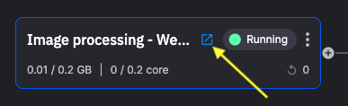

# 1. Connect the webcam video feed

In this part of the tutorial you connect your webcam video feed.

Follow these steps to deploy the **webcam service**:

1.  Navigate to the Samples and locate `Image processing - Webcam input`.

2.  Click `Setup & deploy`.

3.  Click `Deploy`.

    This service will stream data from your webcam to the `image-base64` topic.

4.  Click the `Public URL` icon, in the webcam service tile.

    

    This opens the deployed website which uses your webcam to stream images to Quix.

    !!! note

        Your browser may prompt you to allow access to your webcam. You can allow access.

[Part 2 - Decode images :material-arrow-right-circle:{ align=right }](decode.md)
