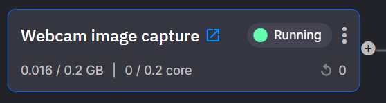

# 1. Connect the video feeds

Follow these steps to deploy the **traffic camera feed service**:

1.  Navigate to the Library and locate `TfL Camera Feed`.

2.  Click `Setup & deploy`.

3.  Paste your TfL API Key into the appropriate input.

4.  Click `Deploy`.

    Deploying will start the service in the Quix pre-provisioned infrastructure. This service will stream data from the TfL cameras to the `tfl-cameras` topic.

    At this point your pipeline view has one service deployed. When it has started the arrow pointing out of the service will be green. This indicates that data is flowing out of the service into a topic. Now, you need to deploy something to consume the data that is streaming into that topic.

5.  Once deployed successfully, stop the service. You will restart it later, but for now it can be stopped.

Follow these steps to deploy the **webcam service**:

1.  Navigate to the Library and locate `Image processing - Webcam input`.

2.  Click `Setup & deploy`.

3.  Click `Deploy`.

    This service will stream data from your webcam to the `image-base64` topic.

4.  Click the service tile:

    

5.  Click the `Public URL`.

    This opens the deployed website which uses your webcam to stream images to Quix.

!!! note

  Your browser may prompt you to allow access to your webcam.

