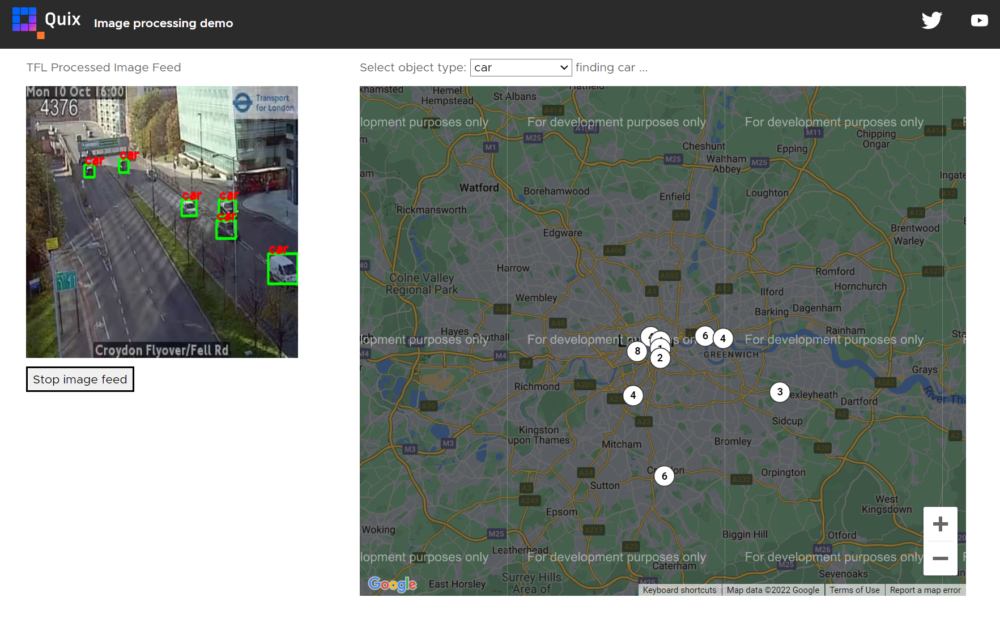

## 5. Deploy the web UI

Follow these steps to deploy the **web UI service**:

1. Navigate to the Library and locate `TFL image processing UI`.

2. Click `Setup & deploy`.

3.  Click `Deploy`.

4.  Once deployed, click the service tile.

5.  Click the `Public URL`.

    This is the user interface for the demo. The following screenshot shows the last image processed from one of the TfL traffic cameras as well as the map with a count of all the cars seen so far and where they were seen:

    

[Part 6 - Summary :material-arrow-right-circle:{ align=right }](summary.md)
