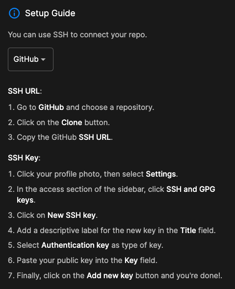
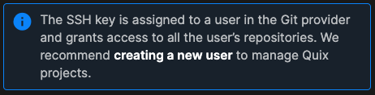
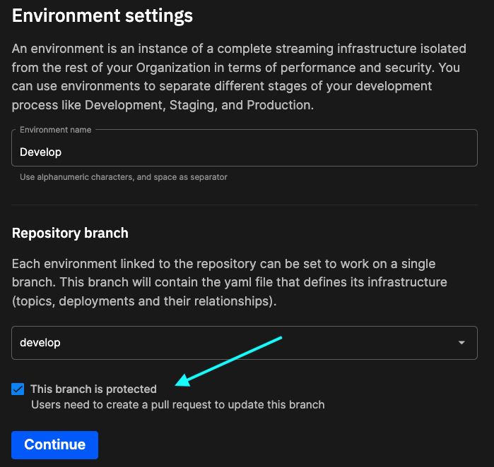

# Get the project

While you can try out the live demo, or experiment using the ungated product experience, it can be useful to learn how to get a project up and running in Quix. 

Once you have the project running in your Quix account, you can modify the project as required, and save your changes to your forked copy of the project. With a forked copy of the repository, you can also receive upstream bug fixes and improvements if you want to, by syncing the fork with the upstream repository. 

In the following sections you learn how to:

1. Fork an existing project repository, in this case the image processing template project.
2. Create a new project (and environment) in Quix linked to your forked repository.

In later parts of the tutorial you explore the project pipeline using the Quix data explorer and other tools, viewing code, examining data structures, and getting a practical feel for the Quix Portal.

## 💡 Key ideas

The key ideas on this page:

* Forking a public template project repository
* Connecting Quix to an external Git repository, in this case the forked repository
* Quix projects, environments, and applications
* Pipeline view of project
* Synchronizing an environment

## Fork the project repository

Quix provides the image processing template project as a [public GitHub repository](https://github.com/quixio/computer-vision-demo){target="_blank"}. If you want to use this template as a starting point for your own project, then the best way to accomplish this is to fork the project. Using fork allows you to create a complete copy of the project, but also benefit from future bug fixes and improvements by using the upstream changes.

To fork the repository:

1. Navigate to the [Quix GitHub repository](https://github.com/quixio/computer-vision-demo){target="_blank"}.

2. Click the `Fork` button to fork the repo into your GitHub account (or equivalent Git provider if you don't have a GitHub account). Make sure you fork all branches, as you will be looking at the `develop` branch.

    !!! tip 

        If you don't have GitHub account you can use another Git provider, such as GitLab or Bitbucket. If using Bitbucket, for example, you could import the repository - this would act as a clone (a static snapshot) of the repository. This is a simple option for Bitbucket, but you would not receive upstream changes from the original repository once the repository has been imported. You would however have a copy of the project you could then modify to suit your use case. Other providers support other options, check the documentation for your Git provider.

## Create your Quix project

Now that you have a forked copy of the repository in your GitHub account, you can now link your Quix account to it. Doing this enables you to build and deploy the project in your Quix account, and examine the pipeline much more closely.

To link Quix to this forked repository:

1. Log into your Quix account.

2. Click `+ Create project`.

3. Give your project a name. For example, "Computer Vision".

4. Select `Connect to your own Git repo`, and follow the setup guide for your provider.

    !!! tip

        A setup guide is provided for each of the common Git providers. Other Git providers are supported, as long as they support SSH keys.

    The setup guide for GitHub is shown here:
            
    

5. Assuming you are connecting to a GitHub account, you'll now need to copy the SSH key provided by Quix into your GitHub account. See the setup guide for further details.

    !!! important

        It is recommended that you create a new user in your Git provider for managing your Quix projects. You are reminded of this when you create a project (the notice is shown in the following screenshot).

    


6. Click `Validate` to test the connection between Quix and GitHub. 

    !!! tip
    
        If errors occur you need to address them before continuing. For example, make sure you have the correct link to the repository, and you have have added the provided SSH key to your provider account, as outlined in the setup guide for that provider.

7. Click `Done` to proceed.

You now need to add an environment to your project. This is explained in the following section.

## Create your Develop environment

A Quix project contains at least one branch. For the purposes of this tutorial you will examine the `develop` branch of the project. In a Quix project a branch is encapsulated in an environment. You'll create a `Develop` environment mapped to the `develop` branch of the repository.

Now create an environment called `Develop` which uses the `develop` branch:

1. Enter the environment name `Develop`.

2. Select the `develop` branch from the dropdown.

    Make sure the branch is protected, as shown in the following screenshot:

    {width=70%}

    !!! tip

        Making a branch protected ensures that developers cannot commit directly into the branch. Developers have to raise pull requests (PRs), which need to be approved before they can be merged into the protected branch.

3. Click `Continue` and then select the Quix Broker and Standard storage options to complete creation of the environment, and the project.

4. Go to the pipeline view. You will see that Quix is out of sync with the repository.

5. Click the `Sync` button to synchronize the environment, and then click `Go to pipeline`. You will see the pipeline building.

At this point you can wait a few minutes for the pipeline services to completely build and start running.

## Configure credentials

As the project uses Quix API credentials, you'll now need to configure your details for the services that require API keys.

### TfL camera feed

Open the service and edit the environment variable as shown here:

{width=60%}

### Web UI service

Note if you just want to try out the UI without performing the following steps, you can do that in the [demo](https://app-demo-computervisiondemo-prod.deployments.quix.ai/){target=_blank}.

When testing the UI you might find Google Maps does not load correctly for you - this is because the code has the Quix Google Maps API key. To work around this, you can set the Google Maps API key to an empty string. Google maps will then default to "developer mode" - the map will display correctly, but will be watermarked with 'for developer use'. To do this, in the Applications list, click on the `TfL image processing UI` application.

To set the Google Maps API key to an empty string, you need to edit `src/app/app.module.ts` and modify the `apiKey` field in `AgmCoreModule.forRoot` to the following:

``` typescript
AgmCoreModule.forRoot({
      apiKey: ''
    }),
```

Also, you need your [workspace ID](../../how-to/get-environment-id.md) and a [PAT](../../how-to/personal-access-token-pat.md) to get the UI fully working. Once you have these, you'll need to access the code for the service, and set these values.

In the file `src/app/services/quix.service.ts`, locate the following code, and replace the place holders with your values:

``` typescript
/*~-~-~-~-~-~-~-~-~-~-~-~-~-~-~-*/
  /*WORKING LOCALLY? UPDATE THESE!*/
  private workingLocally = false; // set to true if working locally
  private token: string = '<your_pat>'; // Create a token in the Tokens menu and paste it here
  public workspaceId: string = '<your_workspace_id>'; // Look in the URL for the Quix Portal your workspace ID is after 'workspace='
```

Other optional services may require similar configuration, for example, the Quix Amazon S3 connector service requires your S3 credentials if you want to use it.

## See also

If you are new to Quix it is worth reviewing the [recent changes page](../../changes.md), as that contains very useful information about the significant recent changes, and also has a number of useful videos you can watch to gain familiarity with Quix.

## 🏃‍♀️ Next step

[Part 2 - TfL camera feed :material-arrow-right-circle:{ align=right }](tfl-camera-feed.md)
