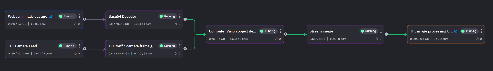

# Real-time image processing

In this tutorial you learn how to build a real-time image processing pipeline in Quix, using the Transport for London (TfL) traffic cameras, known as Jam Cams, and a [YOLO v3](https://viso.ai/deep-learning/yolov3-overview/) machine learning model. 

You'll use prebuilt Quix library items to build the pipeline. A prebuilt UI is also provided that shows you where the recognized objects are located around London.

The following screenshot shows the pipeline you build in this tutorial:

## Getting help

If you need any assistance while following the tutorial, we're here to help in [The Stream community](https://join.slack.com/t/stream-processing/shared_invite/zt-13t2qa6ea-9jdiDBXbnE7aHMBOgMt~8g), our public Slack channel.

## Tutorial live stream

If you'd rather watch a live stream, where one of our developers steps through this tutorial, you can view it here:

  <iframe width="560" height="315" src="https://www.youtube.com/embed/Wi-U0Wg3Jf0?start=188" title="YouTube video player" frameborder="0" allow="accelerometer; autoplay; clipboard-write; encrypted-media; gyroscope; picture-in-picture" allowfullscreen></iframe>

## Prerequisites

To get started make sure you have a [free Quix account](https://portal.platform.quix.ai/self-sign-up).

You'll also need a [free TfL account](https://api-portal.tfl.gov.uk). 

Follow these steps to locate your TfL API key:

  1. Register for an account.

  2. Login and click the `Products` menu item.

  3. You should have one product to choose from: `500 Requests per min.`

  4. Click `500 Requests per min.`

  5. Enter a name for your subscription into the box, for example "QuixFeed", and click `Register`.

  6. You can now find your API Keys in the profile page.

## Quix Library

The Quix Library is a collection of ready-to-use components you can leverage to build your own real-time streaming solutions. Typically these components require minimal configuration.

Most of the code you need for this tutorial has already been written, and is located in the Quix Library. 

When you are logged into the Quix Portal, click on the Library icon in the left-hand navigation, to access the Quix Library.

## The pipeline you will create

There are five stages to the processing pipeline you build in this tutorial:

1. Video feeds
  
    - TfL Camera feed or "Jam Cams"
    - Webcam image capture 

2. Frame extraction
  
    - Frame extraction
    - Decoding

3. Object detection

    - Detect objects within images

4. Merge streams

    - Merge images from all of the individual TfL cameras into one stream

5. Web UI configuration

    - A simple UI showing:

        - Images with identified objects    
        - Map with count of objects at each camera's location

Now that you know which components will be needed in the image processing pipeline, the following sections will step through the creation of the required microservices.

## The parts of the tutorial

This tutorial is divided up into several parts, to make it a more manageable learning experience. The parts are summarized here:

1. **Connect the video feeds**. You learn how to quickly connect to two video feeds: one from your webcam and one from the TfL traffic cam feeds. You can perform object detection across these multiple feeds, as they are all sent into the objection detection service in this tutorial.

2. **Frame extraction**. You use a standard library item to grab frames from the TfL video feed. For the laptop webcam you feed the images to a Base64 decoder library item.

3. **Object detection**. You use a computer vision library item to detect a chosen type of object. The object type to detect is selected through a web UI, which is described later.

4. **Merge streams**. You merge multiple Quix streams (there is a stream for each of the TfL camera feeds and one for your webcam) into a single Quix stream. This single stream is then fed to the web UI. 

5. **Deploy the web UI**. You the deploy a prebuilt web UI. This UI enables you to select an object type to detect across all of your input video feeds.

[Part 1 - Connect the video feeds :material-arrow-right-circle:{ align=right }](connect-video.md)
