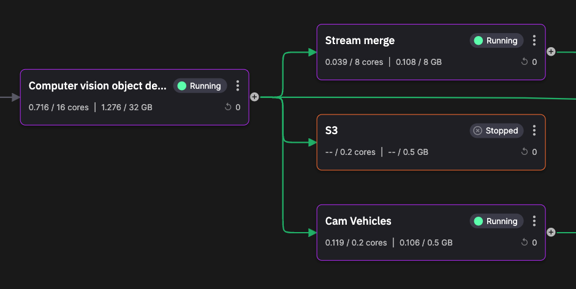
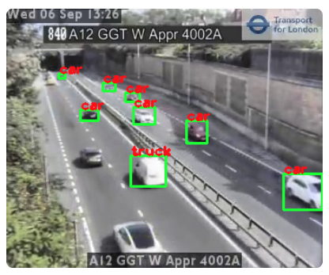
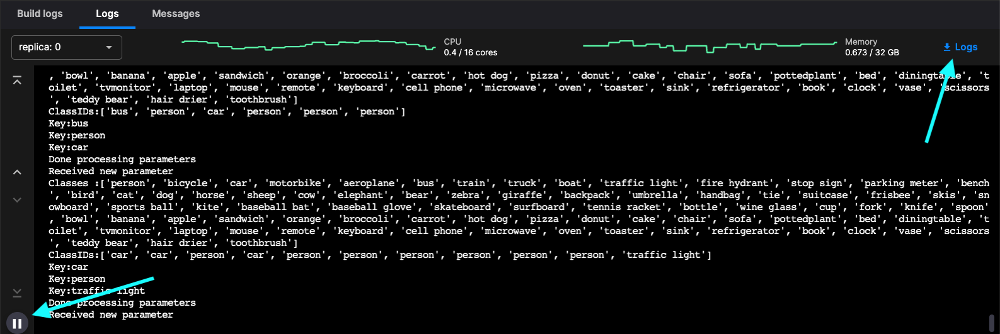
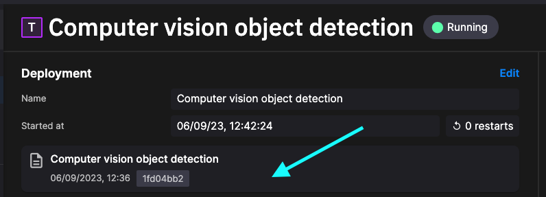

# Object detection

This service takes frames from the frame grabber and detects objects in each frame. This service uses the [YOLOv8 object detection library](https://github.com/ultralytics/ultralytics){target=_blank}.



The key ideas on this page:

* Using the YOLOv8 library to detect objects in a frame
* Intro to Data frame handler: `on_dataframe_received_handler`  
* How to view logs
* How to view the code of a Quix Application
* Using pipeline view to examine topics

## What it does

The key thing this service does is detect objects in frames passed to it. You will remember from the previous part of this tutorial, the frame grabber, that the frame grabber service outputs time  series data, rather than event data. A different handler is invoked for time series data:

``` python
def on_dataframe_received_handler(stream_consumer: qx.StreamConsumer, df: pd.DataFrame):
```

This callback receives the time series data in pandas dataframe format. Each dataframe received in the stream causes this handler to be invoked.

Objects are detected in the frame by the YOLOv8 code. Data is published to the output stream. The messages on the output topic have the following format:

``` json
{
  "Epoch": 0,
  "Timestamps": [
    1694003142728625200
  ],
  "NumericValues": {
    "car": [
      5
    ],
    "truck": [
      2
    ],
    "person": [
      2
    ],
    "traffic light": [
      1
    ],
    "lat": [
      51.4739
    ],
    "lon": [
      -0.09045
    ],
    "delta": [
      -2.597770929336548
    ]
  },
  "StringValues": {},
  "BinaryValues": {
    "image": [
      "(Binary of 152.47 KB)"
    ]
  },
  "TagValues": {}
}
```

The key data here is the count of each vehicle type in the frame. Further, an annotated image (detected objects are marked with a green rectangle) is also included as binary data. The annotated image is used by the UI to display detected objects, as shown in the following screenshot:



## 👩‍🔬 Lab - Examine the logs and code

In this section, you will learn how to examine the logs for the service, and also see how to explore the code.

1. In the pipeline view, click on the object detection service tile.

2. Click on the Logs tab, if not selected by default.

3. You can now see the log messages being produced by the service:

    

    !!! tip

        There is a pause button to allow you to pause the logs (see the screenshot). There is also a button you can use to download the logs for the service.

There  also some tasks for you to carry out in the following sections.

You now learn how to examine the code for the service.

1. Click the panel indicated in the screenshot:

    {width=60%}

    This takes you to the code view. You can view or edit the complete code for this service here. 
    
2. You could for example, make some changes, and then redeploy the service using the `Redeploy` button, or simply test your changes using the `Run` button.

3. In the code view, click the `History` tab to see the complete revision history for changes to the code.

### Task - Check the output message format for this service

Using what you have learned in previous parts of this tutorial, check the format of the messages published by this service. 

### Task - Determine the output topic name

Using the pipline view, can you determine the topic name that the output messages are being published to.

## See also

For more information refer to:

* [Quix Streams](../../../client-library-intro.md) - More about streams, publishing, consuming, events and much more. 

## 🏃‍♀️ Next step

[Part 5 - Web UI :material-arrow-right-circle:{ align=right }](../image-processing/web-ui.md)
