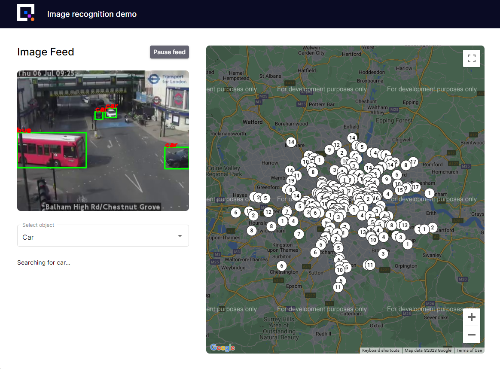
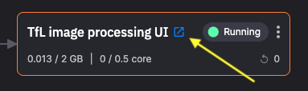

# 5. Deploy the web UI

In this part of the tutorial you add a service to provide a simple UI with which to monitor and control the pipeline.

The following screenshot shows the last image processed from one of the video streams, as well as the map with a count of all the objects detected so far, and their location:

!!! tip

    At this point, make sure that all the services in your pipeline are running.

Follow these steps to deploy the **web UI service**:

1. Navigate to the `Code Samples` and locate `TFL image processing UI`.

2. Click `Setup & deploy`.

3.  Click `Deploy`.

4.  Once deployed, click the service tile.

5.  Click the `Public URL` to launch the UI in a new browser tab.

    

You have now deployed the web UI.

You can select the type of object you want to detect, and the locations at which that object are detected are displayed on the map. The number of occurrences of detection at that location are also displayed in the map pin.

[Part 7 - Summary :material-arrow-right-circle:{ align=right }](summary.md)
