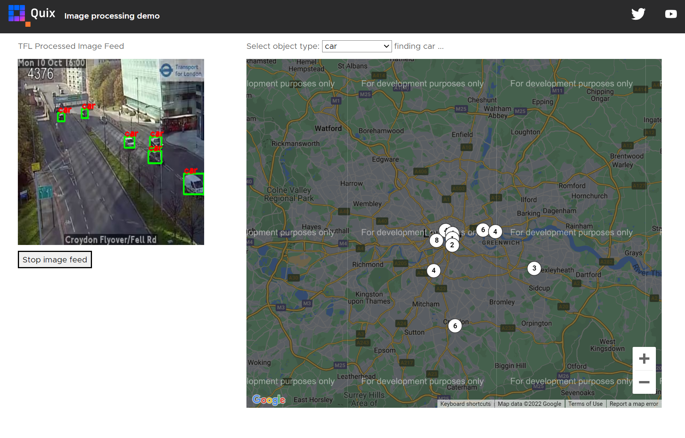

# Web UI

In this part of the tutorial you learn about the web UI service. 


This provides the rather fancy interface for you to interact with this project.

The following screenshot shows vehicle density at various points in London:



## What it does

The key thing this service does is provides a UI that enables you to see vehicle data in real time, displayed on a Google map.

The UI is a JavaScript web client. The most important thing to understand is how this service obtains data from the Quix pipeline. This is done through use of the [Quix Streaming Reader API](../../../apis/streaming-reader-api/intro.md). 

The Streaming Reader API has both an HTTP and websockets interface you can use to interface with a Quix topic. This web client uses the websockets interface. The websockets interface uses Microsoft SignalR technology. You can read more about that in the [Quix SignalR documentation](../../../apis/streaming-reader-api/signalr.md) for the Reader API.

In essence the code to read a topic needs to:

1. Connect to Quix SignalR hub.
2. The web UI reads parameter data rather than event data, as that is the format used for inbound data in this case. The code publishing data to the topic the web UI reads looks like this:

    ``` python
    # Callback triggered for each new parameter data.
    def on_dataframe_handler(self, stream_consumer: qx.StreamConsumer, df: pd.DataFrame):

        df["TAG__parent_streamId"] = self.consumer_stream.stream_id
        df['image'] = df["image"].apply(lambda x: str(base64.b64encode(x).decode('utf-8')))

        self.producer_topic.get_or_create_stream("image-feed") \
            .timeseries.buffer.publish(df)
    ```

    For this reason the web client registers an interest in receiving parameter data from the topic. It subscibes to parameter data events.

3. Handle parameter data received events using a callback.

The web UI code to do this is similar to the following:

``` javascript
ngAfterViewInit(): void {
this.getInitialData();

this.quixService.initCompleted$.subscribe((topicName) => {
    this._topicName = topicName;

    this.quixService.ConnectToQuix().then(connection => {
    this.connection = connection;
    this.connection.on('ParameterDataReceived', (data: ParameterData) => {
        this._parameterDataReceived$.next(data);
    });
    this.subscribeToData();

    this.connection.onreconnected((connectionId?: string) => {
        if (connectionId) this.subscribeToData();
    });
    });
});
```

So, simplifying, after connection to the Quix topic, on a `ParameterDataReceived` event, the corresponding callback (event) handler is invoked. There are other events that can be subscribed to. You can read more about events and subscription in the [subscription and event documentation](../../../apis/streaming-reader-api/subscriptions.md).

!!! note

    A web client can also write data into a Quix topic using the [Quix Streaming Writer API](../../../apis/streaming-writer-api/intro.md), but in this app you only consume (read) data. 

The data read from the topic is as follows:

``` json
{
  "Epoch": 0,
  "Timestamps": [
    1693573934793346000
  ],
  "NumericValues": {
    "car": [
      7
    ],
    "traffic light": [
      1
    ],
    "person": [
      3
    ],
    "lat": [
      51.5107
    ],
    "lon": [
      -0.11512
    ],
    "delta": [
      -4.353343725204468
    ]
  },
  "StringValues": {
    "image": [
        "iVBO…to/v37HG18UyZ1Qz/fby/<snipped>+yXUGc5UVWZfIHnX0iqM6aEAAAAASUVORK5CYII="
    ]
  },
  "BinaryValues": {},
  "TagValues": {
    "parent_streamId": [
      "JamCams_00001.02500"
    ]
  }
}
```

The interesting thing here is that the detected object image to be displayed by the UI is passed to it in Base64 encoded format, as the HTTP interface of the streaming reader API is being used.

## Watch the video

TODO: Not sure it needs a video

Watch the video that shows how to explore the code and data for this service:

**Loom coming soon!**

??? Transcript

    **Transcript**

## Understand the code

You learned how to explore the code for a service in previous parts of this tutorial. The web UI is a fairly standard web client using Angular. 

For more details on using the Quix Streaming Reader API see the [API documentation](../../../apis/streaming-reader-api/intro.md).

## 👩‍🔬 Lab - Explore the UI 

In this section, you will learn how to ...

TODO: do we need another hands-on?

## See also

For more information refer to:

* [Quix Streaming Reader API](../../../apis/streaming-reader-api/intro.md) - read about the API used by clients external to Quix to read data from a Quix topic.

## 🏃‍♀️ Next step

[Part 6 - Other services :material-arrow-right-circle:{ align=right }](../image-processing/other-services.md)
