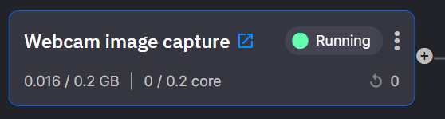
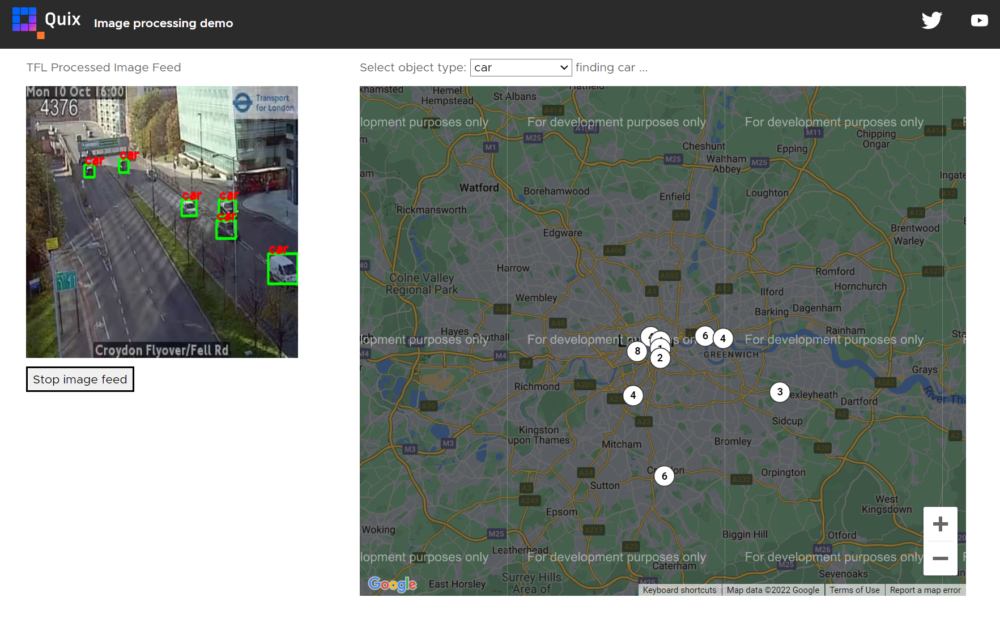

# Image Processing

We show you how to build a video processing pipeline using the Transport
for London (TfL) traffic cameras, known as Jam Cams, and a [YOLO
v3](https://viso.ai/deep-learning/yolov3-overview/) model. We provide a
fully functional UI to show you where the recognized objects are located
around London.


## Watch It

If you'd rather watch our live stream, where we run through this tutorial, see it here:

<div class="video-wrapper">
  <iframe width="560" height="315" src="https://www.youtube.com/embed/Wi-U0Wg3Jf0?start=188" title="YouTube video player" frameborder="0" allow="accelerometer; autoplay; clipboard-write; encrypted-media; gyroscope; picture-in-picture" allowfullscreen></iframe>
</div>

## Get Started

To get started make sure you have a Quix account: signup for a
completely free account at <https://quix.io/>

You’ll also need a free TfL account which you can register for here:
<https://api-portal.tfl.gov.uk/> 

A rough guide to finding your TfL API key is as follows:

  - Register for an account.

  - Login and click the "Products" menu item.

  - You should have 1 product to choose from "500 Requests per min."

  - Click "500 Requests per min."

  - Enter a name for your subscription into the box, e.g. QuixFeed, and
    click "Register."

  - You can now find your API Keys in the profile page.

If you need any assistance while following the tutorial, we’re here to
help in [The
Stream](https://join.slack.com/t/stream-processing/shared_invite/zt-13t2qa6ea-9jdiDBXbnE7aHMBOgMt~8g),
our free Slack community.

### Library

Most of the code you need has already been written for you and it’s
located in our library. We’ll be referring to the library often so make
sure you know where it is: the left hand side menu bar.

### Pipeline Services

There are 5 stages to the processing pipeline you are about to build.

#### Video Feeds

  - TfL Camera feed or “Jam Cams”

  - Webcam image capture

#### Pre Processing

  - Frame extraction

  - Decoding

#### Object Detection

  - Detect objects within images

#### Stream Merge

  - Merge images from all of the individual TfL cameras into one stream

#### Web UI

  - A simple UI showing:
    
      - Images with identified objects
    
      - Map with count of objects at each cameras location

## Built It

Now you know which components will be needed in the image processing
pipeline, let’s create and deploy each service.

### 1\. Video Feeds

Follow these steps to deploy the traffic camera feed service.

1.  Navigate to the Library and locate “TfL Camera Feed”.

2.  Click “Setup & deploy”

3.  Paste your TfL API Key into the appropriate input

4.  Click “Deploy”

> Deploying will start the service in our pre-provisioned
> infrastructure.

> This service will stream data from the TfL cameras to the
> “tfl-cameras” topic.

Once deployed:

1.  Stop the service

> You will restart it later, but for now it can be stopped.

INFO: At this point you should be looking at your pipeline view and have
one service deployed. When it has started the arrow pointing out of the
service will be green. This indicates that data is flowing out of the
service into a topic. Now, we need to deploy something to consume the
data streaming into that topic.

Follow these steps to deploy the webcam service.

1.  Navigate to the Library and locate “Image processing - Webcam input”.

2.  Click “Setup & deploy”

3.  Click “Deploy”

> This service will stream data from your webcam to the “image-base64”
> topic.

1.  Click the service tile



1.  Click the “Public URL”

> This opens the deployed website which uses your webcam to stream
> images to Quix

!!! note

	Your browser may prompt you to allow access to your webcam.

### 2\. Pre Processing

Follow these steps to deploy the frame extraction service.

1.  Navigate to the Library and locate “TfL traffic camera frame
    grabber”.

2.  Click “Setup & deploy”

3.  Click Deploy

> This service receives data from the “tfl-cameras” topic and streams
> data to the “image-raw” topic.

Follow these steps to deploy the decoder service.

1.  Navigate to the Library and locate “Base64 Decoder”.

2.  Click “Setup & deploy”

3.  Click “Deploy”

> This service receives data from the “image-base64” topic and streams
> data to the “image-raw” topic.

### 3\. Computer Vision

Follow these steps to deploy the object detection service.

1.  Navigate to the Library and locate “Computer Vision object
    detection”.

2.  Click “Setup & deploy”

3.  Click “Deploy”

> This service receives data from the “image-raw” topic and streams data
> to the “image-processed” topic.

### 4\. Stream Merge

Follow these steps to deploy the object detection service.

1.  Navigate to the Library and locate “Stream merge”.

2.  Click “Setup & deploy”

3.  Click “Deploy”

> This service receives data from the “image-processed” topic and
> streams data to the “image-processed-merged” topic.

### 5\. Web UI

Follow these steps to deploy the object detection service.

1.  Navigate to the Library and locate “TFL image processing UI”.

2.  Click “Edit code”

3.  Click “Save as project”

> The code for this Angular UI is now saved to your workspace

1.  Find and select the `environment-variables.service.ts` file.

> 

You need to provide the “Token” that this website will need to
communicate with Quix.

1.  Click the user avatar icon in the top right corner of the Quix
    portal

2.  Click Tokens

3.  Generate a token
    
    1.  Give it a name and expiry date

4.  Copy the token

5.  Click back on your browser and relocate the
    `environment-variables.service.ts` file.

6.  Paste the token into the double quotes as indicated in the file

<!-- end list -->

``` python
Token: string = "your token here";
```

Tag the code and deploy the UI

1.  Click the +tag button at the top of the code file

2.  Enter v1 and press enter

3.  Click Deploy near the top right corner

4.  Select v1 under the “Version Tag”

This is the tag you created in step 2

1.  Click “Service” in “Deployment Settings”

This ensures the service runs continuously

1.  Click the toggle in “Public Access”

> This enables access from anywhere on the internet

1.  Click “Deploy”

> The UI receives data from the “image-processed-merged” topic

1.  Once deployed, click the service tile

2.  Click the “Public URL”

> This is the user interface for the demo. This screenshot shows the
> last image processed from one of the TfL traffic cameras as well as
> the map with a count of all the cars seen so far and where they were
> seen.



## Next Steps

You’ve just made extensive use of the Quix library, our collection of
open source connectors, samples and examples. Now you can build your own
connectors and apps and contribute by going to our Github
[here](https://github.com/quixai/quix-library){target=_blank}, forking our library repo
and submitting your code, updates and ideas.

What will you build, let us know. We’d love to feature your project or
use case in our newsletter.

If you need any assistance, we’re here to help in [The
Stream](https://join.slack.com/t/stream-processing/shared_invite/zt-13t2qa6ea-9jdiDBXbnE7aHMBOgMt~8g),
our free Slack community.

## That’s all folks\!

We hope you enjoyed this tutorial on how to deploy a real time image
processing pipeline in just a few minutes.

If you have any questions or feedback please contact us on The Stream.

Thank you and goodbye\!
