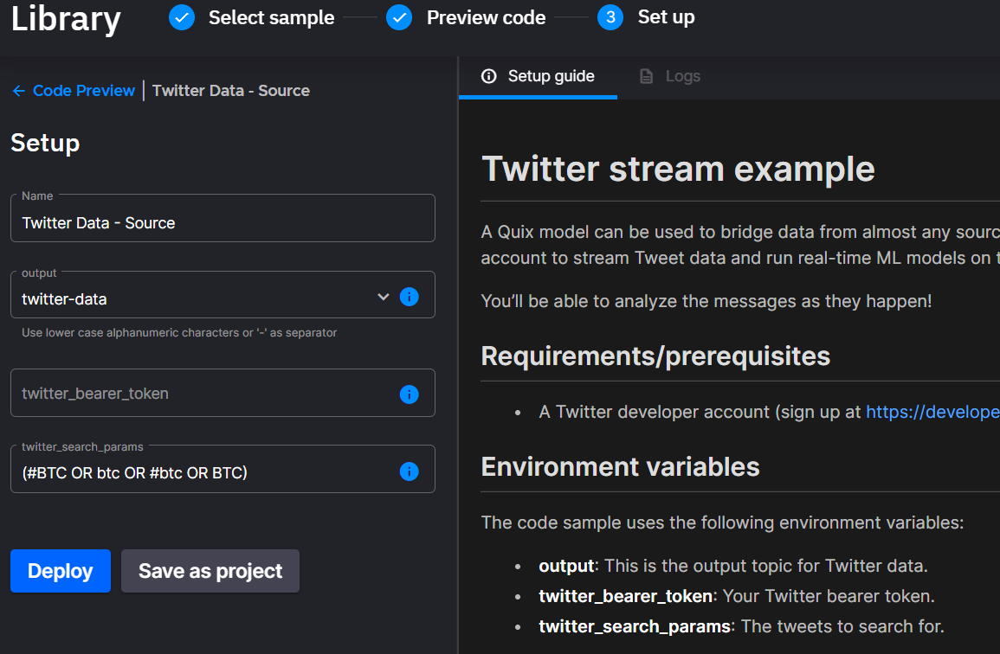
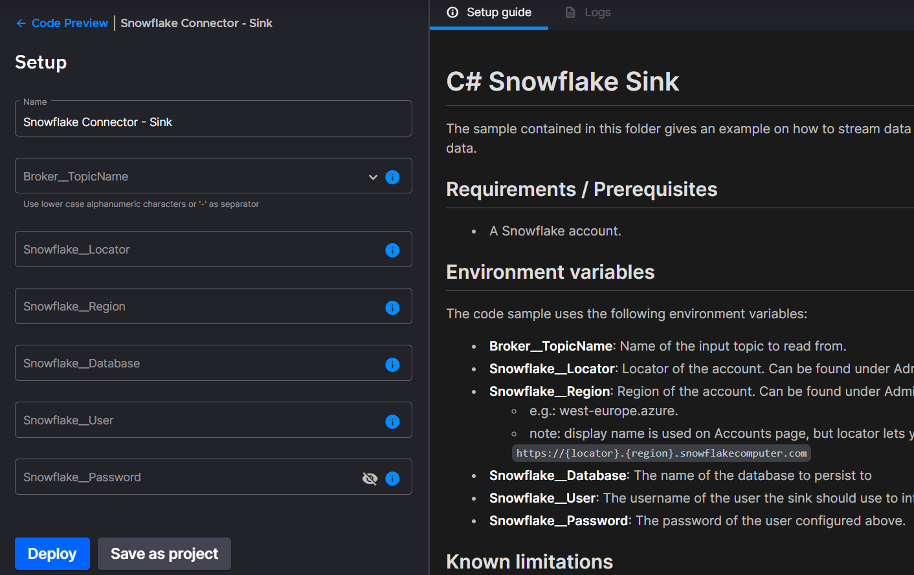
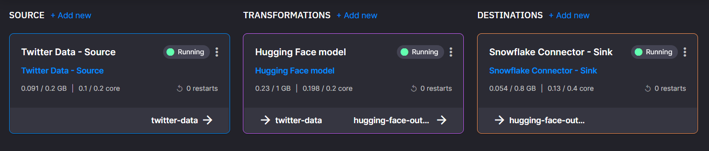

# No code sentiment analysis

This tutorial shows how to build a data processing pipeline without
code. You’ll analyze tweets that contain information about Bitcoin and
stream both raw and transformed data into
[Snowflake](https://www.snowflake.com/){target=_blank}, a storage platform,
using the Twitter,
[HuggingFace](https://huggingface.co/){target=_blank} and Snowflake
connectors.

I’ve made a video of this tutorial if you prefer watching to reading.

  <iframe width="400" height="300" src="https://www.youtube.com/embed/aebIrP5iIEo" frameborder="0" allowfullscreen></iframe>

## What you need for this tutorial

1.  [Free Quix account](https://portal.platform.quix.ai/self-sign-up?xlink=home&_ga=2.191326762.1842305134.1652702101-2083003567.1643907213){target=_blank}

2.  [Snowflake account](https://signup.snowflake.com/?utm_cta=trial-en-www-homepage-top-right-nav-ss-evg){target=_blank}

3.  [Twitter developer account](https://developer.twitter.com/en/portal/petition/essential/basic-info){target=_blank}
    (You can follow [this tutorial to set up a developer account](https://developer.twitter.com/en/support/twitter-api/developer-account){target=_blank})

## Step one: create a database

Sign in to your Snowflake account to create the Snowflake database which
will receive your data. Call this "demodata" and click "Create."

## Step two: get your data

In Quix, click into the library and search for the Twitter source
connector.

Click "Add new." This adds the source to your pipeline and brings you
back to the library.

Fill in the necessary fields:

  - Name: Twitter Data - Source

  - Output: twitter-data

  - Twitter bearer token: paste your Twitter Dev token here

  - Twitter_search_paramaters: (\#BTC OR btc \#btc OR BTC)

!!! tip

	Use search parameters to obtain Tweets on a subject that interests you\! e.g. (\#dolphins OR dolphins)

Click "Deploy"

### Step three: transformation for sentiment analysis

  - Click the "Add transformation" button

  - In the library, search for "HuggingFace"

  - Click "Set up and deploy" on the HuggingFace connector

  - Choose "Twitter data" as the input topic

  - The output field should be set to "hugging-face-output" by default,
    leave this as it is or enter this if it’s not pre-populated.

  - Leave all other values with their defaults

  - Click "Deploy"

!!! note

	Find out more about the hugging face model and the other models you could use at [huggingface.co](https://huggingface.co/distilbert-base-uncased-finetuned-sst-2-english){target=_blank}

### Step five: delivery to your Snowflake database

  - Click the "Add destination" button on the home screen

  - Search the library for the Snowflake connector

  - Click "Set up and deploy" on the connector

  - Fill in the necessary fields:

  - Choose the hugging-face-output output topic

  - The "Broker__TopicName" field should be set to
    "hugging-face-output". This means it will receive the data being
    output by the sentiment analysis model.

To fill in the Snowflake locator and region (these are similar to a
unique ID for your Snowflake instance), navigate to your Snowflake
account. Copy the locator and region from the URL and paste them into
the corresponding fields in the connector setup in Quix. Lastly, input
your username and password.

Click "Deploy" on the Snowflake connector. If the credentials and
connection details are correct, you’ll see the "Connected" status in the
log and will be redirected to your workspace.

Congratulations\! You built a no-code pipeline that filters and collects
data from Twitter, transforms it with a HuggingFace model and delivers
it to a Snowflake database.

You can now go back over to Snowflake and find the "Databases" menu.
Expand the "demodata" database and then find the tables under "public".

!!! tip

	If you need help with this tutorial or want to chat about anything related to Quix or stream processing in general please come and say hi on [The Stream](https://quix.ai/slack-invite){target=_blank}, our slack community.
