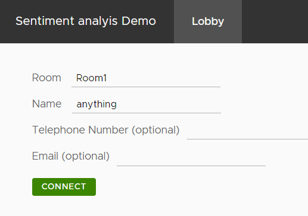
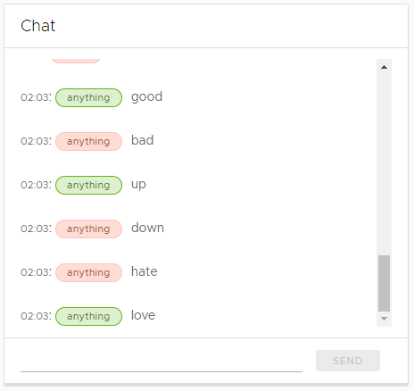
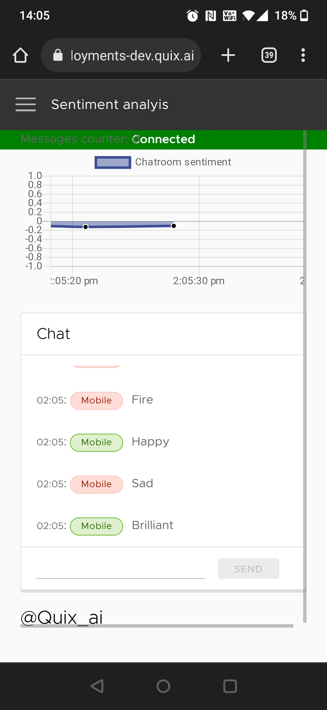

# Quick Start

This quick start gets you up and running with Quix in the shortest possible time.

It shows you how to deploy a real-time app in the Quix platform and walk you through the relevant parts of the code.

There are two parts to the guide:

1. Get up and running
  In this section you will deploy a real-time chat application and connect to it with your computer and phone.

2. Add more features
  In this section you will add an external feed to the pipeline and see messages delivered in real-time.

!!! info "Don't get stuck"

	If you run into trouble or need any help of any kind with this guide, then please drop into our Slack community [`The Stream`](https://quix.ai/slack-invite){target=_blank}

## 1. Get up and running

To get up and running as fast as possible you will use items from the Quix Library. These have been coded and tested. All you have to do is deploy them to your workspace.

### Analyze Sentiment

To compliment the chat UI you will deploy in the next step, you will first deploy a pre-built microservice designed to analyze the sentiment of messages in the chat.

1. Click <span class="border-violet-dash">`+ Add transformation`</span> on the home screen.

    ???- note "Not your first time?"
        If this is not your first time deploying something to this workspace then navigate to the Library using the left hand navigation instead.

2. Use the search box to find the `Sentiment analysis` library item. 

3. Click `Edit code`

    !!! note
      
        Ensure that the `input` is set to `messages` and the `output` is set to `sentiment`

4. Click `Save as project`
    
    The code for this transformation is now saved to your workspace

5. Locate main.py

6. Locate the line of code that creates the output stream
    
    ``` python
    output_stream=output_topic.create_stream(input_stream.stream_id)
    ```

7. Append `-output` to the stream id.
    
    This will ensure the UI is able to locate the sentiment being output by this transformation service.
    
    ``` python
    output_stream=output_topic.create_stream(input_stream.stream_id + "-output")
    ```

8. Click Deploy near the top right corner

9. Change the memory in deployment settings to at least 4GB

10. Click `Deploy` on the deployment dialog

	!!! success
	      
        You located and deployed the sentiment analysis microservice to the Quix platform.

        This microservice will subscribe to the `messages` topic and process data to determine the sentiment of any messages in real-time.


### The UI

You are going to locate and deploy a UI. It's written in Angular and connects to Quix. Allowing you to see messages on both your phone and computer in real-time.

1. Navigate to the library using the left hand navigation.
2. Use the search box to find the `Sentiment Demo UI` library item.
3. Click `Edit code`.
4. Click `Save as project`.
5. Click `Deploy` near the top right hand corner of your browser window.
6. Click the `Public Access` section of the dialog to expand it.
7. Click the toggle switch to enable public access.
8. Click `Deploy` on the dialog.

	!!! success
	      
        You located, saved and deployed the UI code to the Quix platform.

        The UI is comprised of a relatively simple Angular app that subscribes to Quix topics and streams chat messages and sentiment data in real-time.


	???- info "The Code"

        If you want to dive into the code then please do. These are some of the interesting bits:

        1. 
        Expand the tree view and select the webchat.component.ts file.
        {width=250px}
        
        Locate the `connect()` method.
        
        Notice the `SubscribeToEvent` and `SubscribeToParameter` lines. These are used to tell Quix that the code should be notified as soon as data arrives. Specifically any data arriving for the specified topic, stream and event or parameter.

        2. 
        Above the parameter and event subscriptions in the same file you will see the handlers. These will handle the data, doing whatever is needed for the app. In this case we add the messages to a list, which is then displayed in the UI.

        ```nodejs
        this.quixService.readerConnection.on('EventDataReceived', (payload) => {...}

        this.quixService.readerConnection.on('ParameterDataReceived', (payload) => {...}
        ```
    
        For more on connecting to Quix with a web based UI take a look at how to [read](../../../platform/how-to/webapps/read.md) and [write](../../../platform/how-to/webapps/write.md) with NodeJS.

### Testing it out

#### In the browser

Once the UI is built and deployed you can go ahead and click the {width=20px} icon on the `Sentiment Demo UI` tile.

You will see a form asking you to enter the name for a chat room and your own name. 

1. Enter `Room1` for the room and anything for your name.

  {width=250px}

2. Click `Connect`

  You will be redirected to the chat page.

  The most notable features of this page are the chat area, the sentiment graph and the QR code.

  {width=250px}

3. Enter some positive and negative messages in the chat window.

4. You will see your messages and a short time later the sentiment of the message will be indicated by the name tag next to each message changing color.

  {width=250px}

#### On mobile

Now join the chat with your mobile phone, chat messages will be displayed both on the phone and in the browser.

1. With your mobile phone, scan the QR code.

2. Use the same room name as before `Room1`

3. Use a different name e.g. `Mobile`

4. Type some messages


	!!! success

		You will see the message and it's sentiment on your phone

		{width=280px}

		And the same messages and sentiment will appear in real-time on your computer's web browser

		{width=250px}


## 2. Add more features

Now that you have the basics of searching the library, selecting and saving a pre-made sample and deploying it to the Quix serverless infrastructure, we can add an additional services to the pipeline including sourcing data and pre-processing the data so it's compatible with the existing services.

Your'e a pro now, so we'll move a little faster!

### Create the data source

1. Go to the library

2. Search for the `Empty template - Source`. If should have a blue highlight.

3. Click `Edit code`

4. Change the name to `API Data`

5. Change the topic to `api-data`

6. Click `Save as project`

7. Add `requests` on a new line to the requirements.txt file and save it

8. Go back to the `main.py` file

9. Add the following imports to the imports at the top of the file

    ```python 
    import requests
    import time
    ```

10. Delete the code between the following print statements {start=10}

    ```python
    print("Sending values for 30 seconds.")
    ```

    ```python
    print("Closing stream")
    ```

11. Add the following code between those print statements

    ```python
    while True:

        # get a random beer from this free API
        response = requests.get("https://random-data-api.com/api/v2/beers")

        # print the response data
        print(response.json())

        # sleep for a bit
        time.sleep(4)
    ```

12. Add the following code under the `print(response.json())` line and above the `sleep` line

    ```python
    # sink the beers 'style' to Quix as an event
    stream.events.add_timestamp(datetime.datetime.utcnow()) \
        .add_value("beer", response.json()["style"]) \
        .write()
    ```

13. Lastly, delete the following lines

    ```python
    stream.parameters.add_definition("ParameterA").set_range(-1.2, 1.2)
    stream.parameters.buffer.time_span_in_milliseconds = 100
    ```

14. Save and then run the code by clicking the `Run` button near the top right of the code editor window

	!!! success

		Every 4 seconds the random beer API will be called and a new style of beer will be transmitted to the Quix topic `api-data`

		Click `Stop` (mouse over the `Running` button)

#### Deploy

Deploy the code so it will run continuously.

1. Click `Deploy` in the top right
2. Click `Deploy` on the dialog

### Transformation

Now that you have some data you need to transform it to make it compatible with the rest of your data processing pipeline.

You will now locate a suitable transformation template and modify it to handle the incoming beer styles and output them as chat messages.

1. Search the library for `Empty template - Transformation`

2. Save the code to your workspace

	!!! note

		Ensure you change the `Name` to `Beer to chat`

		Change the `input` to `api-data`. This is the topic you set as the output for the API data.

		Change the `output` to `messages`

3. You can click `Run` and look in the console output see that this code is handling the event data. Click stop when you have seen it running.

4. Add the following import to the `quix_function.py` file

	```python
	import datetime
	```

4. Locate the `on_event_data_handler` method

5. Replace the comment `# Here transform your data.` with the following code

	```python
	# stream chat-messages to the output topic
	self.output_stream.events.add_timestamp(datetime.datetime.utcnow()) \
		.add_value("chat-message", data.value) \
		.add_tag("room", "Beer") \
		.add_tag("name", "BeerAPI") \
		.write()
	```

6. Delete the last line of the method

	```python
	self.output_stream.events.write(data)
	```

7. Save the file and open the `main.py` file

8. Locate the following line

	```python
	output_stream = output_topic.create_stream(input_stream.stream_id)
	```

9. Replace `input_stream.stream_id` with `"beer"`

10. Save and deploy this project!

!!! success

	You have built a transformation to take output from an API and turn it into messages that the existing parts of the pipeline can use!

## See it working

1. Navigate to the UI you deployed earlier. Ensure you are in the `lobby`

2. Enter `beer` for the room name and provide any name for yourself

3. You can now see the messages arriving from the API as well as the calculated sentiment for them.


!!! success "Congratulations"

	You made it into the Quix elite squad!

	Your completed real-time data processing pipeline should look something like this

	

	Come on over to our Slack community called [The Stream](https://quix.ai/slack-invite){target=_blank} and tell us how you did or if you had any issues.


**Conclusion**

You’ve successfully built a data pipeline that transforms one stream of
data, which is just the beginning\!

[Speak with a technical
expert](https://calendly.com/mike-quix/quix-demo?) about how to set up
and use Quix in your own projects.

**Additional resources**

  - [The Stream community on Slack](https://quix.ai/slack-invite){target=_blank}

  - [Stream processing glossary](https://quix.ai/stream-processing-glossary/){target=_blank}
