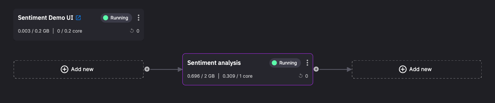
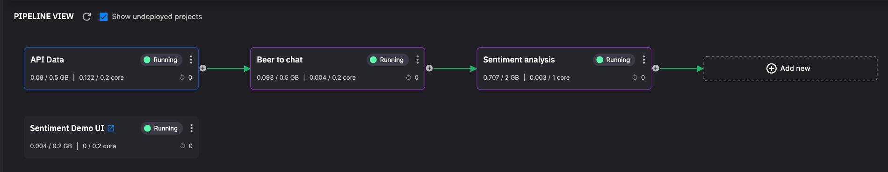
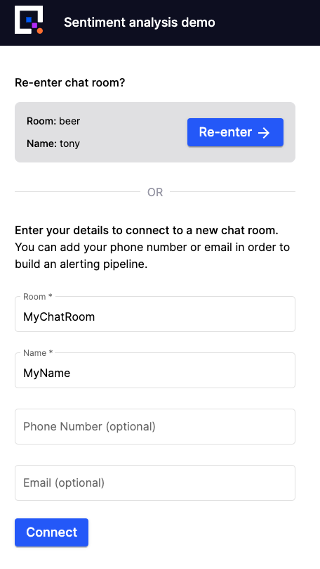
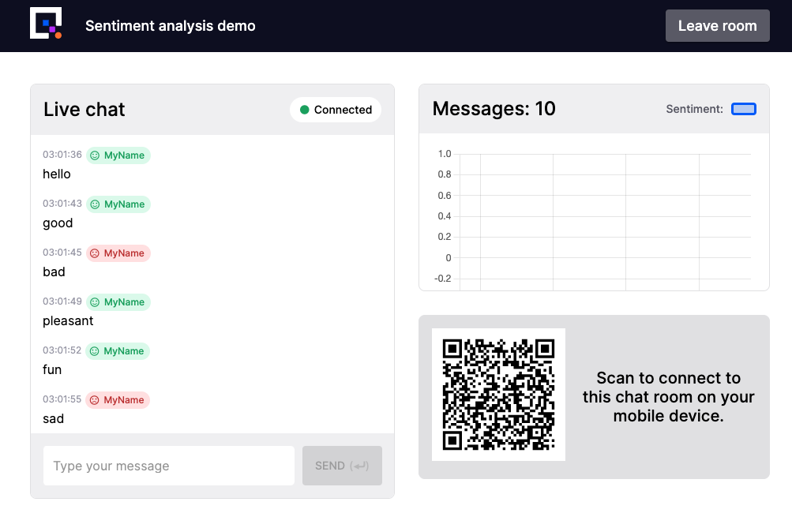
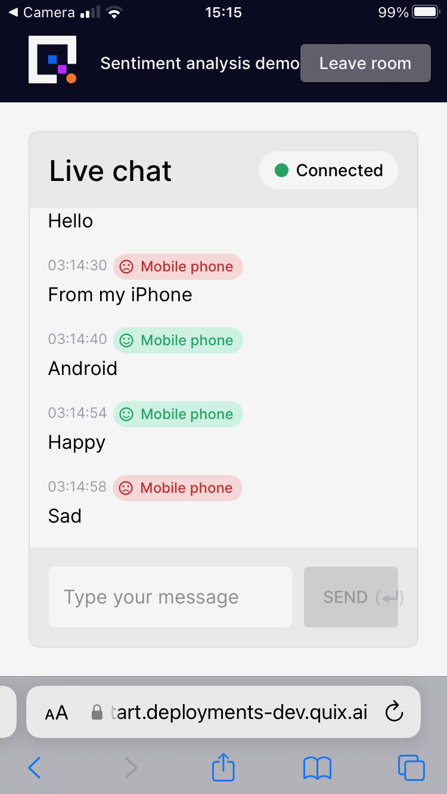
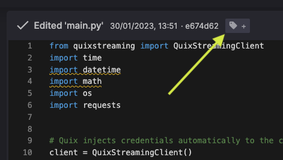
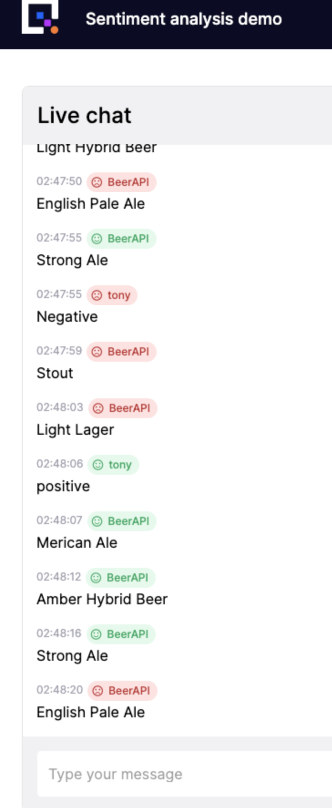

# Quickstart

This quickstart guide aims to get you using Quix effectively in the shortest possible time.

It shows you how to deploy a real-time app in the Quix platform and highlights important aspects of the code. It also shows you how to create your own source and transformation, using Quix templates.

Sign up for a free [Quix account](https://portal.platform.quix.ai/self-sign-up){target=_blank}.

For convenience this guide is divided into two parts:

1. **Deploy a chat UI with sentiment analysis** - in this part you deploy a real-time chat application and connect to it with your computer and phone. You also perform sentiment analysis on the messages in a chat room. 

    This part does not require any coding, as it uses prebuilt code samples for services, so is suitable for those who'd like to get an understanding of how Quix works, without needing to write code. 
    
    The pipeline you create in this part is shown in the following screenshot:

    

2. **Connect an external service** - in this part you add an external data feed to the pipeline using code samples that you will create from templates, and see data delivered in real time to your chat app.

    This part requires some basic Python coding skills. However, as all code you need is provided for you, this is suitable for beginners.

    The completed pipeline you create is shown in the following screenshot:

    

## Getting help

If you need help with this guide, then please join our public Slack community [`The Stream`](https://quix.io/slack-invite){target=_blank} and ask any questions you have there.

## Part 1. Deploy a chat UI with sentiment analysis

To use Quix effectively in the shortest possible time, you will initially use prebuilt code samples from the [Code samples](https://github.com/quixio/quix-samples){target=_blank}. These open source code samples have already been coded and tested by Quix engineers, and other contributors. All you have to do is configure them (if required) and deploy them to your workspace.

### Deploy sentiment analysis

To compliment the chat UI, you will first deploy a prebuilt microservice designed to analyze the sentiment of messages in the chat.

1. Click <span class="border-violet-dash">`+ Add transformation`</span> on the home screen.

    ???- note "Not your first time?"
        If this is not your first time deploying a service to this workspace then navigate to the code samples using the left-hand navigation instead.

2. Use the search box to find the `Sentiment analysis` sample. 

3. Click `Setup & deploy`.

4. Set `input` to the `messages` topic and `output` to the `sentiment` topic. You may need to create the required topics using the `new topic` dropdown.

5. Click the `Deploy` button in the top right.

6. In the `Deploy` dialog, in deployment settings panel, increase the CPU and memory to your maximum.

7. Click `Deploy`.

!!! success
        
    You located and deployed the sentiment analysis microservice to the Quix platform.

    This microservice will subscribe to the `messages` topic and process data to determine the sentiment of any messages in real time. This sentiment value is published to the `sentiment` topic.

### Deploy the chat UI

You are going to locate and deploy a chat UI. The chat UI is written in Angular and connects to Quix using the [Streaming Reader API](../../../apis/streaming-reader-api/intro.md). The chat UI enables you to see messages on both your phone and computer in real-time. The sentiment of each message is also displayed.

1. Navigate to the code samples using the left-hand navigation.

2. Use the search box to find the `Sentiment Demo UI` sample.

3. Click `Setup & deploy`. Notice that this service will read from both the `messages` topic and the `sentiment` topic.

4. Click `Deploy`. The `Deploy` dialog is displayed.

5. Click the `Public Access` section of the `Deploy` dialog to expand it.

6. Click the toggle switch to enable public access.

7. Click `Deploy` on the dialog.

!!! success
        
    You located, and deployed the chat UI code to the Quix platform.

    The UI is comprised of a relatively simple Angular app that subscribes to Quix topics and streams chat messages and sentiment data in real time.


??? example "Understand the code"

    1. Locate the `Sentiment Demo UI` item in the code samples again, and then click `Preview code`. This is just one way to access the code.

    2. Expand the tree view and select the `webchat.component.ts` file.
    
        {width=250px}
    
    3. Locate the `connect()` method.
    
        Notice the `SubscribeToEvent` and `SubscribeToParameter` lines. These are used to tell Quix that the code should be notified as soon as data arrives. Specifically any data arriving for the specified topic, stream and event or parameter.

    4. Above the parameter and event subscriptions in the same file you will see the handlers. These will handle the data, doing whatever is needed for the app. In this case we add the messages to a list, which is then displayed in the UI.

        ```nodejs
        this.quixService.readerConnection.on('EventDataReceived', (payload) => {...}

        this.quixService.readerConnection.on('ParameterDataReceived', (payload) => {...}
        ```
    
    For more on connecting to Quix with a web-based UI, take a look at how to [read](../../../platform/how-to/webapps/read.md) and [write](../../../platform/how-to/webapps/write.md) with Node.js.

### Try it out

#### In the browser

Once the UI is built and deployed you can go ahead and click the {width=20px} icon on the `Sentiment Demo UI` service tile.

You will see a form asking you to enter the name for a chat room and your own name. 

1. Enter `MyRoom` for the room name (although it can be anything) and your name.

  {width=350px}

2. Click `Connect`.

  You will be redirected to the chat page.

  The most notable features of this page are the chat area, the sentiment graph, and the QR code.

3. Enter some positive and negative messages in the chat window.

4. You will see your messages and a short time later the sentiment of the message will be indicated by the name tag next to each message changing color.

  {width=350px}

#### On your mobile

Now join the chat with your mobile phone, chat messages will be displayed both on the phone and in the browser.

1. With your mobile phone, scan the QR code.

2. Use the same room name as before `Room1`.

3. Use a different name, such as `Mobile`.

4. Type some messages.

You will see the message and its sentiment on your phone:

{width=280px}

And the same messages and sentiment will appear in real time in your computer's web browser.

## Part 2. Connect an external service

Now that you have the basics of searching the code samples, selecting and deploying them to the Quix serverless infrastructure, you can learn how to add additional services to the pipeline. In this guide you'll connect to a web service to receive data, and then transform it so it's compatible with the chat UI.

### Create the data source

In this section you will learn how to use a template to help quickly build a Quix source.

1. Navigate to the code samples.

2. Search for the `Empty template - Source`. If should have a blue highlight (blue is used to indicate a source).

3. Click `Preview code`.

4. Click `Edit code`.

5. Change the name to `API Data`.

6. In the `output` field, click `new topic` to create a new topic called `api-data`.

7. Click `Save as project`.

You now have a project for a Quix source you can modify to suit your own requirements. In this case the code will pull data periodically from an external REST API, using the `requests` library. To modify the template code:

1. Add `requests` on a new line to the `requirements.txt` file and save it. 

    You use the `requests` library to fetch data from the web service. Any libraries included in the requirements file will automatically be included in the project build.

2. Open the `main.py` file.

3. Add the following import statement at the top of the file:

    ```python 
    import requests
    ```

4. Delete the for-loop code between the following print statements:

    ```python
    print("Sending values for 30 seconds.")

    # delete code here

    print("Closing stream")
    ```

5. Add the following code between those print statements:

    ```python
    while True:

        # get a random beer from this free API
        response = requests.get("https://random-data-api.com/api/v2/beers")

        # print the response data
        print(response.json())

        # sink the beer's `style` to Quix as an event
        stream.events.add_timestamp(datetime.datetime.utcnow()) \
        .add_value("beer", response.json()["style"]) \
        .write()

        # sleep for a bit
        time.sleep(4)
    ```

    This code performs a `GET` request to retrieve beer information from the REST API.

6. Lastly, delete the following lines:

    ```python
    stream.parameters.add_definition("ParameterA").set_range(-1.2, 1.2)
    stream.parameters.buffer.time_span_in_milliseconds = 100
    ```


7. Save and then run the code by clicking the `Run` button near the top right of the code editor window.

Every 4 seconds the random beer API is called, and a new style of beer is published to the Quix topic `api-data`.

8. Click `Stop` to stop the code running (mouse over the `Running` button).

??? example "Understand the code"

    The complete code for `main.py` is shown here:

    ```python
    from quixstreaming import QuixStreamingClient
    import time
    import datetime
    import os
    import requests  # (1)


    # Quix injects credentials automatically to the client. Alternatively, you can always pass an SDK token manually as an argument.
    client = QuixStreamingClient()

    # Open the output topic where to write data out
    output_topic = client.open_output_topic(os.environ["output"])

    stream = output_topic.create_stream()
    stream.properties.name = "Hello World python stream"

    print("Sending values for 30 seconds.")

    while True:

        # get a random beer from this free API
        response = requests.get("https://random-data-api.com/api/v2/beers") # (2)

        # print the response data
        print(response.json()) # (3)

        # sink the beer's `style` to Quix as an event (4)
        stream.events.add_timestamp(datetime.datetime.utcnow()) \  
        .add_value("beer", response.json()["style"]) \
        .write()

        # sleep for a bit
        time.sleep(4) # (5)

    print("Closing stream")
    stream.close()
    ```

    1. Import the `requests` library. You use this to make a `GET` request on the beer REST API.
    2. Make the request to the beer API endpoint. This is a blocking call.
    3. Print the response received from the API endpoint.
    4. Adds a timestamp and a value to the event data. This is then written to the output stream.
    5. Sleep for four seconds before looping back to make another request. 

### Tag and deploy the API Data service

To create a tagged version of your code:

1. Click the add tag button:

    

2. Enter `v1` and press ++enter++.

You have now create the `v1` tag. You'll select to deploy this version in the next section.

Deploy the `v1` code so it will run continuously:

1. Click `Deploy` in the top right.

2. In the `Version tag` drop-down, select `v1`.

3. In the `Deployment Settings` panel, make sure the `Service` radio button is selected.

4. Click `Deploy` on the dialog.

!!! success

    You have now created your own Quix source by modifying a standard source template, and deployed it.

### Transformation of API Data 

Now that you have some data, you need to transform it to make it compatible with the rest of your data processing pipeline, in this case the chat UI and the sentiment analysis service.

You will now locate a suitable transformation template and modify it to handle the incoming beer styles and output them as chat messages.

1. Search the code samples for `Empty template - Transformation`.

2. Click `Preview code`.

3. Click `Edit code`.

4. Change the value of the `Name` field to `Beer to chat`.

5. Change the `input` field to `api-data`. This is the topic you set as the output for the API data.

6. In the `output` field, click `new topic` and create the `messages` topic.

7. Click `Save as project`.

You have now saved the template to your workspace. In the next section you'll modify your code to suit your requirements.

1. Add the following import to the `quix_function.py` file:

	```python
	import datetime
	```

    You'll need to include this module to use the `datetime` function to add a timestamp to your event data.

2. Locate the `on_event_data_handler` method.

3. Replace the comment `# Here transform your data.` with the following code

	```python
	# stream chat-messages to the output topic
    self.output_stream.parameters.buffer.add_timestamp(datetime.datetime.utcnow()) \
		.add_value("chat-message", data.value) \
		.add_tag("room", "Beer") \
		.add_tag("name", "BeerAPI") \
		.write()
	```

    This writes data to the output stream in the parameter data format.

4. Delete the last line of the method:

	```python
	self.output_stream.events.write(data)
	```

    This is not longer required as the previous method writes out the data in the parameter format.

5. Save the file.

6. Open the `main.py` file.

8. Locate the following line:

	```python
	output_stream = output_topic.create_stream(input_stream.stream_id)
	```

9. Replace it with:

    ```python
    output_stream = output_topic.get_or_create_stream("beer")
    ```

    This code creates the output stream if it does not exist. The chat UI will write messages from this stream into the chat room with the same name.

10. Save, tag, and deploy this project!

!!! success

	You have built a transformation to take output from an API and turn it into messages that the existing parts of the pipeline can use.

## Try it out

1. Navigate to the UI you deployed earlier. Ensure you are in the `lobby`.

2. Enter `beer` for the room name and provide any name for yourself.

3. You can now see the messages arriving from the API as well as the calculated sentiment for them:

    {width=300px}

## Summary

This quickstart guide aimed to give you a tour of some important Quix features. You have learned:

1. Quix enables you to build complex data processing pipelines, using prebuilt items from the code samples.

2. You can get data into and out of Quix using a variety of methods, including polling data, and using a websockets-based API such as the [Streaming Reader API](../../../apis/streaming-reader-api/intro.md). Webhooks are also supported.

3. You can use templates to help rapidly develop new code samples. You built a new source and a new transformation from templates.

4. Quix uses [topics](../../definitions.md#topics) and [streams](../../definitions.md#stream) to route data between services in a pipeline.

5. You can build part of a Quix data processing pipeline, test it, and then extend the pipeline as required.

## Next steps

Try one of the following resources to continue your Quix learning journey:

* [Quix definitions](../../definitions.md)

* [The Stream community on Slack](https://quix.io/slack-invite){target=_blank}

* [Stream processing glossary](https://quix.io/stream-processing-glossary/){target=_blank}

* [Sentiment analysis tutorial](../sentiment-analysis/index.md)
