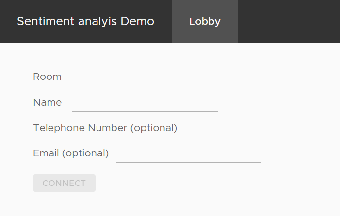
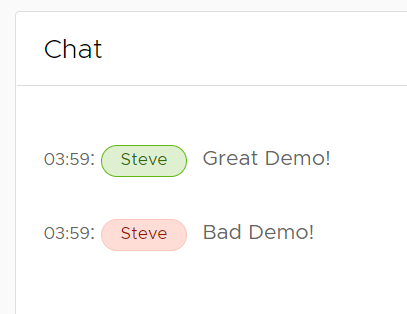

# Sentiment analysis

Build a real time sentiment analysis pipeline. Use the power and ease of Quix to process high volume tweets or user sourced conversation messages.

{width=450px}

## Get Started

To get started make sure you have a Quix account, sign up for a completely free account at [here](https://quix.io/signup){target=_blank}

You’ll also need a Twitter developer account.

A rough guide to getting this is as follows:

Register for an account [here](https://developer.twitter.com/en/apply-for-access){target=_blank}

1. Fill out the forms, there are quite a few\!

2. Wait for Twitter to provide you with your account.

3. Once you have your account locate the `Keys and Tokens` page

4. Save your bearer token for later

Use one of the many guides on YouTube or try [this one](https://youtu.be/vlvtqp44xoQ?t=21){target=_blank} if you need some help creating your Twitter developer account and filling in all those forms.

If you need any assistance, we’re here to help in [The Stream](https://join.slack.com/t/stream-processing/shared_invite/zt-13t2qa6ea-9jdiDBXbnE7aHMBOgMt~8g){target=_blank}, our free Slack community. Just introduce yourself and then ask any questions in `quix-help`.

### Library

Most of the code you need has already been written for you and it’s located in our library. We’ll be referring to the library often so make sure you know where it is.

## Pipeline Services

There are 4 stages to the pipeline you will build in this tutorial.


### 1. Twitter Data Source

Our Twitter connector, pre-built to save you time. This is the data source for the tutorial.

### 2. Tweet to chat

Convert Twitter text to chat messages, so they can be used alongside manually entered chat messages. 

This is an example of a transformation. You will usually need to transform or alter data flowing through the pipeline, this is a simple example of how to do that.

### 3. Sentiment analysis

Do the real work of analyzing chat and tweet sentiment.

This is another example of a transformation. This time a little more complex.

### 4. Web UI

A web UI allowing you to enter and see messages as well as see the sentiment changes in real time.

The UI is both a destination and a data source, since it will subscribe to and receive data as well as publish data to the topic.

## Build It

This guide will show you how to deploy each stage of the processing pipeline, starting with the Web UI.

### 1. Web UI

Follow these steps to deploy the Web UI.

1. Navigate to the Library and locate `Sentiment Demo UI`.

2. Click `Edit code`

3. Ensure that the `sentiment` input contains `sentiment`

    - This topic will be subscribed to and will contain the sentiment scores from the sentiment analysis service, you'll deploy this next.

3. Ensure that the `messages` input contains `messages`

    - This topic will contain all the chat messages.
    - The UI will subscribe to this topic, to display new Twitter messages, as well as publishing to the topic when a user sends a message using the send button in the UI.
    - The sentiment analysis service will also subscribe to messages on this topic to produce sentiment scores.

3. Click `Save as project` The code for this Angular UI is now saved to your workspace

#### Tag the code and deploy the UI

1. Click the +tag button at the top of any code file

2. Enter v1 and press enter

3. Click Deploy near the top right corner

4. In the deployment dialog, select v1 under the `Version Tag`
    
    - This is the tag you just created

5. Click `Service` in `Deployment Settings`
    
    - This ensures the service runs continuously

6. Click the toggle in `Public Access`

7. This enables access from anywhere on the internet

8. Click `Deploy`
    
    - The UI will stream data from the `sentiment` and `messages` topics as well as send messages to the `messages` topic.

9. Once deployed, click the service tile

10. Click the `Public URL`
    
	!!! info
	
		This is the user interface for the demo. This screenshot shows the view you’ll see after creating a `room` to chat in.

		{width=550px}

### 2. Sentiment analysis

Follow these steps to deploy the sentiment analysis stage.

1. Navigate to the Library and locate `Sentiment analysis` transformation.

2. Click `Edit code`

3. Click `Save as project`
    
    - The code for this transformation is now saved to your workspace

4. Locate main.py

5. Locate the line of code that creates the output stream
    
    ``` python
    output_stream=output_topic.create_stream(input_stream.stream_id)
    ```

6. Append `-output` to the stream id.
    
    - This will ensure the Web UI is able to locate the sentiment being output by this transformation service.
    
    ``` python
    output_stream=output_topic.create_stream(input_stream.stream_id + "-output")
    ```

#### Tag the code and deploy the service

1. Click the `+tag` button at the top of any code file

2. Enter `v1` and press enter

3. Click `Deploy` near the top right corner

4. In the deployment dialog, select v1 under the `Version Tag`
    
    - This is the tag you just created

5. Click `Service` in `Deployment Settings`
    
    - This ensures the service runs continuously

6. Click `Deploy`
    
    - This service receives data from the `messages` topic and streams data out to the `sentiment` topic.
    
    - You can now go to the public URL of the Web UI project you deployed in step one. 
    
    - Enter values for `Room` and `Name` . Click connect.
    
	    {width=400px}
    
    - You can now enter `chat` messages.
    
        {width=250px}
    
        !!! info
            The messages will be passed to the sentiment analysis service you deployed in step two. The sentiment is returned to the Web UI and displayed both in the chart and next to the comment in the chat window by colorizing the chat user’s name.

### 3. Tweet to chat conversion

This service subscribes to the `twitter-data` topic and publishes data to the `messages` topic. It transforms the incoming data to make it compatible with the UI and sentiment scoring service.

Follow these steps to deploy the tweet-to-chat conversion stage:

1. Navigate to the Library and apply the following filters
    
    1. Languages = Python
    
    2. Pipeline Stage = Transformation
    
    3. Type = Basic templates

2. Select `Empty template- Transformation`.

3. Click `Edit code`

4. Change the name to `tweet-to-chat`

5. Change the input to `twitter-data` by either selecting it or typing
    it.

6. Ensure the output is set to `messages`

7. Click `Save as project`
    
    - The code for this transformation is now saved to your workspace

8. Locate main.py

9. Add `import pandas as pd` to the imports at the top of the file.

10. Locate the line of code that creates the output stream
    
    ``` python
    output_stream = output_topic.create_stream(input_stream.stream_id)
    ```

11. Change this line to get or create a stream called `tweets`
    
    ``` python
    output_stream = output_topic.get_or_create_stream("tweets")
    ```

12. Now locate quix\_function.py
    
    - Alter the on\_pandas\_frame\_handler to match the code below
    
        ``` python
        def on_pandas_frame_handler(self, df: pd.DataFrame):
            for index, row in df.iterrows():
                text = row["text"]
                self.output_stream.events.add_timestamp_nanoseconds(row.time)\
                .add_tag("name", "Twitter") \
                .add_value("chat-message", text) \
                .write()
        ```
    
        !!! info 
            
            This will take `text` from incoming tweets and stream them to the output topics tweets stream as event values with a key of `chat-message` which the other stages of the pipeline will recognize.

#### Deploy the service:

You'll now tag the code and deploy the service with these steps:

1. Click the +tag button at the top of any code file

2. Enter v1 and press enter

3. Click Deploy near the top right corner

4. In the deployment dialog, select v1 under the `Version Tag`
    
    a. This is the tag you just created. 
    b. Click `Service` in `Deployment Settings`. This ensures the service runs continuously 
    c. Use the slider to allocate 1GB of memory for this service.
    d. Click `Deploy`
    
    !!! success
	
		You now have a service that is ready to receive tweets and pass them onto the sentiment processing stage.

    !!! info 

        Tagging the code means that you can easily locate which version of the code is deployed.

### 4. Twitter Data Source

Follow these steps to deploy the Web UI.

1. Navigate to the Library and locate `Twitter Data - Source`.

2. Click `Setup & deploy`

3. Enter your Twitter bearer token into the appropriate field

4. Click `Deploy`
    
    This service receives data from Twitter and streams it to the `twitter-data` topic. 
    
    !!! note 
        The default Twitter search criteria is looking for Bitcoin tweets, it’s a high traffic subject and great for the demo. Feel free to change this once you’ve got the demo working. 
        
    a. Locate the Web UI you deployed in step one
    b. Navigate to the lobby 
    c. Enter `tweets` for the chatroom and provide a name for the `name` field 
    d. Click `connect`
    
    You will see 'Bitcoin' tweets arriving in the chat along with the calculated average sentiment in a chart.
    
    {width=550px}

!!! success
	Your pipeline is now complete, you can send and view chat messages, receive tweets and analyze the sentiment of all of the messages.

	Share the QR code with colleagues and friends to talk about anything you like while Quix analyzes the sentiment in the room in real time.

## Next Steps

You’ve just made extensive use of the Quix library, our collection of open source connectors, samples and examples. Now you can build your own connectors and apps and contribute by going to our Github [here](https://github.com/quixai/quix-library){target=_blank}, forking our library repo and submitting your code, updates and ideas.

What will you build, let us know. We’d love to feature your project or use case in our newsletter.

If you need any assistance, we’re here to help in [The Stream](https://join.slack.com/t/stream-processing/shared_invite/zt-13t2qa6ea-9jdiDBXbnE7aHMBOgMt~8g){target=_blank}, our free Slack community. Introduce yourself and then ask any questions in `quix-help`.

## The End

We hope you enjoyed this tutorial on how to Build a real time chat and tweet sentiment analysis pipeline.

If you have any questions or feedback please contact us on The Stream.

Thank you and goodbye for now\!
