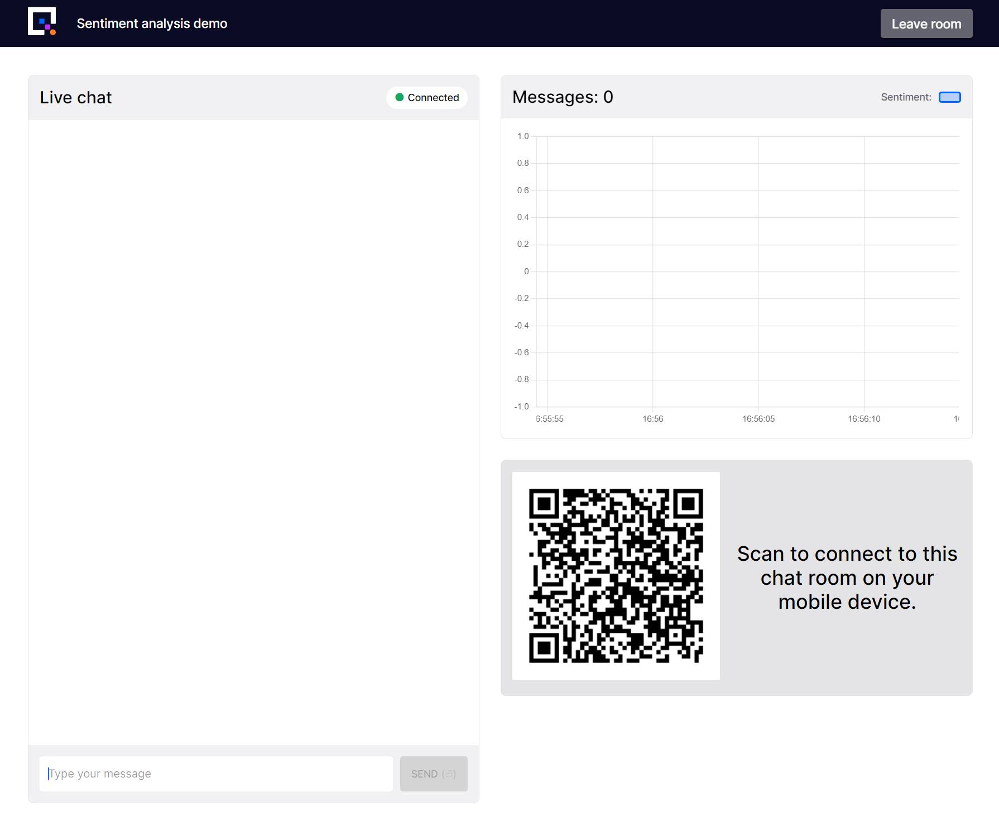
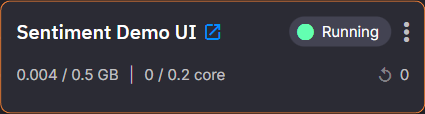

# 1. Chat App

This `Chat App` is the UI for the tutorial and allows the user to see messages from all of the users of the app and, in later parts of this tutorial series, will allow the users to see the sentiment of the chat messages.

This is what you will achieve by the end of this page:

{width=550px}

## Locate the Library item

This stage will guide you through selecting the demo UI Library item and deploying it to your workspace. 

Follow these steps:

1. Navigate to the Library and locate `Sentiment Demo UI`.

2. Click `Setup and deploy`

3. Ensure that the `sentiment` input box contains `sentiment`

	- This topic will be subscribed to and will contain the sentiment scores from the sentiment analysis service, you'll deploy this in a later part of this tutorial.

3. Ensure that the `messages` input contains `messages`

	- This topic will contain all the chat messages.
	- The UI will subscribe to this topic, to display new messages, as well as publishing to the topic when a user sends a message using the 'send' button in the UI.
	- Later, the sentiment analysis service will also subscribe to messages on this topic to produce sentiment scores.

3. Click `Deploy` 

???- info "Customize the UI"

	## Customize the UI (optional)

	If you want to customize the UI in any way, follow these steps to save the UI code and deploy it.

	1. Navigate to the Library and locate `Sentiment Demo UI`.

	2. Click `Edit code`

	3. Ensure that the `sentiment` input box contains `sentiment`

		- This topic will be subscribed to and will contain the sentiment scores from the sentiment analysis service, you'll deploy this in a later part of this tutorial.

	3. Ensure that the `messages` input contains `messages`

		- This topic will contain all the chat messages.
		- The UI will subscribe to this topic, to display new messages, as well as publishing to the topic when a user sends a message using the 'send' button in the UI.
		- Later, the sentiment analysis service will also subscribe to messages on this topic to produce sentiment scores.

	3. Click `Save as project` 

		- The code for this Angular UI is now saved to your workspace

	4. At this stage if you want to customize the code you can do so. You can also deploy what you have a customize it later by repeating the steps below. 

	### Deploy the UI

	1. Click the `+tag` button at the top of any code file

	2. Enter `v1` and press enter

	3. Click `Deploy` near the top right corner

	4. In the deployment dialog, select your tag e.g. `v1` under the `Version Tag`
		
		- This is the tag you just created

	5. Click `Service` in `Deployment Settings`
		
		- This ensures the service runs continuously

	6. Click the toggle in `Public Access`

		- This enables access from anywhere on the internet

	8. Click `Deploy`
		
		- The UI will stream data from the `sentiment` and `messages` topics as well as send messages to the `messages` topic.

		- The sentiment topic will be used later for sentiment analysis.

	9. Once deployed, click the service tile

	10. Click the `Public URL` {width=18px}
  

!!! info "Find the URL"

	To find the URL to the UI go to the homepage and locate the tile representing the deployed service

	{width=200px}

	Click the 'open in new window' icon {width=18px}

!!! info

	This is the user interface for the demo. This screenshot shows the view you’ll see after creating a `room` to chat in.

	{width=550px}

!!! success

	Now enter some messages, they'll be shown in the chat list!

	To make the demo more entertaining use your phone to scan the QR code or send the link to the page to a friend or colleague, you'll see their chat messages appear in your window in real-time!

[Analyze the sentiment of your messages by following Part 2 of this tutorial :material-arrow-right-circle:{ align=right }](sentiment.md)
