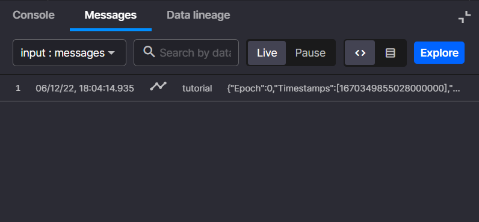

# Sentiment analysis microservice

In this optional tutorial part, you learn how to code a sentiment analysis microservice, starting with a template from the Quix Library. Templates are useful building blocks the Quix platform provides, and which give you a great starting point from which to build your own microservices.

!!! note
    The code shown here is kept as simple as possible for learning purposes. Production code would require more robust error handling.

## Prerequisites

It is assumed that you have a data source such as the [Sentiment Demo UI](sentiment-demo-ui.md) used in the Sentiment Analysis tutorial. It supplies data to a `messages` topic and has a `chat-message` column in the dataset.

Follow the steps below to code, test, and deploy a new microservice to your workspace.

## Select the template

Follow these steps to locate and save the code to your workspace:

1. Navigate to the Library and apply the following filters:
    
    1. Languages = `Python`
    
    2. Pipeline Stage = `Transformation`
    
    3. Type = `Basic templates`

2. Select `Empty template - Transformation`.

    - This is a simple example of how to subscribe and publish messages to Quix.
    - You can't edit anything here, this is a read-only view so you can explore the files in the template and see what each one does.

3. Click `Preview code` then `Edit code`.

4. Change the name to `Sentiment analysis`.

5. Ensure the "input" is set to `messages`.

    This is the topic that is subscribed to for messages to analyze.

6. Ensure the "output" is set to `sentiment`.

    This is the topic that sentiment results are published to.

7. Click `Save as project`.

    The code is now saved to your workspace, you can edit and run it as needed before deploying it into the Quix production-ready, serverless, and scalable environment.

## Development lifecycle

You're now located in the Quix online development environment, where you will develop the code to analyze the sentiment of each message passing through the pipeline. The following sections step through the development process for this tutorial:

1. Running the unedited code
2. Creating a simple transformation to test your code
3. Implementing the sentiment analysis code
4. Running the sentoment analysis code

### Running the code

Begin by running the code as it is, using the following steps:

1. To get started with this code, click the `run` button near the top right of the code window.

    You'll see the message below in the console output:

    ```sh
    Opening input and output topics
    Listening to streams. Press CTRL-C to exit.
    ```

2. Open the Chat App UI you deployed in part 1 of this tutorial and send some messages.

    You will see output similar to this:

    ``` sh
    Opening input and output topics
    Listening to streams. Press CTRL-C to exit.
                    time  ... TAG__email
    0  1670349744309000000  ...           

    [1 rows x 7 columns]
    ```

    This is the Panda DataFrame printed to the console.

3. To enable you to view the messages more easily you can click the "Messages" tab and send another message from the UI.

    You will see messages arriving in the messages tab:

    {width=250px}

    Now click one of the messages. You will see the [JSON](https://www.w3schools.com/whatis/whatis_json.asp){target=_blank} formatted message showing the various parts of the message payload, for example, the "chat-message" and "room":

    {width=250px}

### Creating a simple transformation

Now that you know the code can subscribe to messages, you need to transform the messages and publish them to an output topic.

1. If your code is still running, stop by clicking the same button you used to run it.

2. Locate the `on_pandas_frame_handler` in `quix_function.py`.

3. Replace the comment `# Here transform your data.` with the code below:

    ```python
    # transform "chat-message" column to uppercase
    df["chat-message"] = df["chat-message"].str.upper()
    ```

4. Run the code again, and send some more chat messages from the UI.

5. The messages in the UI are now all in uppercase as a result of your transformation.

Don't forget to stop the code again.

### Sentiment analysis

Now it's time to update the code to perform the sentiment analysis.

#### requirements.txt

1. Select the `requirements.txt` file.

2. Add a new line, insert the following text and save the file:

    ```sh
    transformers[torch]
    ```

#### main.py

Follow these steps to make the necessary changes:

1. Locate the file `main.py`.

2. Import `pipeline` from `transformers`:

    ```python
    from transformers import pipeline
    ```

3. Create the `classifier` property and set it to a new pipeline:

    ```python
    classifier = pipeline('sentiment-analysis')
    ```

    ???- info "What's this `pipeline` thing?"

        The pipeline object comes from the transformers library. It's a library used to integrate [huggingface.co](https://huggingface.co/){target=_blank} models.
        
        The pipeline object contains several transformations in series, including cleaning and transforming to using the prediction model, hence the term `pipeline`.
        
        When you initialize the pipeline object you specify the model you want to use for predictions.
        
        You specified `sentiment-analysis` which directs huggingface to provide their standard one for sentiment analysis.

4. Locate the `read_stream` method and pass the `classifier` property into the `QuixFunction` initializer as the last parameter:

    The `QuixFunction` initialization should look like this:
    ```python
    # handle the data in a function to simplify the example
    quix_function = QuixFunction(input_stream, output_stream, classifier)
    ```

???- info "The completed `main.py` should look like this"

    ```python
    from quixstreaming import QuixStreamingClient, StreamEndType, StreamReader, AutoOffsetReset
    from quixstreaming.app import App
    from quix_function import QuixFunction
    import os
    from transformers import pipeline

    classifier = pipeline('sentiment-analysis')


    # Quix injects credentials automatically to the client. Alternatively, you can always pass an SDK token manually as an argument.
    client = QuixStreamingClient()

    # Change consumer group to a different constant if you want to run model locally.
    print("Opening input and output topics")

    input_topic = client.open_input_topic(os.environ["input"], auto_offset_reset=AutoOffsetReset.Latest)
    output_topic = client.open_output_topic(os.environ["output"])


    # Callback called for each incoming stream
    def read_stream(input_stream: StreamReader):

        # Create a new stream to output data
        output_stream = output_topic.create_stream(input_stream.stream_id)
        output_stream.properties.parents.append(input_stream.stream_id)

        # handle the data in a function to simplify the example
        quix_function = QuixFunction(input_stream, output_stream, classifier)
            
        # React to new data received from input topic.
        input_stream.events.on_read += quix_function.on_event_data_handler
        input_stream.parameters.on_read_pandas += quix_function.on_pandas_frame_handler

        # When input stream closes, we close output stream as well. 
        def on_stream_close(endType: StreamEndType):
            output_stream.close()
            print("Stream closed:" + output_stream.stream_id)

        input_stream.on_stream_closed += on_stream_close

    # Hook up events before initiating read to avoid losing out on any data
    input_topic.on_stream_received += read_stream

    # Hook up to termination signal (for docker image) and CTRL-C
    print("Listening to streams. Press CTRL-C to exit.")

    # Handle graceful exit of the model.
    App.run()
    ```

#### quix_function.py

You have completed the changes needed in `main.py`, now you need to update `quix_function.py`.

##### imports

1. Select the `quix_function.py` file.

2. Add the following to the top of the file under the existing imports:

    ```python
    from transformers import Pipeline
    ```

##### init function

1. Add the following parameter to the `__init__` function:

    ```python
    classifier: Pipeline
    ```

    You will pass this in from the `main.py` file in a moment.

2. Initialize the `classifier` property with the passed in parameter:

    ```python
    self.classifier = classifier
    ```

3. Initialize `sum` and `count` properties:

    ```python
    self.sum = 0
    self.count = 0
    ```

    !!! info "__init__"

        The completed `__init__` function should look like this:

        ```python
        def __init__(self, input_stream: StreamReader, output_stream: StreamWriter, classifier: Pipeline):
            self.input_stream = input_stream
            self.output_stream = output_stream
            self.classifier = classifier

            self.sum = 0
            self.count = 0
        ```

##### on_pandas_frame_handler function

Now, following these steps, edit the code to calculate the sentiment of each chat message using the classifier property you set in the init function.

1. Locate the `on_pandas_frame_handler` function you added code to earlier.

2. Change the `on_pandas_frame_handler` function to the following code:

    ```python
    # Callback triggered for each new parameter data.
    def on_pandas_frame_handler(self, df_all_messages: pd.DataFrame):

        # Use the model to predict sentiment label and confidence score on received messages
        model_response = self.classifier(list(df_all_messages["chat-message"]))

        # Add the model response ("label" and "score") to the pandas dataframe
        df = pd.concat([df_all_messages, pd.DataFrame(model_response)], axis=1)

        # Iterate over the df to work on each message
        for i, row in df.iterrows():

            # Calculate "sentiment" feature using label for sign and score for magnitude
            df.loc[i, "sentiment"] = row["score"] if row["label"] == "POSITIVE" else - row["score"]
            
            # Add average sentiment (and update memory)
            self.count = self.count + 1
            self.sum = self.sum + df.loc[i, "sentiment"]
            df.loc[i, "average_sentiment"] = self.sum/self.count

        # Output data with new features
        self.output_stream.parameters.write(df)
    ```

    This is the heart of the sentiment analysis processing code. It analyzes the sentiment of each message and tracks the average sentiment of the whole conversation. The code works as follows:

    1. Pass a list of all of the "chat messages" in the data frame to the classifier (the sentiment analysis model) and store the result in memory.

    2. Concatenate (or add) the model response data to the original data frame.

    3. For each row in the data frame:

        1. Use the `label`, obtained from running the model, which is either `POSITIVE` or `NEGATIVE` together with the `score` to assign either `score` or `- score` to the `sentiment` column.

        2. Maintain the count of all messages and total of the sentiment for all messages so that the average sentiment can be calculated.

        3. Calculate and assign the average sentiment to the `average_sentiment` column in the data frame.

???- info "The completed `quix_function.py` should look like this"

    ```python
    from quixstreaming import StreamReader, StreamWriter, EventData, ParameterData
    import pandas as pd
    from transformers import Pipeline

    class QuixFunction:
        def __init__(self, input_stream: StreamReader, output_stream: StreamWriter, classifier: Pipeline):
            self.input_stream = input_stream
            self.output_stream = output_stream
            self.classifier = classifier

            self.sum = 0
            self.count = 0

        # Callback triggered for each new event.
        def on_event_data_handler(self, data: EventData):
            print(data.value)

            print("events")

        # Callback triggered for each new parameter data.
        def on_pandas_frame_handler(self, df_all_messages: pd.DataFrame):

            # Use the model to predict sentiment label and confidence score on received messages
            model_response = self.classifier(list(df_all_messages["chat-message"]))

            # Add the model response ("label" and "score") to the pandas dataframe
            df = pd.concat([df_all_messages, pd.DataFrame(model_response)], axis=1)

            # Iterate over the df to work on each message
            for i, row in df.iterrows():

                # Calculate "sentiment" feature using label for sign and score for magnitude
                df.loc[i, "sentiment"] = row["score"] if row["label"] == "POSITIVE" else - row["score"]
                
                # Add average sentiment (and update memory)
                self.count = self.count + 1
                self.sum = self.sum + df.loc[i, "sentiment"]
                df.loc[i, "average_sentiment"] = self.sum/self.count

            # Output data with new features
            self.output_stream.parameters.write(df)
    ```

### Running the completed code

Now that the code is complete you can `Run` it one more time, just to be certain it's doing what you expect.

!!! note

    This time, when you run the code, it will start-up and then immediately download the `sentiment-analysis` model from [huggingface.co](https://huggingface.co/){target=_blank} 

1. Click `Run`.

2. Click the `Messages` tab and select the `output` topic called `sentiment`.

3. Send some "Chat" messages from the Chat App UI.

4. Now select a row in the `Messages` tab and inspect the JSON message.

    You will see the `sentiment` and `average_sentiment` in the `NumericValues` section and the `chat-message` and `label` in the `StringValues` section:

    {width=350px}

5. You can also verify that the Web Chat UI shows an indication of the sentiment for each message as well as showing the average sentiment in the graph:

    {width=450px}

## Deploying your sentiment analysis code

Now that the sentiment analysis stage is working as expected you can deploy it to the Quix serverless environment.

!!! info 

    If you're thinking that it's already running, so why do you need to bother with this extra step, you should know that the code is currently running in a development sandbox environment. This is separate from the production environment, and is not scalable or resilient. Its main purpose is to allow you to iterate on the development cycle of your Python code, and make sure it runs without error, before deployment.

Tag the code and deploy the service:

1. Click the `+tag` button at the top of the code file.

2. Enter `v1` and press ++enter++.
    
    This tags the code with a specific identifier and allows you to know exactly which version of the code you are deploying.

3. Click `Deploy` near the top right corner.

4. Select `v1` under the `Version Tag`.

    This is the same tag you created in step 2.

5. In `Deployment settings` change the CPU to 1 and the Memory to 1. 
    
    This ensures the service has enough resources to download and store the hugging face model and to efficiently process the messages. If you are on the free tier, you can try things out with your settings on the maximum for CPU and Memory.

6. Click `Deploy`.

    - Once the service has been built and deployed it will be started. 
    - The first thing it will do is download the hugging face model for `sentiment-analysis`.
    - Then the input and output topics will be opened and the service will begin listening for messages to process.

7. Go back to the UI, and make sure everything is working as expected. Your messages will have a color-coded sentiment, and the sentiment will displayed on the graph.

You have now completed this optional tutorial part. You have learned how to create your own sentiment analysis microservice from the library template.
