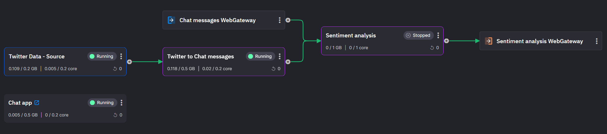
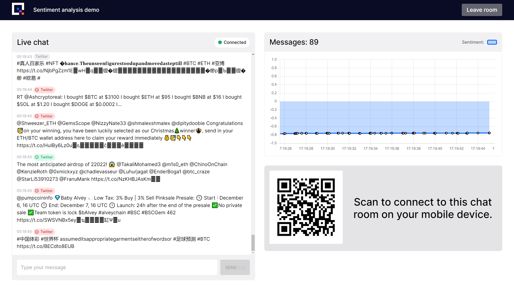

# Sentiment analysis

Build a real time sentiment analysis pipeline. Use the power and ease of Quix to process high volume user generated conversation messages. (We also source and analyze Twitter data to demonstrate some key Quix concepts)

This is the message processing pipeline you will build in this tutorial:

The end result will be sentiment analysis of high volume tweets or your own chat messages.

{width=450px}

!!! tip 
    If you need any assistance, we’re here to help in [The Stream](https://join.slack.com/t/stream-processing/shared_invite/zt-13t2qa6ea-9jdiDBXbnE7aHMBOgMt~8g){target=_blank}, our free Slack community. Introduce yourself and then ask any questions in `quix-help`.

## The steps

There are several stages to this tutorial and we'll guide you every step of the way.

1. Deploy the [Chat App](chat-app.md)
    This `Chat App` is the UI for the tutorial, it allows the user to see messages from all of the users of the app and, in later parts of the tutorial series, will allow the users to see the sentiment of the chat messages.

2. [Analyze](analyze.md) the sentiment of the messages
    Analyze the sentiment of the conversation by adding a new node to the processing pipeline.

3. Increase the volume of messages with the [Twitter integration](twitter-data.md)
    Deploy a data source, subscribing to Twitter messages and publishing them to the `Chat App`. Sentiment will be determined in real-time.

4. [Test](conclusion.md) it all out

[So get started! Deploy the first part of the solution by following step 1 :material-arrow-right-circle:{ align=right }](chat-app.md)