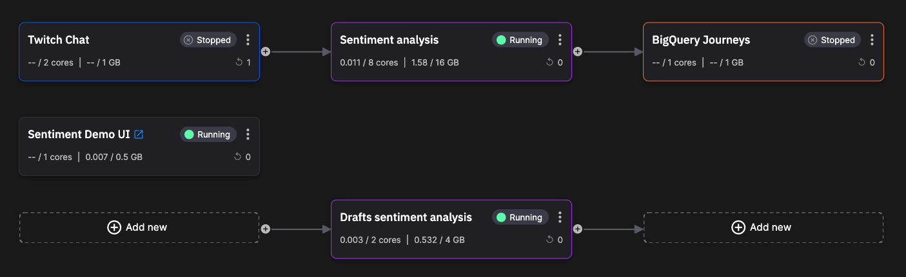

# Sentiment analysis

In this tutorial you learn about a real-time sentiment analysis pipeline, using a [Quix template project](https://github.com/quixio/chat-demo-app){target=_blank}. 

Sentiment analysis is performed on chat messages. The project includes a chat UI, where you can type chat messages. You can also connect to Twitch and perform sentiment analysis on large volumes of messages.

The completed application is illustrated in the following screenshot:

You learn how to get the project, try out the UI, look more deeply into the UI and the sentiment analysis service, and then customize the UI.

## Live demo

You can see the project running live on Quix:

    <iframe id="frame" src="https://sentimentdemoui-demo-chatappdemo-prod.deployments.quix.ai/chat" title="Real-time chat sentiment analysis"></iframe>

You can interact with it here, on this page, or open the page to view it more clearly [here](https://sentimentdemoui-demo-chatappdemo-prod.deployments.quix.ai/chat){target="_blank"}.

## See the pipeline running

See the [pipeline running](https://portal.platform.quix.ai/pipeline?workspace=demo-chatappdemo-prod) without needing to sign up to Quix.

## Watch a video

Explore the pipeline:

**Loom video coming soon.**¥¥

??? Transcript

    **Transcript - coming soon**

## Technologies used

Some of the technologies used by this template project are listed here.

**Infrastructure:** 

* [Quix](https://quix.io/){target=_blank}
* [Docker](https://www.docker.com/){target=_blank}
* [Kubernetes](https://kubernetes.io/){target=_blank}

**Backend:** 

* [Apache Kafka](https://kafka.apache.org/){target=_blank}
* [Quix Streams](https://github.com/quixio/quix-streams){target=_blank}
* [Flask](https://flask.palletsprojects.com/en/2.3.x/#){target=_blank}
* [pandas](https://pandas.pydata.org/docs/reference/api/pandas.DataFrame.html){target=_blank}

**Sentiment analysis:**

* [Hugging Face](https://huggingface.co/){target=_blank}

**Frontend:**

* [Angular](https://angular.io/){target=_blank}
* [Typescript](https://www.typescriptlang.org/){target=_blank}
* [Microsoft SignalR](https://learn.microsoft.com/en-us/aspnet/signalr/){target=_blank}

**Data warehousing:**

* [BigQuery](https://cloud.google.com/bigquery/){target=_blank}

## GitHub repository

The complete code for this project can be found in the [Quix GitHub repository](https://github.com/quixio/chat-demo-app){target="_blank"}.

## Getting help

If you need any assistance while following the tutorial, we're here to help in the [Quix forum](https://forum.quix.io/){target="_blank"}.

## Prerequisites

To get started make sure you have a [free Quix account](https://portal.platform.quix.ai/self-sign-up).

If you are new to Quix it is worth reviewing the [recent changes page](../../changes.md), as that contains very useful information about the significant recent changes, and also has a number of useful videos you can watch to gain familiarity with Quix.

### Twitch API key

You'll also need an API key for the [Twitch](https://dev.twitch.tv/docs/api/) service (optional), if you want to try Twitch-related features.

### BigQuery credentials

If you want to use the Quix BigQuery service (optional), you'll need to provide your credentials for accessing [BigQuery](https://cloud.google.com/bigquery/){target=_blank}.

### Git provider

You also need to have a Git account. This could be GitHub, Bitbucket, GitLab, or any other Git provider you are familar with, and that supports SSH keys. The simplest option is to create a free [GitHub account](){target=_blank}.

!!! tip

    While this tutorial uses an external Git account, Quix can also provide a Quix-hosted Git solution using Gitea for your own projects. You can watch a video on [how to create a project using Quix-hosted Git](https://www.loom.com/share/b4488be244834333aec56e1a35faf4db?sid=a9aa124a-a2b0-45f1-a756-11b4395d0efc){target=_blank}.

## The pipeline

This is the message processing pipeline for this project:

The main services in the pipeline are:

1. *UI* - provides the chat UI, and shows the sentiment being applied to the chat messages.

2. *Sentiment analysis* - uses the [Hugging Face](https://huggingface.co/) model to perform sentiment analysis on the chat messages. There is also a *Drafts sentiment analysis* service for messages being typed, but not yet sent.

3. *Twitch data source* - An alternative to typing chat messages - you select a Twitch channel and then perform sentiment analysis on Twitch messages.

## The parts of the tutorial

This tutorial is divided up into several parts, to make it a more manageable learning experience. The parts are summarized here:

1. [Get the project](get-project.md) - you get the project up and running in your Quix account. 

2. [Try the UI](try-the-ui.md) - you try the UI, typing in chat messages and observing the sentiment analysis in operation.

3. [Explore the UI service](ui-service.md) - explore UI service and gateways...

4. [Explore the sentiment analysis service](sentiment-analysis-service.md) - you take a closer look at the sentiment analysis service, its code, and messages.

5. [Explore ther Twitch service](twitch-service.md) - you explore the service that interfaces Quix with Twitch using the [Twitch API](https://dev.twitch.tv/docs/api/){target=_blank}.

6. [Customize the UI](customize-the-ui.md) - you carry out a simple customization to the chat UI on a feature branch, and then merge your changes onto the develop branch.

7. [Summary](summary.md) - you are presented with a summary of the work you have completed.

## 🏃‍♀️ Next step

[Part 1 - Get the project :material-arrow-right-circle:{ align=right }](get-project.md)
