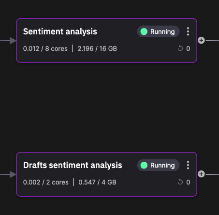
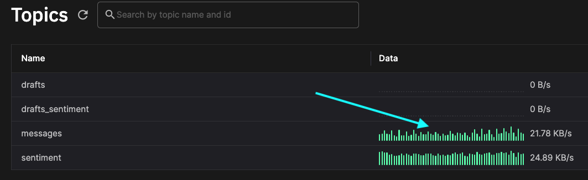

# Sentiment analysis service

In this part of the tutorial you learn about the sentiment analysis service. 



This service uses the Hugging Face model to calculate sentiment for messages, and these are then displayed on the web UI.

## 💡 Key ideas

The key ideas on this page:

* Hugging Face model is used to generate sentiment values
* Sentiment analysis service subscribes to two topics and publishes to two topics
* How to examone message formats

## What it does

The sentiment analysis service uses a prebuilt model from [Hugging Face](https://huggingface.co/){target=_blank} to analyze the sentiment of each message flowing through the service.

The sentiment analysis service subscribes to the `messages` and `drafts` topics. The messages and draft messages are generated by the web UI. 

After sentiment analysis performed by the Hugging Face model, sentiment values are published to the `sentiment` and `drafts_sentiment` topics. The UI subscribes to these topics, and can then display the setiment values in the UI.

TODO - more detail

## 👩‍🔬 Lab - Examine messages 

There are several ways to view live data. This lab shows one way to do it. 

1. Click on `Topics` in the main left-hand navigation.

2. Where you see live data for the `messages` topic, click in that area, as shown in the screenshot:

    {width=80%}

    You are taken to the live view of the Quix Data Explorer.

3. The `messages` topic is preselected for you. The stream names are the user names that you entered, or are user names from the Twitch service. Select any one and then select the `chat-message` parameter.

4. Click the `Messages` view, and then click on any real-time message displayed. In the message code view you see something similar to the following:

    ``` json
    {
    "Epoch": 0,
    "Timestamps": [
        1695303751958000000
    ],
    "NumericValues": {},
    "StringValues": {
        "chat-message": [
        "Can you check on my order please?"
        ]
    },
    "BinaryValues": {},
    "TagValues": {
        "room": [
        "channel"
        ],
        "name": [
        "gabbybe"
        ],
        "role": [
        "Customer"
        ]
    }
    }
    ```

## 🏃‍♀️ Next step

[Part 5 - Explore the Twitch service :material-arrow-right-circle:{ align=right }](twitch-service.md)