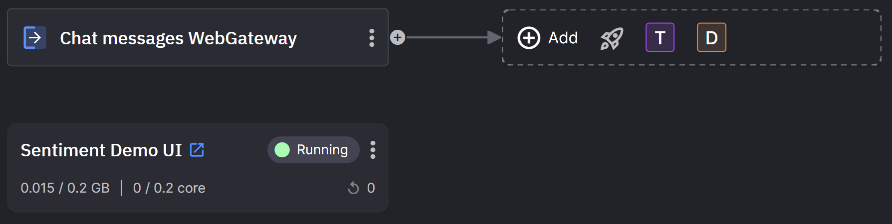

# 1. Sentiment Demo UI

The Sentiment Demo UI is the UI for the tutorial and enables the user to see messages from all of the users of the app and, in later parts of this tutorial, allows the users to see the sentiment of the chat messages.

The UI you will build in this part of the tutorial is shown in the following screenshot:

{width=550px}

## Creating the gateways

Gateways provide a way for external apps to subscribe and publish to topics, and help visualize those connections in the pipeline view of the Quix platform. An example of their use is shown in the following screenshot:

{width=550px}

In this scenario, the Sentiment Demo UI is the external app since it is using the [Quix websockets API](../../how-to/webapps/read.md).

Follow these steps to create the messages and sentiment web gateways:

1. Make sure the `sentiment` topic is available. Click `Topics` on the main left-hand navigation, and click `+ Create topic`, enter `sentiment`, and then click `Create`. 

	This topic needs to be available so you can select it in a later step.

2. Navigate to the Library and locate `External Source`.

3. Click `Add external source`.

4. In the `name` field enter `Chat messages WebGateway`. 

5. Select or enter `messages` in the `output` field.

6. Click `Add external Source` to create the external source.

7. Navigate to the Library and locate `External Destination`.

8. Click `Add external destination`.

9. In the `name` field enter `Chat sentiment WebGateway`. 

10. Select `sentiment` in the `input` field.

11. Click `Add external Destination` to create the external destination.

You've now created the gateways needed for this tutorial.

## Locating and deploying the Sentiment Demo UI

The following steps demonstrate how to select the demo UI Library item and deploy it to your Quix workspace. 

Follow these steps to deploy the prebuilt UI:

1. Navigate to the Library and locate `Sentiment Demo UI`.

2. Click the `Setup & deploy` button.

3. Ensure that the `sentiment` input box contains `sentiment`.

	This topic will be subscribed to and will contain the sentiment scores from the sentiment analysis service, you'll deploy this in a later part of this tutorial.

4. Ensure that the `messages` input contains `messages`.

	- This topic will contain all the chat messages.
	- The UI will subscribe to this topic, to display new messages, as well as publishing to the topic when a user sends a message using the `send` button in the UI.
	- Later, the sentiment analysis service will also subscribe to messages on this topic to produce sentiment scores.

5. Click `Deploy`.

You've now Deployed the Sentiment Demo UI.

## Trying out the UI

Now try out the UI you just deployed. 

1. Find the URL for the deployed UI by navigating to the homepage and locating the tile representing the deployed UI, as shown in the following screenshot:

	{width=250px}

2. Click the `open in new window` icon {width=18px}.

	This is the user interface for the demo. The view you’ll see after creating a `room` to chat in is shown in the following screenshot:

	{width=550px}

3. Now enter some messages. They will be displayed in the chat list.

4. To make the demo more entertaining, use your phone to scan the QR code, or send a link to this page to a friend or colleague. When they interact you'll see their chat messages appear in your UI in real time!

!!! success

	You have successfully deployed and tested the UI.

[Analyze the sentiment of your messages by following Part 2 of this tutorial :material-arrow-right-circle:{ align=right }](analyze.md)
