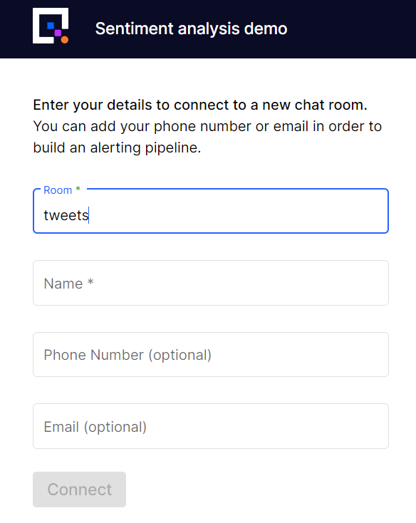
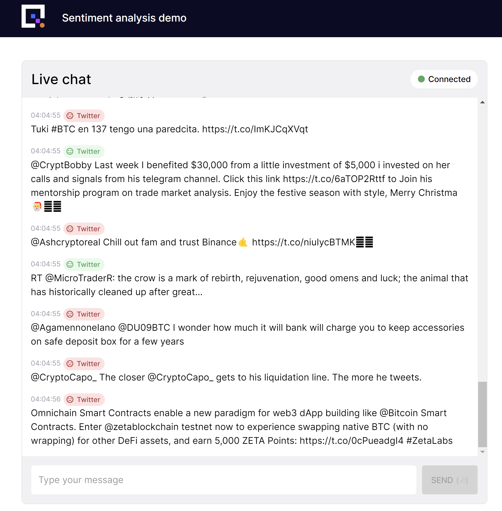

# 3. Adding Twitter data

In the [previous part](analyze.md) of this tutorial you deployed a microservice to analyze the sentiment of messages in the chat. 

In this part of the tutorial you will learn how to:

1. Deploy a data source that subscribes to Twitter messages.
2. Deploy a new microservice to normalize the Twitter messages, making them compatible with the sentiment analysis microservice and UI you have already deployed. The sentiment of all the messages will be determined in real time.

The objective is to show you how to integrate with an external system, and demonstrate the sentiment analysis service processing a higher volume of messages.

{width=450px}

If you're asking "Why Twitter?" it's a good question. Quix has a great Twitter connector and want to show it off! Plus it allows you to source real-world data at volume (if you choose the right search parameters).

There are two steps in this part of the tutorial:

1. Fetching the tweets.
2. Transforming the tweets to ensure they're compatible with the Sentiment Demo UI.

## Prerequisites

To complete this part of the tutorial you'll need a [Twitter developer account](https://developer.twitter.com/en/portal/petition/essential/basic-info){target=_blank}.

You can follow [this tutorial to set up a developer account](https://developer.twitter.com/en/support/twitter-api/developer-account){target=_blank}.

## Fetching the tweets

You are going to be using a prebuilt library item for fetching the tweets. The default search parameters for the library item search for anything to do with Bitcoin, using the search term `(#BTC OR btc OR #btc OR BTC)`. It's a high-traffic subject and great for this demo. However, if you are on the Quix free tier, you might find it better to use a lower-traffic subject, as less CPU and Memory resource can be allocated to a deployment on this tier. To do this, you can edit the `twitter_search_params` field in the library item to contain a different search term, such as `(#rail OR railway)`. This will create less load on the sentiment analysis microservice.

Follow these steps to deploy the Twitter data source:

1. Navigate to the Library and locate `Twitter Data - Source`.

2. Click the `Setup & deploy` button.

3. Enter your Twitter bearer token into the `twitter_bearer_token` field.

4. Click `Deploy`.
    
    This service receives data from Twitter and streams it to the `twitter-data` topic. You can verify this by clicking the `Twitter Data - Source` service in the pipeline and then viewing the `Logs` or `Messages` tab.    
    
!!! note 
    The default Twitter search criteria is looking for Bitcoin tweets, it's a high traffic subject and great for the demo. However, because of the volume of Bitcoin tweets it will use up your Twitter Developer Account credits in a matter of days. So stop the Twitter feed when you're finished with it.
    
    Feel free to change the search criteria once you’ve got the demo working. 
    

## Building the transformation

In the first part of this part of the tutorial, [Fetching the tweets](#fetching-the-tweets) you deployed a microservice which subscribes to tweets on a predefined subject and publishes them to a topic. 

In order to get the tweets to appear in the Sentiment Demo UI, and have their sentiment analyzed, you now need to transform the Twitter data into a format that the Sentiment Demo UI can understand.

This service will subscribe to the `twitter-data` topic and publish data to the `messages` topic. It will transform the incoming data to make it compatible with the UI and sentiment analysis service.

### Creating the project

Follow these steps to code and deploy the tweet-to-chat conversion stage:

1. Navigate to the Library and apply the following filters:
    
    1. Languages = `Python`
    
    2. Pipeline Stage = `Transformation`
    
    3. Type = `Basic templates`

2. Select `Empty template - Transformation`.

3. Click `Preview code` then `Edit code`.

4. Change the name to `tweet-to-chat`.

5. Change the input to `twitter-data` by either selecting it or typing it.

6. Ensure the output is set to `messages`.

7. Click `Save as project`.
    
    The code for this transformation is now saved to your workspace.

### Editing the code

Once saved, you'll be redirected to the online development environment. This is where you can edit, run and test the code before deploying it to production.

Follow these steps to create the tweet-to-chat service.

1. Locate `main.py`.

2. Add `import pandas as pd` to the imports at the top of the file.

3. Locate the line of code that creates the output stream:
    
    ``` python
    output_stream = output_topic.create_stream(input_stream.stream_id)
    ```

4. Change this line to get or create a stream called `tweets`:
    
    ``` python
    output_stream = output_topic.get_or_create_stream("tweets")
    ```

    This will ensure that any messages published by this service go into a stream called `tweets`. You'll use the `tweets` room later on to see all of the tweets and their sentiment.

5. Now locate `quix_function.py`.
    
    Alter `on_pandas_frame_handler` to match the code below:
    
    ``` python
    def on_pandas_frame_handler(self, df: pd.DataFrame):
        
        df = df.rename(columns={'text': 'chat-message'})
        df["TAG__name"] = "Twitter"
        df["TAG__role"] = "Customer"

        self.output_stream.parameters.write(df)
    ```
        
    This will take `text` from incoming `twitter-data` and stream it to the output topics `tweets` stream, as parameter or table values, with a column name of `chat-message`, which the other stages of the pipeline will recognize.

6. Click `Run` near the top right of the code window.

7. Click the `Messages` tab.

    In the default view showing `input` messages you will see the incoming `twitter-data` messages.

    Select a message and you will see that these have `"text"` in the string values. This is the tweet text.

    ```sh
    "StringValues": {
        "tweet_id": ["1600540408815448064"],
        "text": ["Some message about @BTC"]
    }
    ```

8. Select the "output" messages from the messages dropdown list. These are messages being published from the code.

    Select a message, and you will see that the output messages have a different structure.

    The string values section of the JSON message now contains "chat-message" instead of "text":

    ```sh
    "StringValues": {
        "tweet_id": ["1600541061583192066"],
        "chat-message": ["Some message about @BTC"]
    }
    ```

9. Stop the running code and proceed to the next section.

### Deploying the Twitter service

You'll now tag the code and deploy the service with these steps:

1. Click the `+tag` button at the top of any code file.

2. Enter `v1` and press ++enter++.

3. Click `Deploy` near the top right corner.

4. In the deployment dialog, select `v1` under the `Version Tag`.
    
    There is no need to allocate much resource to this service, it is very light weight.

5. Click `Deploy`.

6. Navigate to, or reload, the Sentiment Demo UI you deployed in the first part of this tutorial.

7. Enter the chat room called `tweets`. Using `tweets` for the chat room name will ensure you are seeing the messages coming from Twitter. For `Name`, you can use any name you want. The dialog is show here:

	{width=350px}
	
8. You can now see messages arriving from Twitter and their sentiment being analyzed in real-time.

    {width=550px}
        

!!! success
	
	You will see 'Bitcoin' tweets arriving in the chat along with the calculated average sentiment in a chart.
    
	Your pipeline is now complete, you can send and view chat messages, receive tweets, and analyze the sentiment of all of the messages.

	Share the QR code with colleagues and friends, to talk about anything you like while Quix analyzes the sentiment in the room in real time.

[Conclusion and next steps :material-arrow-right-circle:{ align=right }](conclusion.md)