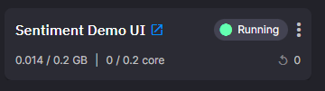

# UI service

In this part of the tutorial you learn about the web UI service. 



This provides the UI for you to interact with this app.

## 💡 Key ideas

The key ideas on this page:

* How a web client can read data from a Quix topic using Quix Streaming Reader API
* How a web client can write data to a Quix topic using Quix Streaming Writer API
* WebSockets as a way of streaming data into a web client
* Microsoft SignalR is the WebSockets technology used in the Streaming Reader API
* Access an external web application from the pipeline view

## What it does

The UI is an Angular web client written using Typescript.

The key thing this service does is provide a UI that implements the chat interface, a typing indicator with sentiment value, sentiment value and emoticon for each message, and a real-time chart showing sentiment.

The most important thing to understand is how this service reads and writes data to and from the Quix pipeline. 

This is done through use of two APIs:

* [Quix Streaming Reader API](../../../apis/streaming-reader-api/index.md)
* [Quix Streaming Writer API](../../../apis/streaming-writer-api/index.md) 

The Streaming Writer is used to write both published and draft messages to the sentiment analysis service. Note the UI provides sentiment analysis of messages as they are being typed, that is, in the draft state, as they have not yet been sent to the chat room.

The Streaming Reader is used to read the sentiment from the sentiment analysis service for both the sent messages and draft messages.

The four topics involved are:

* `chat-messages` - topic for the sent messages
* `drafts` - topic for draft messages
* `chat-with-sentiment` - topic with sentiment for sent messages
* `drafts_sentiment` - topic with sentiment for draft messages

So, the web UI uses the Writer API to write to both `chat-messages` and `drafts` and the Reader API to read from both `chat-with-sentiment` and `drafts_sentiment`.

The Streaming Reader API has both an HTTP and WebSockets interface you can use to interface with a Quix topic. This web client uses the WebSockets interface. This enables data to be streamed from the Quix topic into the web client with good performance. This is a more efficient method than using the request-response method of HTTP.

The WebSockets interface uses Microsoft SignalR technology. You can read more about that in the [Quix SignalR documentation](../../../apis/signalr.md) for the Reader API.

In essence the code to read a topic needs to:

1. Connect to Quix SignalR hub.
2. The web UI reads parameter data rather than event data, as that is the format used for inbound data in this case.
3. Handle "parameter data received" events using a callback.

So, simplifying, after connection to the Quix topic, on a `ParameterDataReceived` event, the corresponding callback (event) handler is invoked. There are other events that can be subscribed to. You can read more about events and subscription in the [subscription and event documentation](../../../apis/streaming-reader-api/subscriptions.md). An example for the handler is shown here:

``` typescript
// Listen for parameter data and emit
readerHubConnection.on("ParameterDataReceived", (payload: ParameterData) => {
    this.paramDataReceived.next(payload);
});
```

The Streaming Writer API is [used in a similar way](../../../apis/signalr.md).

## See also

For more information refer to:

* [Quix Streaming Reader API](../../../apis/streaming-reader-api/index.md) - read about the API used by clients external to Quix to read data from a Quix topic.
* [Quix Streaming Writer API](../../../apis/streaming-writer-api/index.md) - read about the API used by clients external to Quix to write data to a Quix topic.

## 🏃‍♀️ Next step

[Part 4 - Explore the sentiment analysis service :material-arrow-right-circle:{ align=right }](sentiment-analysis-service.md)
