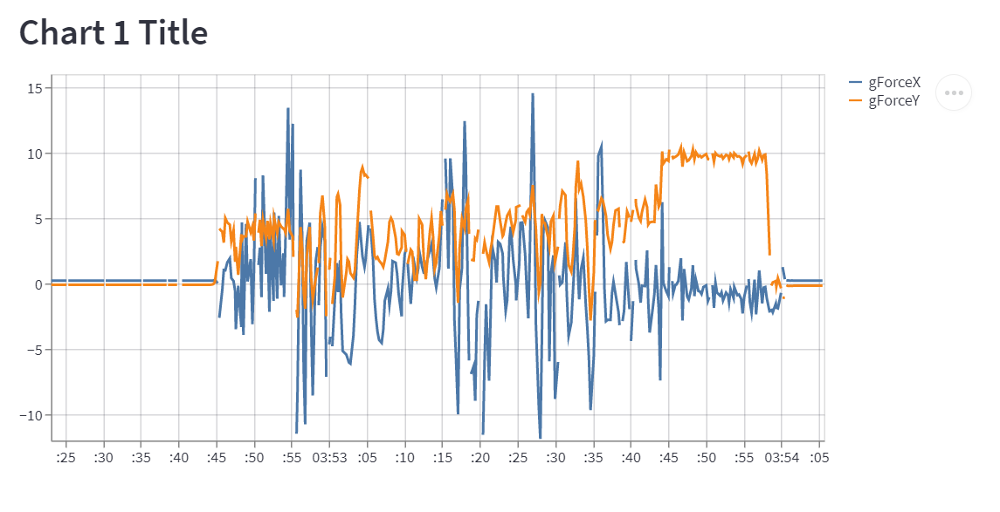

# Telemetry data

## Stream and visualize real-time telemetry data with an Android app and Streamlit



Learn how to build an end-to-end telemetry data pipeline for IoT applications. Use our Android companion app to stream sensor data from your phone and visualize it in a Streamlit app.

## Get Started

To get started make sure you have a Quix account, signup for a completely free account at [https://quix.io](https://quix.io){target=_blank}

You will need an Android mobile phone for this tutorial (we're working on the Apple app).

If you need any assistance, we're here to help in [The Stream](https://join.slack.com/t/stream-processing/shared_invite/zt-13t2qa6ea-9jdiDBXbnE7aHMBOgMt~8g){target=_blank}, our free Slack community.

### Library

Most of the code you'll need has already been written. It lives in our library, which is accessible from inside the Quix portal or directly via our open source [GitHub](https://github.com/quixai/quix-library){target=_blank} repo. We'll be referring to the library often so make sure you know where it is.

## Components

**Android App** - Our companion app for collecting real-time sensor data from your phone. It's pre-built and published to the Play store to save you time. You can also access the source code in our [Github repo](https://github.com/quixai/quix-tracker){target=_blank}.

**Streamlit App** - See your location on a map and other activity metrics.

**QR Settings Share** - A lightweight UI and API for sharing settings with the Android app.

## Build It

This guide will show you how to deploy each of the components, starting with QR Settings Share.

#### 1. QR Settings Share

Follow these steps to deploy the QR Settings Share.

1.  Navigate to the Library and locate "QR Settings Share"

2.  Click "Setup & deploy"

3.  Click "Deploy"

!!! info 
    The service will be deployed to your workspace

Open the UI with these steps

4.  Once deployed, click the service tile

5.  Click the "Public URL"

6.  Append the following querystring to the url in the address bar

> ?topic=phone-data&notificationsTopic=notifications-topic

!!! info "These are needed by the Android app and will be passed to it via the QR code you'll generate in a moment"

7.  You can now enter a username and device name into the relevant inputs

{width=400px}

!!! tip "These can be anything! But sensible values will help understand which token belongs to which user"

8.  Click OK

9.  You can now click Generate Token

Several things happened when you clicked the button.

A token was generated in Quix with an expiry time in around 1 month.

The token was published to an API and a link to the token was generated.

The QR shown on screen is a short-lived link to the longer lasting token.

!!! info 
    Scanning the token with the Android App will allow the app to receive its configuration information without you having to enter any long token strings by hand.

#### 2. Android App

It's time to install the Android app!

1.  Go to the Google Play store and search for "Quix Tracker App" ensuring it's the one published by us.

\[Screenshot of Play store coming soon\]

2.  Install the app.

3.  Tap the menu hamburger

4.  Tap settings

5.  Tap SCAN QR CODE

6.  Generate a new QR code in the QR Settings Share website you deployed in step 1

7.  Scan the QR code with your device

    !!! info "The Token, Workspace and topics should now be configured"

8.  Tap the menu hamburger once again

9.  Tap Dashboard

10. Tap START at the bottom of the screen

    ???- success "Your device is now streaming to the topic called 'phone-data' in your workspace"

        These parameters are being streamed from your phone:

        - Accuracy
        - Altitude
        - BatteryLevel
        - BatteryPowerSource
        - BatteryState
        - EnergySaverStatus
        - gForceX
        - gForceY
        - gForceZ
        - Heading
        - Latitude
        - LogInfo
        - Longitude
        - Speed

    !!! tip 
        Leave the app running until you've completed the next step.

#### 3. Streamlit app

Explore the data inside Quix and then deploy a frontend app.

Within Quix:

1.  Click Data Explorer on the left hand menu

2.  Select the "phone-data" topic

3.  You should have at least one stream, select it

4.  Select as many parameters as you want. The gForce ones are great for this tutorial

5.  You can see the gForce from your device displayed on the waveform in real time

Deploy an app:

1.  Click Library on the left hand menu

2.  Search for Streamlit Dashboard

3.  Click Preview code

4.  Click Edit code

5.  Ensure phone-data is selected for the input field

6.  Click Save as project

    !!! info "The code for the dashboard is now saved to your workspace. You can now edit it to ensure it works with the data coming from the device"

7.  Locate the following line in streamlit_file.py

``` py
st.line_chart(local_df[["datetime",'Speed','EngineRPM']].set_index("datetime"))
```

8.  Replace 'Speed' with 'gForceX'

9.  Replace 'EngineRPM' with 'gForceY'

10. Remove the following code block

``` py
with fig_col2:

st.markdown("### Chart 2 Title")

st.line_chart(local_df[["datetime", 'Gear', 'Brake']].set_index("datetime"))
```

11. Click Run near the top right corner of the code editor


    !!! info "The dashboard will run right here in the development environment"


    !!! tip "Click the icon that appears next to the project name (circled here in green)"

        {width=300px}

12. Once the dashboard has loaded you will see sensor data from your device in real time

    {width=400px}
    
    !!! note "Below this is also the raw data showing all the values from the device"


13. Close the dashboard

    !!! info "The dashboard you were just using was deployed to a temporary URL in the development area"

        You need to deploy it to its permanent home!

14. Click the Deploy button in the top right corner.

15. Click Service in the Deployment Settings

16. Click the toggle button under Public Access

17. Click Deploy

    You will be redirected to the home page

18. Once the dashboard has been built and deployed click the deployment tile

19. Click the Public URL

!!! success "You are now looking at your dashboard in its permanent home"

!!! warning "Be aware that there is no security on the dashboard"

## Next Steps

You've just connected your mobile device to Quix and deployed a Streamlit app to view the data in real time.

Now try showing some different parameters in the app, or build a transformation in Quix to make better use of the raw data.

What will you build? Let us know. We'd love to feature your project or use case in our newsletter.

If you need any assistance, we're here to help in [The Stream](https://join.slack.com/t/stream-processing/shared_invite/zt-13t2qa6ea-9jdiDBXbnE7aHMBOgMt~8g){target=_blank}, our free Slack community.

## Ciao for now!

We hope you enjoyed this tutorial. If you have any questions or feedback please contact us on The Stream.

Thank you.!