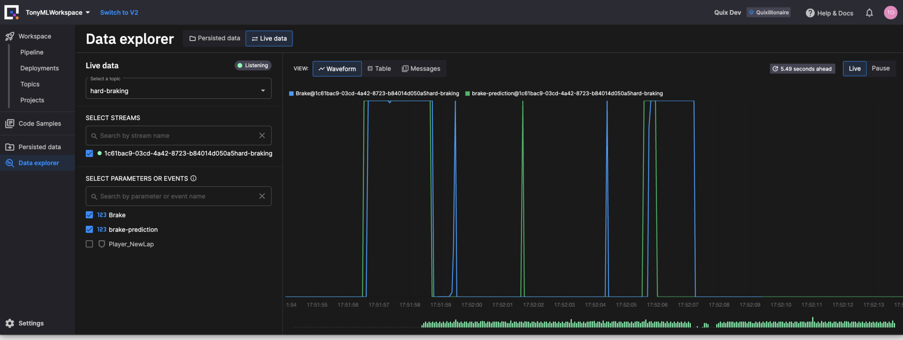

# Conclusion

In this tutorial you've learned how to use Quix to generate real-time data. You've also learned how to import that data into Jupyter Notebook using the Quix code generator. You then saw how to deploy your ML model and visualize its output in real time.

The objective of the tutorial was not to create the most accurate model, but to step you through the overall process, and show you some of the useful features of Quix.

## Next Steps

Here are some suggested next steps to continue on your Quix learning journey:

* Visit the [Quix Code Samples GitHub](https://github.com/quixio/quix-samples){target=_blank}. If you decide to build your own connectors and apps, you can contribute something to the Quix Code Samples. Fork our Code Samples repo and submit your code, updates, and ideas.

* [Sentiment analysis tutorial](../sentiment-analysis/index.md) - In this tutorial you learn how to build a sentiment analysis pipeline, capable of analyzing real-time chat.

* [Data science tutorial](../data-science/data-science.md) - In this tutorial you use data science to build a real-time bike availability pipeline.

What will you build? Let us know! We’d love to feature your project or use case in our [newsletter](https://www.quix.io/community/).

## Getting help

If you need any assistance, we're here to help in [The Stream](https://join.slack.com/t/stream-processing/shared_invite/zt-13t2qa6ea-9jdiDBXbnE7aHMBOgMt~8g){target=_blank}, our free Slack community. Introduce yourself and then ask any questions in `quix-help`.
