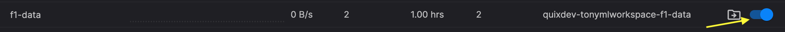

# Get your data

In this part of the tutorial you learn how to obtain some real-time data to work with in the rest of the tutorial. You use a demo data source that generates Formula 1 race car data from a computer game. You use this data as the basis to build a ML model to predict braking patterns.

## Create a persisted topic

To make things a little easier, first create a **persisted topic** to receive the generated data. 

1. Login to the Quix Portal. 

2. Click `Topics` on the left-hand menu.

3. Click the `Add new`, which is located top right.

4. Enter a topic name of `f1-data`.

5. Leave other values in the `Create new topic` dialog at their defaults.

6. Click `Done`. Now wait while the topic is created for you.

7. Once the topic has been created, click the persistence slider button to ensure your data is persisted, as shown in the following screenshot: 

    

## Generate data from the demo data source

Now generate the actual data for use later in the tutorial by completing the following steps:

1. Click `Code Samples` on the left-hand sidebar.

2. Find the `Demo Data` source. This service streams F1 Telemetry data into a topic from a recorded game session.

3. Click the `Setup & deploy` button in the `Demo Data` panel.

4. You can leave `Name` as the default value.

5. Make sure `Topic` is set to `f1-data` and then click `Deploy`.

Once this service is deployed it will run as a [job](../../definitions.md#job) and generate real-time data to the `f1-data`, and this will be persisted. 

This data is retrieved later in this tutorial using Python code that uses the [Data Catalogue API](../../../apis/data-catalogue-api/intro.md), generated for you by Quix.

[Import data into Jupyter Notebook :material-arrow-right-circle:{ align=right }](./import-data.md)
