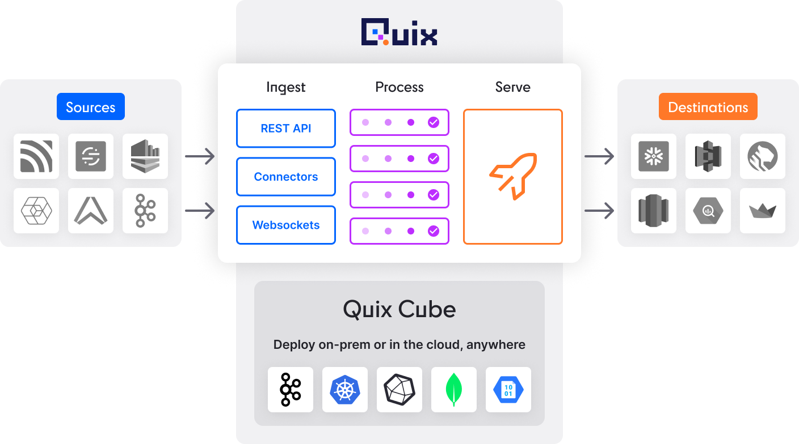

# What is Quix?

Quix is a complete end-to-end solution for building and deploying stream processing applications. Quix provides you with the ability to build, deploy, and scale your applications.

Streaming data applications, where you need to process time series or event data in order to make decisions in real time, is what Quix is designed for. 

With its roots in the demanding world of Formula 1 racing, where performance is paramount, Quix is built to deliver results. 

Such intelligent real-time decision making has many use cases, including examples such as increasing engagement with social media and digital content, monitoring vast arrays of sensors, fraud prevention, and of course Formula 1 race car telemetry systems.

Quix has excellent synergy with Machine Learning (ML) systems too. You can quickly deploy your ML model and monitor its performance in real time, modify the model, and redeploy it with a single click. 

[Sign up for free](https://portal.platform.quix.ai/self-sign-up).

!!! note

    For recent significant changes to Quix Platform, please see the [changes documentation](../platform/changes.md).

## Reducing complexity

Quix is also designed to remove as much complexity as possible from the process of creating, deploying, and monitoring your stream processing applications.

Quix leverages industry-standard technologies, such as Kafka to provide the core functionality for streaming data, Kubernetes for scaling your deployments, InfluxDB and MongoDB for data persistence, Git for revision control, and Python as the main language for programming your solutions.

The following sections take a look at the key components of creating your streaming data solutions:

* Connecting your data to Quix
* Developing your application
* Deploying (and scaling) pipelines
* Monitoring and managing your data

While this short introduction to Quix is intentionally brief, there are abundant links for more detailed information you can follow to increase your knowledge of Quix. Alternatively, simply drop into our [Community](https://forum.quix.io/){target=_blank} and ask any question you may have.

## The Quix stack

Quix provides everything a developer needs to build industrial-strength streaming applications. 

The Quix stack provides the following:

* Quix Portal, the web-based Integrated Development Environment (IDE).
* [REST and websocket APIs](../apis/index.md)
* [Quix Streams](../client-library-intro.md)

These components enable developers to:

* Use a full web-based IDE with version control and logging, to build their applications. 
* Have abstracted access to underlying broker infrastructure, including fully-managed Kafka topics.
* Access the Quix serverless compute environment for hosting your web-based real-time streaming applications.
* Connect existing web applications and IoT clients.
* Access the real-time data catalogue, which is a time-series database.

In addition to providing a complete solution, Quix also enables you to leverage third-party providers if your use case requires it. For example, while Quix can host all your Git repositories, you can also configure your environments to use third-party providers for this purpose, such as GitHub, Bitbucket, and Azure DevOps. 

Similarly Quix provides Quix-hosted Kafka, but you can also use Confluent Cloud or self-hosted Kafka options.

## Quix Portal

**Quix Portal** strives to present an intuitive software experience that facilitates DevOps/MLOps best practices for development teams. The goals of Quix Portal are to:

* Help a broad spectrum of developers access live data.
* Help developers create and manage complex infrastructure and write application code without support from expert engineering teams.
* Help to accelerate the development lifecycle by enabling developers to test and iterate code in an always-live environment.

To achieve these goals, Quix Portal includes the following features:

* **Online IDE**: Develop and run your streaming applications directly in the browser without setting up a local environment.

* **Code Samples**: Choose from the [prebuilt Code Samples](../platform/connectors/index.md) ready to run and deploy from the IDE.

* **One-click deployments**: Configure, deploy, and manage your streaming applications with a simple user interface.
 
* **Monitoring tools**: Monitor the status and data flow of your streaming applications in real time.

* **Broker management**: Create, delete, explore and configure your self-hosted message broker infrastructure from the Quix Portal.

* **Pipeline view**: Visualize your pipeline architecture with the information provided from the deployment variables. You can also monitor your pipeline in real time.

* **Data Explorer**: Explore live and historical data of your applications to test that your code is working as expected.

**Watch the video to see the Quix web-based IDE**

## Git integration

Quix has the ability to create projects where all code and configuration is contained in a Git repository. This Git repository can be hosted by Quix (using Gitea), or on any third-party Git provider, such as GitHub, or Bitbucket, where you can configure the Quix SSH public key provided to you for Git provider authentication. This helps integrate Quix with your existing workflows.

## Kafka integration

Quix requires Kafka to provide streaming infrastructure for your solutions.

When you create a new Quix environment, there are three hosting options:

1. Quix Broker - Quix hosts Kafka for you. This is the simplest option as Quix provides hosting and configuration.
2. Self-Hosted Kafka - This is where you already have existing Kafka infrastructure that you use, and you want to enable Quix to provide the stream processing platform on top of it. You can configure Quix to work with your existing Kafka infrastructure using this option.
3. Confluent Cloud - if you use Confluent Cloud for your Kafka infrastructure, then you can configure Quix to connect to your existing Confluent Cloud account.

This enables you host according to requirements. For example, your production environment may be hosted on your own Kafka infrastructure, while your develop environment is hosted by Quix.

## Connecting your data

There are [various ways](../platform/ingest-data.md) to connect your data to Quix. Quix provides a number of [connectors](../platform/connectors/index.md) that you can use with only some simple configuration. In addition, there are a range of [APIs](#apis), both REST and websockets that are available. There is also the [Quix Streams](#quix-streams) client library, that can be used to get data quickly and easily into Quix.

For a simple example of getting data from your laptop into Quix, see the [Quickstart](../platform/quickstart.md).

## Pipelines

Stream processing is implemented by building pipelines consisting of a series of applications deployed to Kafka and Kubernetes clusters. These processing pipelines are now described by a single YAML file, `quix.yaml`. With just this file, you can reconstruct any pipeline. Further, changes in this file in one environment can be merged into another environment, giving you the ability to test changes in one environment, before deplying into another, while the change history is retained in Git. 

An example pipeline is shown in the following screenshot:

You can see how to build a simple pipeline in the [Quix Tour](../platform/quixtour/overview.md). You can also [watch the video](https://www.loom.com/share/5b0a88d2185c4cfea8fd2917d3898964?sid=b58b2b0c-5814-494a-82ea-2a2ba4d4dac0).

## Multiple environments

In Quix you create a project to contain your stream processing pipeline. A project corresponds to  a Git repository, either hosted by Quix, or alternatively using an external Git provider such as GitHub. Within a project you can create multiple environments, containing your stream processing pipelines. Each environment is associated with a Git branch, so that you can embrace the full Git workflow, having for example, production, staging and development branches. You can also configure your preferred Kafka hosting option for the environment too, for example you can choose Quix-hosted Kafka, self-hosted Kafka, or Confluent Cloud.

Environments are a new features of Quix, and you can read more about them in the [documentation](../platform/changes.md#environments).

## Monitoring and managing your data

Quix provides a suite of tools to enable you to monitor and manage your data. These are explored in the following sections.

The Data Explorer enables you to view your data graphically in real time. Graph, table and messages views.

[See the Data Explorer in action](https://www.loom.com/share/0e3c24fb5f8c48038fe5cf02859b7ebc?sid=743fbdf7-fad5-4c26-831d-b6dad78b9b06).

## Data persistence

While [topics](../platform/glossary.md#topic) do provide a configurable retention time, persisting data into a database provides advantages - for example, you can perform powerful queries to retrieve historical data. This data can be retrieved and displayed using the Data Explorer, or retrieved using the Data Catalogue API.

Quix provides a very simple way to persist data in a topic. Simply locate the topic in your topic list, and click the `Persistance` button. 

For more information see the later sections on [Data Catalogue](#data-catalogue) and [APIs](#apis).

!!! note

    You don't have to use the Quix Data Catalogue. Quix provides [connectors](../platform/connectors/index.md) for common database technologies, so you can always store your data in the database of your choice.

## Replay service

When data has been [persisted](#data-persistence), you have the option to not only query and display it, but replay it into your pipeline. This can be very useful for debugging pipelines using historical data.

See how to [use the Quix replay service](../platform/how-to/replay.md).

See also an in-depth blog post on [stream reprocessing](https://quix.io/blog/intro-stream-reprocessing-python/){target=_blank}.

## Data Catalogue

Quix provides a data catalogue for long-term storage, analytics, and data science activities.

The Quix data catalogue combines the best database technologies for each data type into a unified catalogue. There’s a timeseries database for recording your events and parameter values, blob storage for your binary data, and a NoSQL database for recording your metadata.

The Quix data catalogue technology has two advantages:

1. It allocates each data type to the optimal database technology for that type. This increases read/write and query performance, which reduces operating costs.
2. It uses your metadata to record your context. This makes your data more accessible across your organization, as users only need to know your business context in order to navigate vast quantities of data.

## APIs

Quix provides four APIs to help you work with streaming data. These include:

* [**Stream Writer API**](../apis/streaming-writer-api/intro.md): enables you to send any data to a Kafka topic in Quix using HTTP. This API handles encryption, serialization, and conversion to the Quix Streams format, ensuring efficiency and performance of down-stream processing regardless of the data source.
* [**Stream Reader API**](../apis/streaming-reader-api/intro.md): enables you to push live data from a Quix topic to your application, ensuring low latency by avoiding any disk operations.
* [**Data Catalogue API**](../apis/data-catalogue-api/intro.md): enables you to query historical data streams in the data catalogue, in order to train ML models, build dashboards, and export data to other systems.
* [**Portal API**](../apis/portal-api.md): enables you to automate Quix Portal tasks such as creating environments, topics, and deployments.

## Quix Streams

As you will notice as you explore the various open source code samples and connectors that come with Quix, Quix also provides a complete client library, [Quix Streams](../client-library-intro.md), to reduce development times, and provide advanced features such as automatic scaling through Streams.

Python is the dominant language for data science, data engineering, and machine learning, but it needs to be interfaced carefully with streaming technologies, such as [Kafka](../client-library/kafka.md), which are predominantly written in Java and Scala.

[Quix Streams](../client-library-intro.md) provides Python and C# developers with a client library that abstracts the complexities of building streaming applications.

For Python developers, Quix Streams can provide streaming data packaged in a data frame, so you can write data processing logic and connect it directly to the abstracted broker. Developers can read about the most important streaming concepts in the [Quix Streams introduction](../client-library-intro.md).

## Next steps

* [Quickstart](../platform/quickstart.md) - get data into Quix and display it in less than 10 minutes
* [Quix Tour](../platform/quixtour/overview.md) - build a complete pipeline in less than 30 minutes
* Watch [a video]((https://www.youtube.com/watch?v=0cr19MfATfY)) on the art of the possible with Quix
