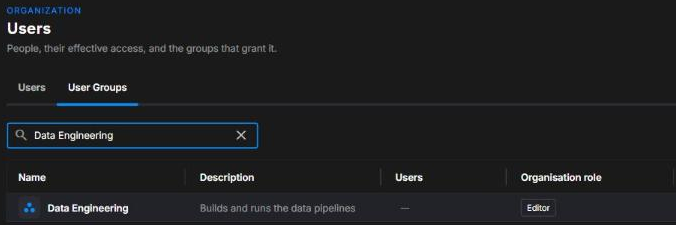
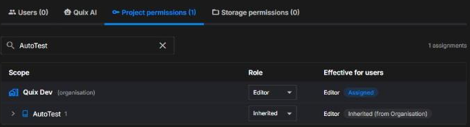

# User groups

A user group is a set of users in your organisation who share common settings. Instead of setting up the same things for each user, you set them up once on the group and add the users as members. Each setting reaches the members in its own way:

| Setting | What members get | Which members get it |
|---------|------------------|----------------------|
| [Project permissions](#set-a-groups-project-permissions) | The group's roles | Members whose **Inherit from group** toggle on the **Project permissions** tab is on - see [How group roles and user roles combine](../roles.md#how-group-roles-and-user-roles-combine) |
| Storage permissions | Read, read-write or no access to folders in your Quix Lake storage, set on the group's **Storage permissions** tab. See [Storage Access Gateway](../quix-lake/secure-storage-access.md) for folder visibility and how environment access applies to storage | Every member, unless the **Storage permission source** on the member's or the group's **Storage permissions** tab is **Organization default** |
| Quix AI | Access to Quix AI, turned on or off on the group's **Quix AI** tab, if Quix AI is available to your organisation | Members whose **Inherit from group** toggle on the **Quix AI** tab is on |
| Spaces | Every space the group is added to. A space changes what members see, not what they can do | Every member |
| Deployment sizes | Access to the sizes [restricted to the group](../deployments/deployment-sizes.md#restrict-a-size-to-users-and-groups). The deployment dialog's **Size** dropdown doesn't list them unless the member is also selected individually | Every member |

The **Inherit from group** toggles on the **Project permissions** and **Quix AI** tabs are separate, so a member can inherit one and not the other. They also start differently: the **Quix AI** toggle is on for a member whose Quix AI settings nobody has saved, while the **Project permissions** toggle stays off until an organisation Admin turns it on.

- Groups belong to an organisation.
- A user can be a member of **one group at a time**.
- A group's role assignments use the same [roles](../roles.md#available-roles), [levels](../roles.md#permission-levels) and [inheritance rules](../roles.md#inheritance) as a user's own assignments.

Groups are managed in the Quix Cloud UI on the **Users** page in your organisation's sidebar, on the **User Groups** tab. You need the Admin role at the organisation level to create, edit or delete a group, or to change its members.

## Create a group

1. Open your organisation's **Users** page and select the **User Groups** tab.
2. Click **+ New group**.
3. Enter a **name** (up to 64 characters, unique within the organisation) and an optional **description** (up to 200 characters), and optionally pick an icon.
4. Click **Create group**.

The group list shows each group's members, a summary of its role in the **Organisation role** column, and when it was last modified. You can show a **Created** column with the column picker. The role is shown with a **(Custom)** suffix - for example `Editor (Custom)` - when the group's assignments go beyond a single organisation-wide role.

## Set a group's project permissions

1. Open the group and select the **Project permissions** tab.
2. Set a role at the organisation level, and override it for specific projects or environments where needed - exactly as you would for a single user.
3. Click **Save changes**.

**Example:** a `Data Engineering` group set to **Editor** at the organisation level, overridden with **Viewer** on the `production` environment of the `payments` project. Every member who inherits from the group has Editor access everywhere except that environment, where they have Viewer access.

## Add and remove members

1. Open the group and select the **Users** tab.
2. Click **Add users**, select the users to add, and click **Add**.

A user can only belong to one group. In **Add users**, people who are already in another group are shown as **In *group name*** and can't be selected. To move a user to a different group, open the user's menu in the **Users** list, choose **Edit details**, and change **Group**. Moving turns their **Inherit from group** toggle on the **Project permissions** tab off - see [How group roles and user roles combine](../roles.md#how-group-roles-and-user-roles-combine). You cannot add or remove yourself, or change where your own project permissions come from.

The **Project permissions** column on the Users tab shows, for each member, whether their permissions currently come from the **Group** or from their own **User** assignments. Adding a member does not switch them to the group's roles. An organisation Admin does that per user with the **Inherit from group** toggle on the user's **Project permissions** tab, as described in [How group roles and user roles combine](../roles.md#how-group-roles-and-user-roles-combine).

To remove a member, open their menu on the group's **Users** tab and choose **Remove from group**. Their **Inherit from group** toggle on the **Project permissions** tab turns off, so their own role assignments apply again.

## Edit a group

Open the group and click the pencil next to the name or description in the **Group details** panel, or choose **Edit details** from the group's menu in the list. In the **Edit group** dialog, change the name, description or icon, and click **Save**.

## Delete a group

Open the group, click **Delete** in the **Delete this group** card, type the group name to confirm, and click **Delete group**. A group that still has members cannot be deleted - [remove its members](#add-and-remove-members) first.

## Managing groups through the API

The Quix CLI manages a user's own role assignments only. To manage groups programmatically, use the [Portal API](../apis/portal-api/overview.md) endpoints under `organisations/user-groups`.

## See also

- [Users](users.md) - Invite users, edit their details and group, and delete them
- [Roles and permissions](../roles.md) - Roles, levels, inheritance, and how group roles combine with a user's own
- [Deployment sizes and resources](../deployments/deployment-sizes.md#restrict-a-size-to-users-and-groups) - Restricting deployment sizes to users and groups
- [Storage Access Gateway](../quix-lake/secure-storage-access.md) - Folder visibility and how environment access applies to your Quix Lake storage
