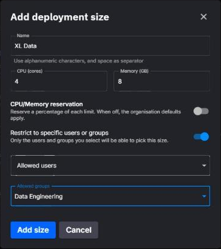

# User groups

A user group is a named set of role assignments that applies to every member of the group. Instead of assigning the same roles to each engineer on a team, you assign them once to the group and add the engineers as members. A group can also unlock restricted deployment sizes for its members.

- Groups belong to an organisation.
- A user can be a member of **one group at a time**.
- A group's role assignments use the same [roles](../roles.md#available-roles), [levels](../roles.md#permission-levels) and [inheritance rules](../roles.md#inheritance) as a user's own assignments.
- Group membership does not change a user's roles by itself. Each user either keeps their own role assignments or inherits the group's - see [How group roles and user roles combine](../roles.md#how-group-roles-and-user-roles-combine).

Groups are managed in the Quix Cloud UI on the **Users** page in your organisation's sidebar, on the **User Groups** tab. You need the Admin role at the organisation level to create, edit or delete a group, or to change its members.

## Create a group

1. Open your organisation's **Users** page and select the **User Groups** tab.
2. Click **New group**.
3. Enter a **name** (up to 64 characters, unique within the organisation) and an optional **description** (up to 200 characters), and optionally pick an icon.
4. Click **Create group**.

The group list shows each group's members, a summary of its role in the **Organisation role** column, and when it was created and last modified. The role is shown with a **(Custom)** suffix - for example `Editor (Custom)` - when the group's assignments go beyond a single organisation-wide role.

## Give a group access

1. Open the group and select the **Project permissions** tab.
2. Set a role at the organisation level, and override it for specific projects or environments where needed - exactly as you would for a single user.
3. Click **Save changes**.

**Example:** a `Data Engineering` group set to **Editor** at the organisation level, overridden with **Viewer** on the `production` environment of the `payments` project. Every member who inherits from the group can edit everywhere except that environment, where they can only view.

## Add members

1. Open the group and select the **Users** tab.
2. Click **Add users** and pick the users to add.

A user can only belong to one group. In **Add users**, people who are already in another group are shown as **In *group name*** and can't be selected. To move a user to a different group, open the user's menu in the **Users** list, choose **Edit details**, and change **Group**. Moving turns their **Inherit from group** toggle off - see [How group roles and user roles combine](../roles.md#how-group-roles-and-user-roles-combine). You cannot add or remove yourself, or change your own permission source.

The **Project permissions** column on the Users tab shows, for each member, whether their permissions currently come from the **Group** or from their own **User** assignments. Adding a member does not switch them to group permissions. An organisation Admin does that per user with the **Inherit from group** toggle on the user's **Project permissions** tab, as described in [How group roles and user roles combine](../roles.md#how-group-roles-and-user-roles-combine).

## Delete a group

Open the group, click **Delete** in the **Delete this group** card, type the group name to confirm, and click **Delete group**. A group that still has members cannot be deleted - remove its members first.

## Restricting deployment sizes to users and groups

Organisation Admins define the **deployment sizes** (named CPU and memory presets) that users pick from when they deploy - see [Deployment sizes and resources](../deployments/deployment-sizes.md). By default every size is available to all users. A size can instead be **restricted** to specific users, specific groups, or a mix of both.

To restrict a size, edit it in your organisation's **Deployment Sizes** settings, turn on **Restrict to specific users or groups**, and select the allowed users and groups. The sizes list then shows the size as **Restricted** with a summary of who can use it; unrestricted sizes show **All users**, and a size restricted through the API to nobody shows **-**.

Which sizes the platform makes available to each user:

| User | Available sizes |
|------|-----------------|
| Admin at the organisation level | Every size, restricted or not |
| A user in the size's allowed users, or a member of an allowed group | Unrestricted sizes plus that size |
| Anyone else | Unrestricted sizes only |

Group membership alone is enough - the member's **Inherit from group** setting does not matter here.

The restriction is enforced on deployments only when your organisation has deployment sizes enabled and **enforces deployment size limits**. Then a deployment's CPU and memory limits are capped by the highest CPU and the highest memory among the sizes available to the user, and a user with no available sizes cannot deploy at all until an Admin allows them a size. Without enforcement, users can still enter custom CPU and memory.

!!! note "An empty allow list is not a restriction"
    In the Quix Cloud UI, a restriction only takes effect when at least one user or group is selected. Turning the toggle on and saving without selecting anyone leaves the size available to all users. When you edit a size through the Portal API instead, sending an empty list of allowed users and groups restricts the size to organisation Admins only.

## Managing groups through the API

The Quix CLI manages a user's own role assignments only. To manage groups programmatically, use the [Portal API](../apis/portal-api/overview.md) endpoints under `organisations/user-groups`.

## See also

- [Roles and permissions](../roles.md) - Roles, levels, inheritance, and how group roles combine with a user's own
- [Deployment sizes and resources](../deployments/deployment-sizes.md) - Defining sizes, requests and limits
