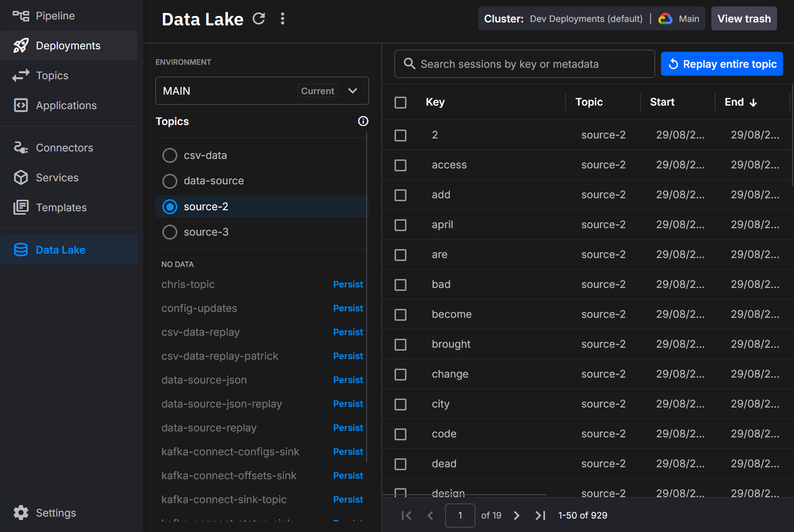
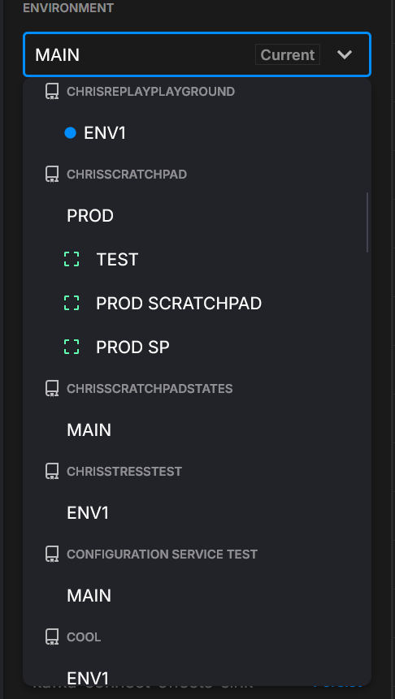
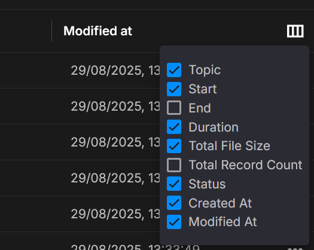
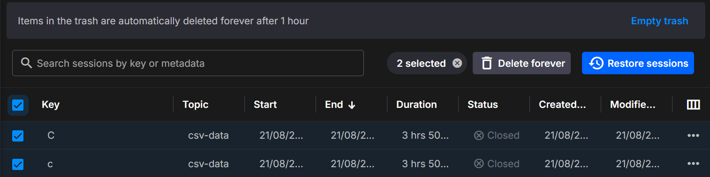
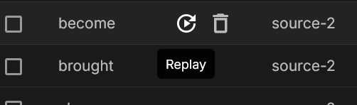

# Data Lake Catalog

The **Data Lake Catalog** lets you browse, search, and manage datasets persisted into Quix Data Lake. It surfaces Avro data segments and their Parquet index metadata, making datasets easy to discover and replay.

You can open the catalog from any **environment** that has a blob storage connection. With permission, you can also explore catalogs from **other environments**.

!!! info "Prerequisites"
    - A **Blob storage connection** is configured for at least one environment.  
    - The **Data Lake services** are running.  
    See: [Blob storage connections](../../deploy/blob-storage.md).

## Exploring datasets

Each row represents a persisted **session** of Kafka messages grouped by **topic** and **key**, with an associated time range and metadata. The catalog supports:

- **Search** by session key or custom metadata  
- **Filter** by topic and environment  
- **Sort** by start, end, duration, size, or record count (click a column header)  
- **Paginate** through results when the list is large

!!! tip inline end "Cross-environment access"
    Use the **Environment** switcher to inspect datasets written by other
    environments you can access (helpful for shared ingestion vs. per-team exploration).

{ width="40%" }

## Columns

Choose which columns are shown. Built-ins include **Key**, **Topic**, **Start/End**, **Duration**, **Total file size**, **Total record count**, **Status**, and **Created/Modified**. You can also display **custom metadata** fields when present. Use **Select columns** to toggle visibility.

!!! tip inline "Sorting & columns"
    Click any column header to sort. Use **Select columns** to show/hide fields for your task (for example, turn on **Total record count** when validating completeness).

{ width="40%" }

## Soft deletion

Deleting a dataset moves it to **Trash** for a short retention window before permanent deletion. From **Trash** you can:

- **Restore** sessions back into the catalog  
- **Delete forever** to purge immediately

!!! warning "Retention window"
    Items in Trash are automatically and permanently deleted after **1 hour**.

## Operations

From the catalog you can:

- Inspect datasets across environments  
- Trigger **Replay** from a topic or individual dataset  
- **Refresh cache** to surface newly ingested data sooner  
- Open **deployment details** for the Data Lake service

## Use cases

- Explore persisted datasets by **key** and **time range**
- Verify ingestion from topics into blob storage
- Restore or permanently delete sessions
- Prepare datasets for **Replay** in pipelines
- Integrate with APIs for governance and lineage

## Related

- [Blob storage connections](../..deploy/blob-storage.md) – enable the catalog  
- [Data Lake Replay (managed)](../managed-services/replay.md) – re-run datasets to Kafka  
