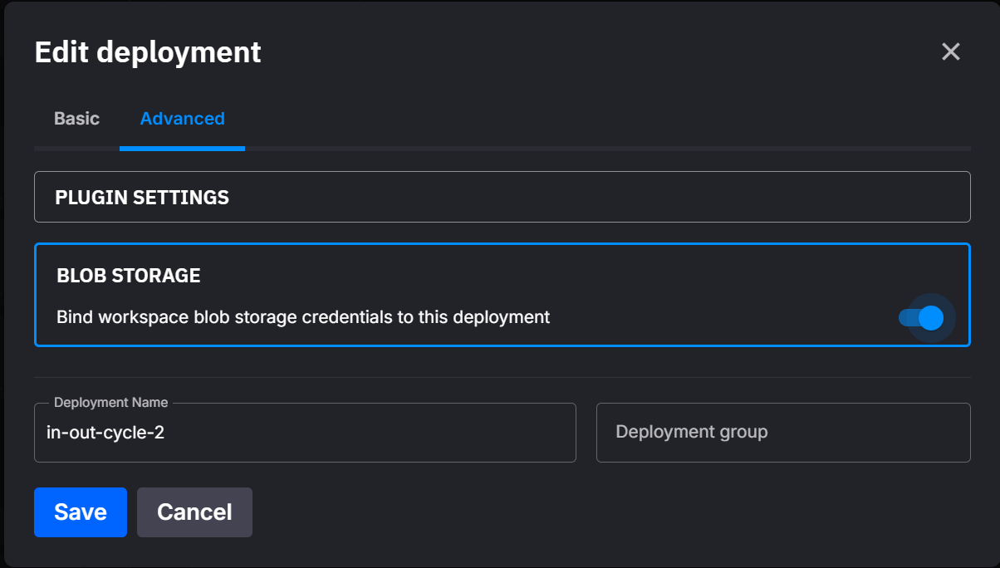

# Blob storage

Giving a deployment access to cloud object storage is two halves of one workflow: the **blob storage toggle** binds your environment's credentials to the deployment (injected as a secret), and the **`quixportal`** Python library reads that secret and hands your code a ready-to-use filesystem. You never parse credentials or branch per provider.

## Blob storage toggle

If the cluster or your environment has a [blob storage connection](../quix-lake/blob-storage.md), you can bind it to a deployment so your code can reach that storage. The bound connection is injected as a secret, so your code never holds hard-coded credentials.

### Enabling it

In the deployment dialog, open the **Advanced** tab and expand the **Blob Storage** panel. Turn on **Bind workspace blob storage credentials to this deployment**.

{width=80%}

!!! note "A connection must exist first"
    The toggle binds the connection already configured for your environment. If none exists, the deployment has nothing to bind to, so create one under **Settings → Blob storage connections** first. See [Blob storage connections](../quix-lake/blob-storage.md).

### What you get

With the toggle on, Quix injects the connection as a secret variable, `Quix__BlobStorage__Connection__Json`, holding the provider plus credentials and the bucket/container as a JSON document. If the connection also has [Quix Lake](../quix-lake/overview.md) enabled, the Lakehouse Catalog and Query endpoints are injected too. For the full list, see [Quix variables](./quix-variables.md) and [variables injected into bound deployments](../quix-lake/blob-storage.md#variables-injected-into-bound-deployments).

The variable is written at deploy time, so redeploy the service after switching the toggle on. You can read it yourself, but the easiest way to consume it is the `quixportal` library below.

## The quixportal library

`quixportal` is a Python library that reads the injected credentials and returns an [fsspec](https://filesystem-spec.readthedocs.io/) filesystem, so your file-access code stays the same whatever the storage is. Add it to your service's `requirements.txt` so it's installed when the deployment builds (Python 3.12+):

```
quixportal[s3]
```

The `[s3]` part pulls in the S3 driver the library needs. To install locally, run `pip install "quixportal[s3]"`.

```python
from quixportal import get_filesystem

fs = get_filesystem()          # reads Quix__BlobStorage__Connection__Json from the environment
fs.ls("my-bucket/")
with fs.open("my-bucket/file.txt") as f:
    data = f.read()
```

`get_filesystem()` is the convenience path. For more control use `FilesystemFactory`, which can build a filesystem from the environment, a dict, or a JSON string, and can validate the connection on creation:

```python
from quixportal.storage import FilesystemFactory

factory = FilesystemFactory(enable_connection_testing=True)
fs = factory.get_filesystem()                 # from the environment variable
# fs = factory.get_filesystem_from_config(cfg)  # from a dict
# fs = factory.get_filesystem_from_json(json)    # from a JSON string
```

### The connection JSON

The bound deployment receives the connection in `Quix__BlobStorage__Connection__Json`. Quix serves all storage through the Storage Access Gateway, which presents an **S3-compatible** API, so the injected document always uses the `S3Compatible` provider, whatever the storage is behind the gateway. You don't need to handle other shapes:

```json
{
  "provider": "S3Compatible",
  "s3Compatible": {
    "bucketName": "my-bucket",
    "accessKeyId": "...",
    "secretAccessKey": "...",
    "region": "us-east-1",
    "serviceUrl": "https://<storage-gateway-endpoint>"
  }
}
```

`serviceUrl` points at the gateway endpoint. Key names are case-insensitive, so `s3Compatible` (what Quix injects) and `S3Compatible` both parse.

The library *can* also target Azure, GCS, and a local directory directly (useful for tests or running outside Quix), but those are configs you build yourself with the [helpers below](#generating-the-json-yourself), not something the platform injects.

### Generating the JSON yourself

For local runs or tests, build a valid connection string without going through the platform:

```python
from quixportal.storage import generate_connection_json

json_str = generate_connection_json(
    provider="S3",
    bucket_name="my-bucket",
    access_key_id="...",
    secret_access_key="...",
    region="us-west-2",
)
```

Typed builders are also available (`create_s3_config()`, `create_minio_config()`, `create_azure_config()`, `create_local_config()`), paired with `config_to_json()` / `config_to_dict()`.
