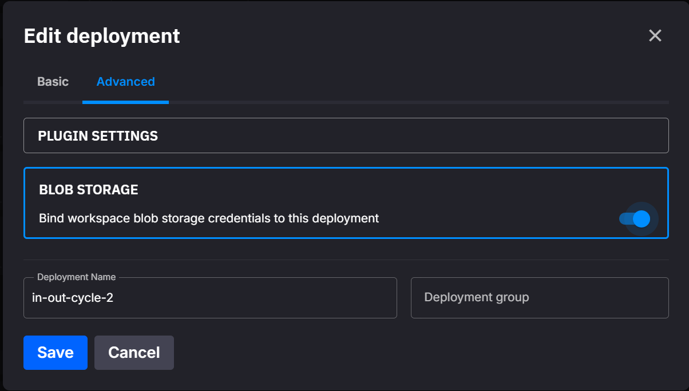

# Quix Lake storage

Giving a deployment access to cloud object storage is two halves of one workflow. The **bind toggle** attaches your environment's credentials to the deployment, injected as a secret. The **`quixportal`** Python library reads that secret and hands your code a ready-to-use filesystem. You never parse credentials and you never branch per provider.

## The bind toggle

If the cluster or your environment has a [Quix Lake connection](../quix-lake/blob-storage.md), you can bind it to a deployment so your code reaches that storage. Quix injects the bound connection as a secret, so your code never holds hard-coded credentials.

### Enabling it

In the deployment dialog, open the **Advanced** tab and expand the **Quix Lake** panel. Turn the bind toggle on.

{width=80%}

!!! note "A connection must exist first"
    The toggle binds the connection already configured for your environment. If none exists, the deployment has nothing to bind to. Create one under **Settings → Quix Lake** first. See [Quix Lake connections and storages](../quix-lake/blob-storage.md).

### What you get

With the toggle on, Quix injects the connection as a secret variable, `Quix__BlobStorage__Connection__Json`. It holds the endpoint plus the credentials and the bucket as a JSON document. If the connection also has [Quix Lake](../quix-lake/overview.md) enabled, Quix injects the Lakehouse Catalog and Query endpoints too. For the full list, see [Quix variables](./quix-variables.md) and [variables injected into bound deployments](../quix-lake/blob-storage.md#variables-injected-into-bound-deployments).

Quix writes the variable at deploy time, so redeploy the service after you switch the toggle on. You can read the variable yourself, but the easiest way to consume it is the `quixportal` library below.

## One connection, several buckets

A connection can hold more than one storage. **Each storage is its own bucket.** The name an administrator gives a storage is the bucket name your code uses. A storage with no name of its own keeps the bucket name of the bucket behind it, and a new storage never moves it.

The gateway rewrites the bucket name only. Your object keys travel unchanged, so an object you write through the gateway lands at the same key it would land at if you wrote it to the bucket directly.

The injected document names the bucket of the storage your deployment binds to. Your code reaches a second storage with a second bucket name, on the same endpoint and with the same credential:

```python
fs.ls("<your_bucket>/")            # the storage this deployment binds to
fs.ls("minio/")                    # the storage named minio
```

An S3 LIST covers one bucket, so there is no single listing across every storage. List each bucket in turn. Call `ListBuckets` to see every storage you may reach. Your access still follows the rules in [Storage Access Gateway](../quix-lake/secure-storage-access.md): a deployment reads its own environment's data and anything shared with it.

!!! warning "A rename needs a redeploy"
    An administrator can rename a storage, and the name replaces the bucket name your code uses. Quix writes the bucket name into the deployment at deploy time, so redeploy the service after a rename. The old bucket name fails at once, with no alias and no grace period. See [Rename a storage](../quix-lake/blob-storage.md#rename-a-storage).

!!! note "A main storage move needs no redeploy"
    An administrator can also make another storage the main storage. That move changes no bucket name, so your deployment keeps working and needs no redeploy. Your service also stays on the storage that holds its data: Quix never moves a running service to a different bucket. See [Make a storage the main storage](../quix-lake/blob-storage.md#make-a-storage-the-main-storage).

!!! note "One copy cannot cross a storage"
    A copy whose source and destination sit in different storages is a real transfer between two backends, so the gateway refuses it. Copy inside one storage, or read and write the object yourself.

## The quixportal library

`quixportal` is a Python library that reads the injected credentials and returns an [fsspec](https://filesystem-spec.readthedocs.io/){target=_blank} filesystem, so your file-access code stays the same whatever the storage is. Add it to your service's `requirements.txt`, so the build installs it. It needs Python 3.12 or later:

```text
quixportal[s3]
```

The `[s3]` part pulls in the S3 driver the library needs. To install locally, run `pip install "quixportal[s3]"`.

Read a file with the convenience helper:

```python
from quixportal import get_filesystem

fs = get_filesystem()          # reads Quix__BlobStorage__Connection__Json from the environment
fs.ls("<your_bucket>/")
with fs.open("<your_bucket>/file.txt") as f:
    data = f.read()
```

`get_filesystem()` is the convenience path. For more control use `FilesystemFactory`, which builds a filesystem from the environment, a dict, or a JSON string, and can validate the connection on creation:

```python
from quixportal.storage import FilesystemFactory

factory = FilesystemFactory(enable_connection_testing=True)
fs = factory.get_filesystem()                 # from the environment variable
# fs = factory.get_filesystem_from_config(cfg)  # from a dict
# fs = factory.get_filesystem_from_json(json)    # from a JSON string
```

### The connection JSON

The bound deployment receives the connection in `Quix__BlobStorage__Connection__Json`. Quix serves all storage through the Storage Access Gateway, which presents an **S3-compatible** API, so the injected document always uses the `S3Compatible` provider, whatever the storage is behind the gateway. You do not need to handle other shapes:

```json
{
  "provider": "S3Compatible",
  "s3Compatible": {
    "bucketName": "<your_bucket>",
    "accessKeyId": "<your_access_key_id>",
    "secretAccessKey": "<your_secret_access_key>",
    "region": "us-east-1",
    "serviceUrl": "https://<your_storage_gateway_endpoint>"
  }
}
```

`serviceUrl` points at the gateway endpoint. Key names are case-insensitive, so `s3Compatible`, which Quix injects, and `S3Compatible` both parse.

The gateway is there for three reasons:

* **Security** — your real bucket credentials never leave it. Instead of handing storage keys to every deployment, the gateway checks each request and grants access scoped to the environment, so one environment cannot reach another's data although the whole organization shares a single connection.
* **Abstraction** — whatever you connect from the Quix Portal, S3, Azure, GCS, or MinIO, your code reaches it through the same S3-compatible interface. The same code works regardless of the storage behind it.
* **One endpoint** — every storage answers on the same endpoint, with the same credential, so adding a storage changes no client configuration.

See [Storage Access Gateway](../quix-lake/secure-storage-access.md) for how the gateway governs access, and [S3-compatible endpoint](../quix-lake/s3-endpoint.md) for the exact API surface.

The library *can* also target Azure, GCS, and a local directory directly, which is useful for tests or running outside Quix. Those are configs you build yourself with the [helpers below](#generating-the-json-yourself), not something the platform injects.

### Generating the JSON yourself

For local runs or tests, build a valid connection string without going through the platform:

```python
from quixportal.storage import generate_connection_json

json_str = generate_connection_json(
    provider="S3",
    bucket_name="<your_bucket>",
    access_key_id="<your_access_key_id>",
    secret_access_key="<your_secret_access_key>",
    region="us-west-2",
)
```

Typed builders are also available — `create_s3_config()`, `create_minio_config()`, `create_azure_config()`, and `create_local_config()` — paired with `config_to_json()` and `config_to_dict()`.

## Next steps

* [Quix Lake connections and storages](../quix-lake/blob-storage.md) — connect a bucket and add a storage
* [Storage Access Gateway](../quix-lake/secure-storage-access.md) — who can read and change what
* [S3-compatible endpoint](../quix-lake/s3-endpoint.md) — the API surface your client may use
* [Quix variables](./quix-variables.md) — every variable the platform injects
