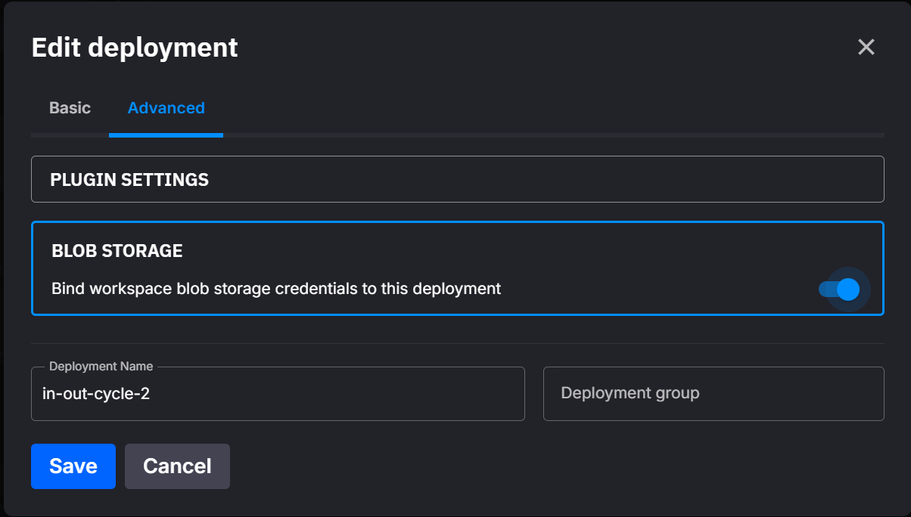

# Quix Lake storage

Giving a deployment access to cloud object storage is two halves of one workflow. The **bind toggle** attaches your environment's credentials to the deployment, injected as a secret. The **`quixportal`** Python library reads that secret and hands your code a ready-to-use filesystem. You never parse credentials and you never branch per provider.

## The bind toggle

If the cluster or your environment has a [Quix Lake connection](../quix-lake/blob-storage.md), you can bind it to a deployment so your code reaches that storage. Quix injects the bound connection as a secret, so your code never holds hard-coded credentials.

### Enabling it

In the deployment dialog, open the **Advanced** tab and expand the **Blob Storage** panel. Turn the bind toggle on.

{width=80%}

!!! note "A connection must exist first"
    The toggle binds the connection already configured for your environment. If none exists, the deployment has nothing to bind to. Create one under **Settings → Quix Lake** first. See [Quix Lake connections and storages](../quix-lake/blob-storage.md).

### What you get

With the toggle on, Quix injects the connection as a secret variable, `Quix__BlobStorage__Connection__Json`. It holds the endpoint plus the credentials and the bucket as a JSON document. If a [Lakehouse](../quix-lake/lakehouse/overview.md) runs on the bound storage, Quix injects the Lakehouse Catalog and Query endpoints too. For the full list, see [Quix variables](./quix-variables.md) and [variables injected into bound deployments](../quix-lake/blob-storage.md#variables-injected-into-bound-deployments).

Quix writes the variable at deploy time, so redeploy the service after you switch the toggle on. You can read the variable yourself, but the easiest way to consume it is the `quixportal` library below.

## One bucket, several storages

A connection can hold more than one storage. Your code still uses **one bucket**, the Quix Lake bucket, and **each storage is a folder** inside it. The **Folder** an administrator sets on a storage is that folder name. Only the **main storage** may sit at the **root** of the bucket, so every other storage has a folder. A new storage never moves the storages that are already there.

The injected document names the Quix Lake bucket. Put the folder first in the key to reach a second storage, on the same endpoint and with the same credential:

```python
fs.ls("<your_bucket>/<workspaceId>/")          # your environment folder in the main storage
fs.ls("<your_bucket>/minio/<workspaceId>/")    # your environment folder in the storage named minio
```

`fs` is the filesystem that [the quixportal library](#the-quixportal-library) gives you. Quix injects the environment ID as `Quix__Workspace__Id`.

Quix takes the storage folder off the key before it calls the storage behind it, so a write to `<your_bucket>/minio/reports/day.csv` lands at `reports/day.csv` in the bucket behind `minio`.

The bind always goes to the **main storage** of the connection. A deployment credential holds a grant on its own environment folder, so it works inside `<workspaceId>/` of each storage. A LIST of the bucket root answers `403 AccessDenied` for it, and `ListBuckets` answers the one Quix Lake bucket. Your access follows the rules in [Storage Access Gateway](../quix-lake/secure-storage-access.md): a deployment reads its own environment's data and anything shared with it.

!!! warning "An administrator can change the folder in your keys"
    A [rename](../quix-lake/blob-storage.md#rename-a-storage) changes the **Folder** of a storage, and the old folder fails at once. A [main storage move](../quix-lake/blob-storage.md#make-a-storage-the-main-storage) gives the storage that steps down a folder, when it sat at the bucket root. In both cases the bucket name stays, Quix restarts the deployments bound to that storage, and you update the keys in your code:

    ```python
    fs.open("<your_bucket>/<workspaceId>/reports/day.csv")            # before the move, at the bucket root
    fs.open("<your_bucket>/principal/<workspaceId>/reports/day.csv")  # after the move, in the folder principal
    ```

!!! note "One copy cannot cross a storage"
    A copy whose source and destination sit in different storages is refused. Copy inside one storage, or read and write the object yourself.

## The quixportal library

`quixportal` is a Python library that reads the injected credentials and returns an [fsspec](https://filesystem-spec.readthedocs.io/){target=_blank} filesystem, so your file-access code stays the same whatever the storage is. Add it to your service's `requirements.txt`, so the build installs it. It needs Python 3.12 or later:

```text
quixportal[s3]
```

The `[s3]` part pulls in the S3 driver the library needs. To install locally, run `pip install "quixportal[s3]"`.

Read a file with the convenience helper:

```python
from quixportal import get_filesystem

fs = get_filesystem()          # reads Quix__BlobStorage__Connection__Json from the environment
fs.ls("<your_bucket>/<workspaceId>/")
with fs.open("<your_bucket>/<workspaceId>/file.txt") as f:
    data = f.read()
```

`get_filesystem()` is the convenience path. For more control use `FilesystemFactory`, which builds a filesystem from the environment, a dict, or a JSON string, and can validate the connection on creation:

```python
from quixportal.storage import FilesystemFactory

factory = FilesystemFactory(enable_connection_testing=True)
fs = factory.get_filesystem()                 # from the environment variable
# fs = factory.get_filesystem_from_config(cfg)  # from a dict
# fs = factory.get_filesystem_from_json(json)    # from a JSON string
```

### The connection JSON

The bound deployment receives the connection in `Quix__BlobStorage__Connection__Json`. Quix serves all storage through the Storage Access Gateway, which presents an **S3-compatible** API, so the injected document always uses the `S3Compatible` provider, whatever the storage is behind the gateway. You do not need to handle other shapes:

```json
{
  "Provider": "S3Compatible",
  "S3Compatible": {
    "BucketName": "<your_bucket>",
    "AccessKeyId": "<your_access_key_id>",
    "SecretAccessKey": "<your_secret_access_key>",
    "Region": "<region>",
    "ServiceUrl": "https://<your_storage_gateway_endpoint>"
  }
}
```

`ServiceUrl` points at the gateway endpoint, and `BucketName` is the Quix Lake bucket. `Region` is the region of the storage, or `us-east-1` when the storage has none. Quix injects the keys in this PascalCase form, and `quixportal` reads them as they are.

Your real bucket credentials never leave Quix. The key in this document reaches your environment's data only, and every storage of the connection answers on this one endpoint. See [Storage Access Gateway](../quix-lake/secure-storage-access.md) for who may read what, and [S3-compatible endpoint](../quix-lake/s3-endpoint.md) for the API surface.

The library *can* also target Azure, GCS, and a local directory directly, which is useful for tests or running outside Quix. Those are configs you build yourself with the [helpers below](#generating-the-json-yourself), not something the platform injects.

### Generating the JSON yourself

For local runs or tests, build a valid connection string without going through the platform:

```python
from quixportal.storage import generate_connection_json

json_str = generate_connection_json(
    provider="S3",
    bucket_name="<your_bucket>",
    access_key_id="<your_access_key_id>",
    secret_access_key="<your_secret_access_key>",
    region="us-west-2",
)
```

Typed builders are also available — `create_s3_config()`, `create_minio_config()`, `create_azure_config()`, and `create_local_config()` — paired with `config_to_json()` and `config_to_dict()`.

## Next steps

* [Quix Lake connections and storages](../quix-lake/blob-storage.md) — connect a bucket and add a storage
* [Storage Access Gateway](../quix-lake/secure-storage-access.md) — who can read and change what
* [S3-compatible endpoint](../quix-lake/s3-endpoint.md) — the API surface your client may use
* [Quix variables](./quix-variables.md) — every variable the platform injects
