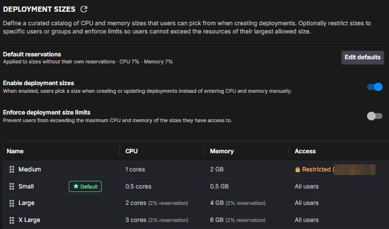
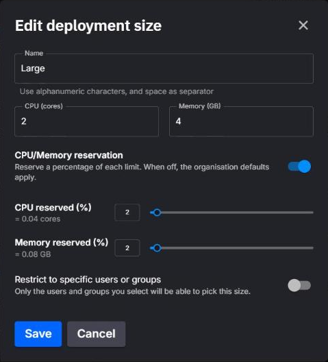
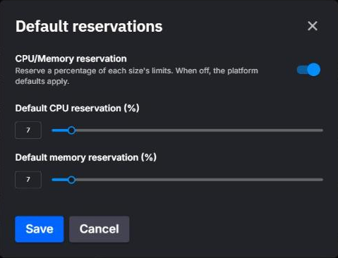

# Deployment sizes and resources

Every replica of a deployment runs with a **CPU limit** and a **memory limit**, and a **request** for each that reserves capacity on the cluster. Organization admins can turn the free-form CPU and memory inputs into a curated catalog of **deployment sizes**, and set organization-wide **default reservations** that apply when nothing more specific does.

This page explains the resource model once. Other deployment pages, such as the [deployments overview](./overview.md), the [`quix.yaml` reference](../projects/project-structure.md) and [Quix variables](./quix-variables.md), link here rather than repeating it.

## Limits and requests

A deployment carries two numbers per resource. They mean different things at runtime:

| Aspect | Limit | Request |
|---|---|---|
| What it is | The most a single replica may use. | The amount reserved for the replica when it is scheduled. |
| CPU at runtime | The replica cannot use more CPU than the limit. | When the node's CPU is contended, replicas with larger requests get more CPU time. |
| Memory at runtime | A replica that uses more than the limit can be stopped by the kernel. A service replica is then restarted. A job is not restarted. | Used mainly for scheduling. Under node memory pressure, replicas using more than their request are the first candidates for eviction. |
| Scheduling | Not used for placement. | The replica is only placed on a node with this much unallocated CPU and memory. |
| Units | Millicores and MB. `1000` millicores is one core. | Millicores and MB. Always less than or equal to the limit. |

The request is what the scheduler counts. A deployment with a `1000` millicore limit and a `100` millicore request occupies `100` millicores of the node's schedulable CPU and can burst to a full core when the node has spare capacity. When the node is busy, it gets CPU time in proportion to its small request. Raising the request makes the replica's performance more predictable and lets fewer replicas fit on the cluster.

These are standard Kubernetes behaviors, described in [Resource Management for Pods and Containers](https://kubernetes.io/docs/concepts/configuration/manage-resources-containers/) and [Node-pressure Eviction](https://kubernetes.io/docs/concepts/scheduling-eviction/node-pressure-eviction/).

In the portal a request is expressed as a **reservation**: a percentage of the limit. A `40%` CPU reservation on a `1000` millicore limit reserves `400` millicores. In `quix.yaml` the request is written as an absolute number of millicores or MB.

The platform enforces a floor of **10 millicores** and **50 MB** on every request, and never lets a request exceed its limit. Organizations on a trial subscription always run with a **10%** reservation and cannot change it.

The limits, but not the requests, are exposed to your code as the `Quix__Deployment__Limits__Cpu` and `Quix__Deployment__Limits__Memory` [Quix variables](./quix-variables.md).

## Deployment sizes

A deployment size is a named CPU and memory pair, such as `S` = 1 core / 2000 MB, that users pick from a dropdown instead of typing numbers. Sizes are defined per organization in **Organization Settings > Deployment Sizes** and need the organization update permission, so in practice an [Admin](../roles.md).

{width=80%}

To set up deployment sizes:

1. Open **Organization Settings > Deployment Sizes**.
2. Turn on **Enable deployment sizes**. The catalog appears below the settings.
3. Adjust the catalog. **+ Add new deployment size** adds a size, and each row's menu has **Make default** (**Remove default** on the current default), **Edit size** and **Delete size**. Drag a row to change its position.
4. Optionally, set the organization's default reservations with **Set defaults**, or **Edit defaults** once they're set. See [Organization default reservations](#organization-default-reservations).
5. Optionally, turn on **Enforce deployment size limits**, described in the table below.

The page has three settings above the catalog:

| Setting | Effect |
|---|---|
| Default reservations | The organization-wide request percentages. See [Organization default reservations](#organization-default-reservations). |
| Enable deployment sizes | When on, the deployment dialog shows a **Size** dropdown, as described in [Choosing resources in the deployment dialog](#choosing-resources-in-the-deployment-dialog). When off, it offers only **Custom**, users enter CPU and memory directly, and sizes are ignored, even if some are defined. |
| Enforce deployment size limits | Only shown when sizes are enabled. When on, the deployment dialog no longer lets users pick **Custom**. Creating or updating a deployment by any route, including `quix.yaml` syncs and the API, is rejected if its CPU exceeds the largest CPU, or its memory the largest memory, among the sizes the user has access to. Through `quix.yaml` and the API, values within those limits don't have to match a size. Turning it on does not change existing deployments. Creating or changing a dev session is checked the same way, for each of CPU and memory that the request sets. Rejections read `CPU millicores must be no greater than <max> based on your allowed deployment sizes` or `Memory must be no greater than <max> MB based on your allowed deployment sizes`. A user with access to no size is rejected with `No deployment sizes are available for your user. Contact your organisation admin.` The check is skipped while the catalog is empty. |

### The starter catalog

The first time the size list is requested for an organization that has sizes enabled and no sizes defined, the platform seeds four:

| Size | CPU | Memory | Default |
|---|---|---|---|
| XS | 500 millicores | 1000 MB | |
| S | 1000 millicores | 2000 MB | Yes |
| M | 2000 millicores | 3000 MB | |
| L | 3000 millicores | 4000 MB | |

Edit, reorder, delete or add to these freely. The seed runs once per organization, so deleting them all leaves an empty catalog.

### What a size defines

{width=60%}

| Field | Notes |
|---|---|
| Name | Letters, digits and spaces, up to 25 characters in the dialog, unique within the organization. |
| CPU (cores) and Memory (GB) | The size's CPU and memory limits. The dialog takes cores and GB, with 1 GB = 1024 MB, and stores millicores and MB. The seeded `S` size's 2000 MB therefore shows as 1.95 GB in the catalog. |
| CPU/Memory reservation | Optional. When on, the size stores request percentages, `0` to `100` of each limit. The dialog shows the cores and GB each percentage corresponds to. |
| Restrict to specific users or groups | Optional. When on with at least one user or group selected, only the selected users, members of the selected groups, and anyone with the organization update permission, in practice Admins, have access to the size. Access decides which sizes the Portal API returns to a user and the limit enforced for them. |

Two more properties are set from the catalog rather than the edit dialog:

- **Default.** At most one size can be the default. When a new deployment opens with the dialog's starting values of 0.2 cores and 0.5 GB, the dialog preselects a listed size of exactly 200 millicores and 512 MB if there is one. Otherwise it preselects the default if the dropdown lists it, and otherwise the dropdown's smallest size by CPU, then memory. An organization does not need a default: the last one can be unmarked or deleted.
- **Order.** Drag rows to set the order the dropdown lists them in. Sizes with the same position sort by CPU, then memory.

Deleting a size does not change the deployments that used it: they keep their CPU and memory.

Admins can also manage sizes through the Portal API, with the `/organisations/current/deployment-sizes` endpoints listed in the [Swagger reference](https://portal-api.cloud.quix.io/swagger/index.html){target=_blank}.

## Choosing resources in the deployment dialog

The **Deployment resources** panel of the [deployment dialog](./overview.md#deployment-settings) adapts to the organization's settings:

| Organization setting | What the user sees |
|---|---|
| Sizes disabled | CPU and memory sliders. The Size dropdown shows only **Custom** and an info icon pointing at Organization Settings. No reservation controls. |
| Sizes enabled, limits not enforced | The Size dropdown lists the unrestricted sizes and each restricted size that selects the user individually, plus **Custom**. Picking a size locks the sliders to its values. Picking Custom unlocks them, bounded by your subscription's CPU and memory quota. |
| Sizes enabled, limits enforced | The Size dropdown lists the same sizes, without **Custom** for a new deployment. When you edit an existing deployment, a disabled **Custom** entry can appear, and a size must be picked before saving. |

The **CPU/Memory reservation** toggle sits next to the dropdown whenever sizes are enabled:

- Picking a named size locks the toggle.
- With **Custom** selected and limits not enforced, the toggle is the user's. Switching it on seeds the sliders with the organization defaults, and the values saved become an explicit request on the deployment. Switching it off clears any explicit request so the deployment inherits again.
- With limits enforced, the toggle is locked.

With **Custom** selected, the collapsed panel header summarizes the result. For a service with sizes enabled and **Custom** set to 1 core, 2 GB and a 40% reservation, it reads `Size: Custom (1 cores / 2 GB) | Reservation: 0.4 cores (40%) / 0.8 GB (40%) | Replicas: 1`. The reservation part appears only when the reservation toggle is on and reserves more than zero, and the replica count for every deployment type except jobs.

## How a request is resolved

CPU and memory resolve independently. For each, the first layer that supplies a value wins:

1. **Trial subscription.** Fixed at 10% of the limit. Nothing below applies.
2. **Explicit request on the deployment.** An absolute value written in `quix.yaml` under `resources.requests`, or saved from the dialog with the reservation toggle on and Custom selected.
3. **Organization default reservations**, whether set by an admin or inherited from the subscription plan.
4. **Platform fallback** of 10%.

The result is rounded up to a whole millicore or MB and clamped to the 10 millicore / 50 MB floor and the limit.

## Organization default reservations

The **Default reservations** row at the top of **Organization Settings > Deployment Sizes** holds the organization-wide request percentages. They apply to every deployment that has no explicit request of its own, including deployments created while sizes are disabled.

{width=60%}

The row shows where the current values come from:

| Row shows | Meaning |
|---|---|
| Percentages such as `CPU 40% · Memory 40%`, not marked as inherited | An admin set these values on the organization. |
| `Inherited from your plan` followed by the percentages | The organization has no values of its own and inherits its subscription plan's default reservation percentage. |
| `No org default set` | Neither the organization nor its plan supplies a value. The 10% platform fallback applies. |

Open the dialog with **Set defaults** or **Edit defaults**. The **CPU/Memory reservation** toggle switches between the two states:

- **On.** Set each percentage between `1` and `100`. Saving stores them on the organization.
- **Off.** When the organization was already inheriting when the dialog opened, the sliders show the inherited plan values read-only, with the note `These values are inherited from your plan. Turn on CPU/Memory reservation to set your own.` Saving clears the organization's values so it inherits again.

Through the API, `GET /organisations/current` returns the effective `requestDefaults` together with `userDefinedRequestDefaults`, which is `true` only when an admin set them. `PATCH /organisations/{organisationId}` takes either `requestDefaults` with both axes between `1` and `100`, or `unsetRequestDefaults: true` to go back to inheriting. Zero is rejected on either axis.

## Resources in `quix.yaml`

The `resources` block of a deployment in [`quix.yaml`](../projects/project-structure.md) carries the limits, the optional requests and the replica count, all as absolute numbers:

```yaml
deployments:
  - name: order-processor
    application: order-processor
    deploymentType: Service
    version: latest
    resources:
      limits:
        cpu: 1000
        memory: 2000
      requests:
        cpu: 200
        memory: 500
      replicas: 1
```

- `limits.cpu` and `requests.cpu` are millicores. `limits.memory` and `requests.memory` are MB.
- `requests` is optional, and each axis is optional inside it. An omitted axis inherits from the organization defaults described above. A present axis is an explicit request and must not exceed its limit.
- `quix.yaml` has no size field. A deployment records only its CPU and memory numbers, never the name of the size it was created from.
- On sync, the file is the source of truth for requests. If a deployment had an explicit request set from the portal and the file omits that axis, the sync clears it.
- With **Enforce deployment size limits** on, a sync whose limits exceed the largest size the syncing user has access to fails validation.

The [YAML 2.0 reference](../projects/yaml-2-0.md) documents the rest of the deployment fields.

## Where each value is set

| Value | Organization Settings | Deployment dialog | `quix.yaml` |
|---|---|---|---|
| CPU and memory limits | Per size, in the catalog | Size dropdown, or the sliders with Custom | `resources.limits` |
| Request percentages | The organization defaults | Reservation toggle with Custom, saved as absolute values | `resources.requests`, absolute |
| Which sizes exist and who has access to them | Catalog, restriction per size | Not editable | Not expressed |
| Enable sizes, enforce limits | Two toggles above the catalog | Not editable | Not expressed |
| Replicas | Not expressed | Replicas field, not shown for jobs | `resources.replicas` |

Dev sessions have their own resource limits, documented with [VS Code dev sessions](../applications/dev-sessions/vscode-devsessions.md#resource-limits).
