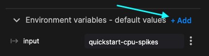
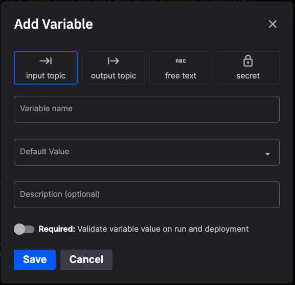

# How to add environment variables in Quix

In Quix, it is possible to create new environment variables that your code can then access. This is useful for things like API keys, secrets, and passwords for other services that your code may need to access.

For credentials and any value that varies between environments, prefer defining a [project variable](./project-variables.md) and binding it to the environment variable. Quix also injects a set of [platform-provided variables](./quix-variables.md) into every deployment.

## To create an environment variable

To add environment variables that you can access from your code, open the code view for your service, and in the `Environment variables` panel, click `+ Add`. 

{width=60%}

The `Add Variable` dialog is displayed:

{width=60%}

Complete the information for the environment variable. You can select properties such as `Text Hidden` for variables that represent API secrets, keys, and passwords. If necessary, you can also make a variable required.

To pass a value defined at project scope, set the variable's input type to `ProjectVariable` and select the project variable to bind. See [Project variables](project-variables.md) for how to define project variables and use them across environments.

## To access an environment variable

Once the variable has been created, you can then access the variable in your code using `os.environ["variable"]`. For example, to access the environment variable `API_SECRET`, your code would be:

```python
api_secret = os.environ["API_SECRET"]
print(api_secret)
```


