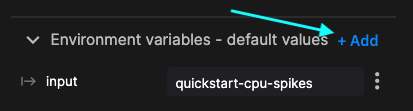

# Environment variables

An environment variable is a **name/value pair that Quix makes available to your deployment's container at runtime**. Your application reads it from its process environment, for example as `os.environ["LOG_LEVEL"]` in Python. Environment variables are the basic way to provide runtime configuration without hard-coding it in application code.

In `quix.yaml`, add them under a deployment's `variables:` list. Each entry has a `name` and an `inputType`. The `inputType` selects the value source; it does not change how your code reads the resulting value.

The examples below show deployment-level entries in `quix.yaml`. An application can instead define variables once in `app.yaml` and let its deployments inherit them; see [YAML 1.0 and 2.0](../projects/yaml-2-0.md) for that inheritance model.

## Choose a value source with `inputType`

For runtime configuration, use one of these value sources:

* **`FreeText`** reads the literal `value:` in this deployment. Use it when the value is non-sensitive and does not need to change between environments.
* **`ProjectVariable`** reads one [project variable](project-variables.md), selected with `variableKey`. Use it when the value differs by environment, is a secret, or is reused by deployments in one project.
* **`VariableGroup`** reads every member of one [global-variable group](global-variables.md), selected with `variableGroupId`. Use it when related configuration or credentials are shared by more than one project.

Applications also support topic, option, and other input types. See the [complete input-type reference](../projects/project-structure.md#variable-input-types) when you are defining an application's interface rather than supplying its runtime configuration.

For `FreeText` and `ProjectVariable`, `name` is the environment-variable name your code receives. A `VariableGroup` binding is different: its `name` is a label in the YAML and UI; Quix injects one environment variable for each member of the group.

### Literal value: `FreeText`

Use a literal value for configuration that belongs to one deployment and is safe to keep in YAML:

```yaml
deployments:
  - name: my-service
    variables:
      - name: LOG_LEVEL
        inputType: FreeText
        value: info
```

This makes `LOG_LEVEL=info` available when `my-service` runs.

### Project value: `ProjectVariable`

Bind one project variable when the runtime value changes by environment or must remain secret:

```yaml
deployments:
  - name: my-service
    variables:
      - name: API_KEY
        inputType: ProjectVariable
        variableKey: API_KEY
        required: true
```

The container receives `API_KEY`. Quix resolves its value when the deployment starts; the secret or environment-specific value is not written into `quix.yaml`. See [Project variables](project-variables.md#pattern-2-bind-to-a-container-environment-variable) for the complete pattern.

Set `required: true` on a binding when the deployment must fail rather than start without a value it cannot resolve.

### Shared values: `VariableGroup`

Bind a global-variable group when the deployment needs all the group's values:

```yaml
deployments:
  - name: my-service
    variables:
      - name: redis
        inputType: VariableGroup
        variableGroupId: redis-config
        required: true
```

If `redis-config` contains `REDIS_HOST`, `REDIS_PORT`, and `REDIS_PASSWORD`, Quix injects all three into the container. See [Global variables](global-variables.md#pattern-2-bind-a-whole-group-to-container-environment-variables) for group setup, value sets, and the complete pattern.

## Read the value in your code

Your code reads every injected value by name, regardless of which `inputType` supplied it:

```python
import os

log_level = os.environ["LOG_LEVEL"]
api_key = os.environ["API_KEY"]
redis_host = os.environ["REDIS_HOST"]
```

## When a value changes

Environment variables are fixed for the lifetime of a running container; Quix does not rewrite its process environment in place. Redeploy to start a new container with the latest literal, project-variable, or variable-group values. Syncing an environment can detect a changed bound value and trigger that redeployment for you.

## Binding is not `{{ }}` substitution

An `inputType` entry **binds a value to the container environment**. Use it for configuration that application code reads at runtime, especially secrets.

`{{ }}` substitution does something else: it writes a resolved non-secret value into a `quix.yaml` field when you sync the environment. It does not create an environment variable for your code. For example, use `{{ REPLICAS }}` to vary a deployment's replica count, not to provide `REPLICAS` to the process environment.

See [Variables overview](variables-overview.md) for the decision guide and timing comparison. Quix also provides [platform variables](quix-variables.md) that your deployment can read without declaring them here.

## Add an environment variable in the UI

Open the code view for your service. In the **Environment variables** panel, click **+ Add**, enter the name, then choose the value source. Quix writes the corresponding `variables:` entry to the deployment configuration.

{width=60%}
