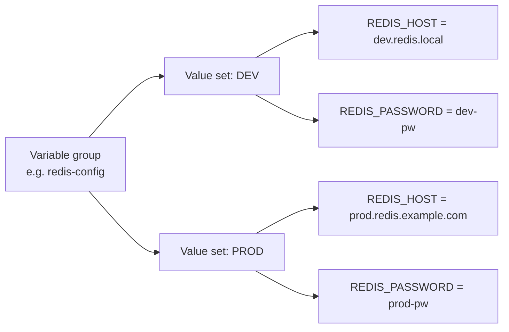

# Global variables

!!! info "Beta feature"

    Global variables are currently in beta. The portal labels the feature with a **Beta** badge in the sidebar; behavior and UI labels may still change before general availability.

## Introduction

**Global variables** are configuration values defined at the organization level and shared across multiple Quix projects. Use them when the same configuration — such as a Redis host, a third-party API key, or a feature flag — is consumed by more than one project, and you want a single place to update it.

Global variables differ from [environment variables](./environment-variables.md), [YAML variables](./yaml-variables.md), and [secrets](./secrets-management.md), which are all scoped to a single project. A global variable belongs to the whole organization and can be consumed by any project that opts in.

Global variables are organized into **variable groups**. A group is a named bucket of related global variables (for example, `redis-config` or `payment-provider`) and is the unit a project assigns. Each group also defines one or more **value sets** — named variants such as `DEV` and `PROD` — so the same variable can hold a different value per environment.

!!! tip "Inject a whole group with one line of YAML"

    A deployment references a variable group **once** in `quix.yaml`, and Quix injects **every variable in the group** into the container as separate environment variables. You don't need to list each variable individually — adding a new variable to the group later automatically reaches every deployment that already references the group. See [Use a global variable in `quix.yaml`](#use-a-global-variable-in-quixyaml).

## Where to find global variables in the portal

The feature has two entry points:

* **Organization level** — `Global Variables` in the organization sidebar. This is where admins create groups, edit their variables, and rotate values. Visible to users whose role grants access to global variables.
* **Project level** — the `Variables` sidebar item opens a panel with two tabs: `Plain Variables` (project-scoped variables, including secrets) and `Variable Groups` (the org-level groups assigned to this project). Use this tab to assign a group to the project and to pick which value set each environment uses.

## When to use global variables

Use global variables when:

* The same configuration is needed by **more than one project** — for example, the credentials for a shared Redis cluster or a third-party API.
* You want to **centralize updates**. Rotating an API key in the group propagates the new value to every project that consumes the group.
* You want to **add or remove variables centrally**. Adding a new global variable to a group automatically makes it available to every deployment that already references the group, without changes to `quix.yaml`.
* You need **environment-specific variants** of a configuration set, and you want to manage all variants together rather than maintaining parallel project variables in every project.

For configuration that is local to a single project, use [YAML variables](./yaml-variables.md) or [secrets](./secrets-management.md) instead.

## How global variables are organized

A global variable lives inside a variable group. The group is the unit a project assigns; the variables it contains are what your code consumes at runtime.



* **Variable group.** A named container that lives at the organization level. The group has an identifier (used in `quix.yaml`), a display name, and an optional description. The identifier is set at creation time and cannot be changed afterwards.
* **Value sets.** Named variants within the group, for example `DEV`, `STAGING`, and `PROD`. Every global variable in the group has one value per value set.
* **Global variables.** Key/value pairs that live inside a group. The variable name is the name of the environment variable that reaches the container at runtime. A variable can be marked as a secret, in which case its value is encrypted at rest and hidden in the UI, in the YAML view, and in the Git repository.

To use a group in a project, you create an **assignment**:

* A **project-level assignment** picks the default value set for every environment in the project.
* An **environment-level override** swaps that choice for a single environment. Project-level and environment-level assignments coexist; the environment-level entry wins when both are present.

## Create a variable group

To create a variable group:

1. In the Quix Cloud portal, open the organization sidebar and select `Global Variables`.

    <!-- TODO: screenshot of the org-level Global Variables page. -->

2. Click `New variable group`.
3. Enter an identifier, a display name, and an optional description. The identifier is used in `quix.yaml` and cannot be changed after creation.
4. Add one or more value sets, for example `DEV` and `PROD`.
5. Click `Save` to create the group.

!!! note "Creator override"

    The user who created a group can edit, delete, and manage assignments for it, even if their role does not grant the general `Update variable groups` or `Delete variable groups` permission. Read and Create still require the standard role permissions.

## Add global variables to a group

To add a global variable:

1. Open the variable group from the `Global Variables` list.
2. Add a new row to the variables grid.
3. Enter the variable name. This is the name that the container sees as an environment variable, so it must follow OS env-var conventions (no spaces; we recommend `[a-zA-Z_][a-zA-Z0-9_]*`). The same name applies across every value set in the group.
4. Enter a value for each value set, for example a development value and a production value.
5. To store the value securely, toggle the `Secret` option. Secret values are encrypted at rest and are not shown in the UI, the YAML view, or the Git repository.
6. Save the row.

Editing a value updates every project and environment that resolves against that value set. Adding a new variable to a group makes it immediately available to every deployment that already references the group — no change to `quix.yaml` is needed.

!!! warning "Secrets cannot be turned back into plain values"

    Once a global variable is marked as a secret, it cannot be demoted to a non-secret variable. To replace a secret with a plain value, delete the variable and recreate it without the `Secret` toggle.

## Assign a variable group to a project

A project must be assigned to a variable group before any deployment in the project can reference its variables.

To create an assignment:

1. Open your project, select `Variables` in the sidebar, and switch to the `Variable Groups` tab.

    <!-- TODO: screenshot of the project Variables → Variable Groups tab. -->

2. Click `Assign variable group`. (If you need a group that does not exist yet, the empty state also offers `Create new group`, which takes you to the org-level dialog.)
3. In the dialog, pick the variable group, then pick the value set that applies to this project by default. The dialog presents fields in the order that matches your starting point — when you assign from the project, the project and environment are already pinned; when you assign from `Global Variables` at the org level, you pick the project and environment instead.
4. Save the assignment.

The project now has access to every global variable in the group, resolved against the chosen value set.

The list of groups offered in the assignment dialog is gated by your role's permissions on global variables. Ask an organization admin if a group you expect to use does not appear.

### Override the value set per environment

The `Variable Groups` tab shows every assigned group as a row, with a column per environment in the project. To override the value set for a single environment:

1. In the row for the assigned group, open the value set dropdown for the environment you want to override.
2. Pick a different value set, for example `PROD`.

    <!-- TODO: screenshot of the per-environment value set dropdown. -->

Environments without an explicit override continue to use the project-level default. Project-level and environment-level entries coexist — the environment-level entry wins where both are set.

## Use a global variable in `quix.yaml`

A deployment references a variable group by adding **one** entry under `variables` with `inputType: VariableGroup` and the group identifier in `variableGroupKey`:

```yaml
deployments:
  - name: Order processor
    application: order-processor
    deploymentType: Service
    variables:
      - name: redis                # label only — not injected
        inputType: VariableGroup
        variableGroupKey: redis-config
```

At deploy time, Quix resolves the group against the value set that is currently assigned to the environment, and injects **every variable in that value set** into the container as a separate environment variable. In the example above, if the `redis-config` group contains `REDIS_HOST`, `REDIS_PORT`, and `REDIS_PASSWORD`, all three become environment variables on the container.

Two consequences worth highlighting:

* **One reference, many env vars.** You don't list each variable in `quix.yaml`. Adding a new variable to the group automatically makes it available to every deployment that already references the group.
* **The `name` field is a label.** It identifies the reference in the UI and in error messages, but it is **not** injected as an environment variable. The env var names are taken from the global variables defined inside the group.

To bring in variables from more than one group, add one entry per group:

```yaml
variables:
  - name: redis
    inputType: VariableGroup
    variableGroupKey: redis-config
  - name: payments
    inputType: VariableGroup
    variableGroupKey: payment-provider
```

### Required references

Set `required: true` on the reference to make the deployment fail-fast at deploy time if the group cannot be resolved:

```yaml
- name: redis
  inputType: VariableGroup
  variableGroupKey: redis-config
  required: true
```

A required reference fails with a clear error if:

* The `variableGroupKey` is empty.
* The group exists but is not assigned to the current environment (no project-level assignment and no per-environment override).

If the reference is not required, an unresolved group is logged and silently skipped, and the container starts without those env vars.

## Access the values from your code

Each global variable in the resolved value set is delivered to the container as a standard environment variable, using the variable's name as the env var name. Read it the same way you read any other environment variable.

=== "Python"

    ```python
    import os

    redis_host = os.environ["REDIS_HOST"]
    redis_password = os.environ["REDIS_PASSWORD"]
    ```

=== "Node.js"

    ```javascript
    const redisHost = process.env.REDIS_HOST;
    const redisPassword = process.env.REDIS_PASSWORD;
    ```

=== "C#"

    ```csharp
    var redisHost = Environment.GetEnvironmentVariable("REDIS_HOST");
    var redisPassword = Environment.GetEnvironmentVariable("REDIS_PASSWORD");
    ```

Secret values are decrypted before injection, so your code receives the plaintext value at runtime.

## Synchronize after changes

After you create or update a global variable, change an assignment, or switch a value set, the affected environments enter an out-of-sync state. Sync each environment to apply the new values. Quix tracks which environments are affected by a given change, so you only need to sync where it matters.

!!! note "Running containers don't hot-reload"

    Syncing updates the deployment definition, but a container that is already running keeps the value it received at start time. **Redeploy or restart the deployment** for the new value to take effect inside the running process.

## Delete a group or value set

Deleting a variable group or a value set is a cascading operation:

* **Delete a value set** — removes all global variables defined for that value set within the group. Assignments that pointed at the value set lose their selection and must be re-pointed.
* **Delete a group** — removes the group, all global variables it contained, and every assignment that referenced it. Projects that depended on the group lose access immediately.

The portal asks for explicit confirmation and lists the projects and environments that will be affected so you can assess the blast radius before confirming. Re-creating a deleted group with the same identifier does not restore previous assignments.

## Full example

The following `quix.yaml` shows a deployment that pulls in global variables from two different groups, alongside YAML variables for resource scaling. The two `VariableGroup` references expand at deploy time into every variable defined in those groups:

```yaml
# Quix Project Descriptor
# This file describes the data pipeline and configuration of resources of a Quix Project.

metadata:
  version: 1.0

deployments:
  - name: Order processor
    application: order-processor
    deploymentType: Service
    version: v1
    resources:
      cpu: {{CPU}}
      memory: {{MEMORY}}
      replicas: {{REPLICAS}}
    variables:
      - name: input
        inputType: InputTopic
        required: true
        value: orders
      - name: redis
        inputType: VariableGroup
        variableGroupKey: redis-config
        required: true
      - name: payments
        inputType: VariableGroup
        variableGroupKey: payment-provider
        required: true
```

In this example:

* `CPU`, `MEMORY`, and `REPLICAS` are [YAML variables](./yaml-variables.md) scoped to this project.
* The `redis` reference brings in every variable defined in the `redis-config` group — for example `REDIS_HOST`, `REDIS_PORT`, `REDIS_PASSWORD`.
* The `payments` reference brings in every variable defined in the `payment-provider` group — for example `PAYMENT_API_KEY`, `PAYMENT_API_URL`. Variables that the group marks as secret arrive decrypted at runtime.

If the SaaS team later adds a `REDIS_DB_INDEX` variable to the `redis-config` group, it automatically reaches this deployment on the next sync — no edit to `quix.yaml` required.

## How global variables compare with other variable types

Quix offers several mechanisms for configuring deployments. The following table summarizes when to use each one:

| Mechanism | Scope | Per-environment values | Typical use |
|---|---|---|---|
| [Environment variables](./environment-variables.md) | Single deployment | No | Static, deployment-specific configuration |
| [YAML variables](./yaml-variables.md) | Single project | Yes | Per-environment scaling such as `CPU`, `MEMORY`, `REPLICAS` |
| [Secrets](./secrets-management.md) | Single project | Yes | Credentials specific to one project |
| **Global variables** | Organization-wide (via variable groups) | Yes, through value sets | Shared configuration consumed by multiple projects; one reference injects the whole group |
| [Quix variables](./quix-variables.md) | Platform-injected | Read-only | Built-in identifiers such as `Quix__Workspace__Id` |
