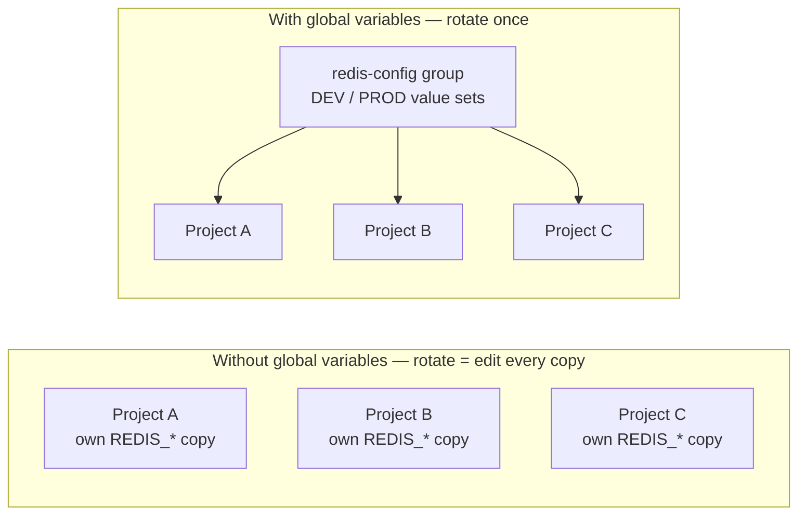
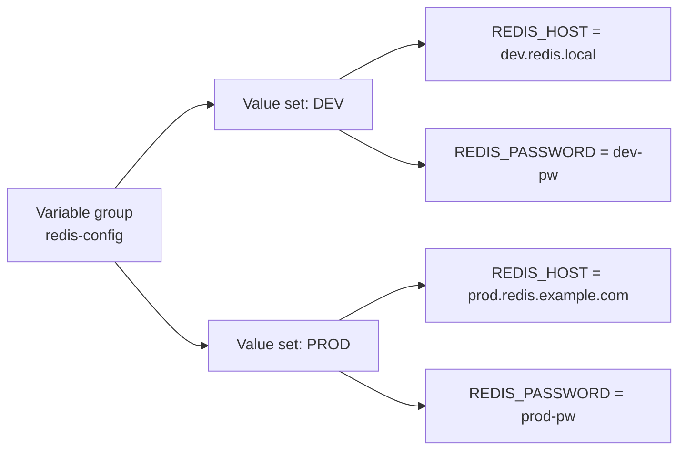
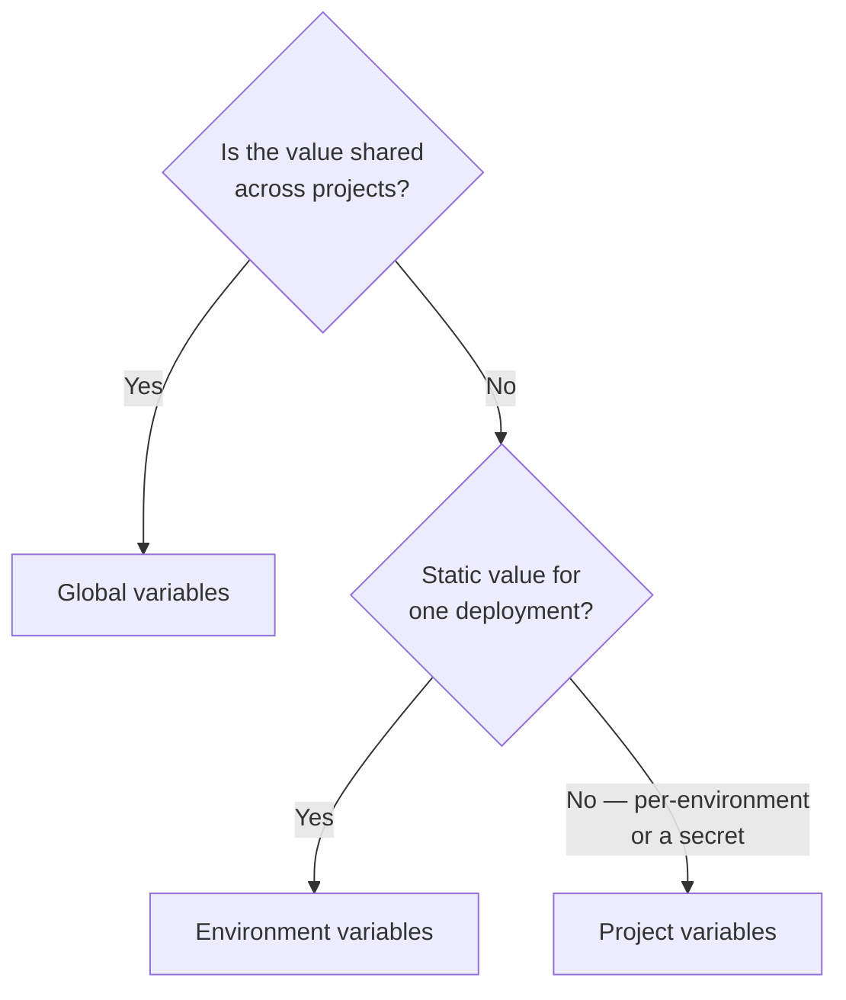
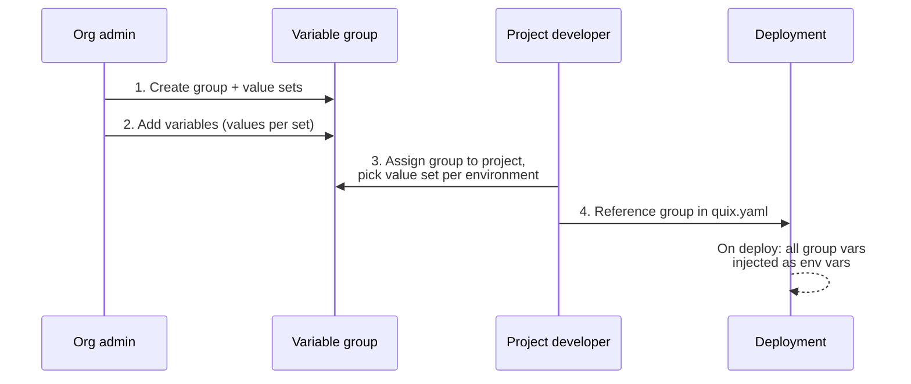

# Global variables

!!! info "Beta feature"

    Global variables are currently in beta. The portal labels the feature with a **Beta** badge in the sidebar; behavior and UI labels may still change before general availability.

**Global variables** let you define configuration once, at the organization level, and reuse it across many projects and environments. A deployment pulls in a whole set of these variables with a single reference, and you update the value in one place instead of editing every project that uses it.

## The problem they solve

Without global variables, configuration that is shared by several projects has to be duplicated into each one. A typical example is a Redis cluster used by five different services:

* You copy `REDIS_HOST`, `REDIS_PORT`, and `REDIS_PASSWORD` into all five projects, and into each environment (`develop`, `production`) of every project.
* When the password rotates, you edit the value in 5 projects × 2 environments = **10 places**. Miss one and that service breaks.
* Adding a new setting (say `REDIS_DB_INDEX`) means touching every project again.
* There is no single source of truth — the values drift apart over time.

Global variables remove the duplication:

* Define the Redis configuration **once** as a group, with a value set per environment (`DEV`, `PROD`).
* Each project **assigns** the group and picks which value set each environment uses.
* Rotating the password is a **single edit** that reaches every project and environment that consumes the group.
* Adding `REDIS_DB_INDEX` to the group makes it available everywhere — no change to any project's `quix.yaml`.



## What a global variable is

Global variables are organized into **variable groups**. Understanding three terms is enough to use the feature:

| Term | What it is |
|---|---|
| **Variable group** | A named, organization-level container of related variables — for example `redis-config`. It has an immutable identifier (used in `quix.yaml`), a display name, and an optional description. It is the unit a project assigns. |
| **Value set** | A named variant within a group — for example `DEV` and `PROD`. Every variable in the group holds one value per value set, so the same group supplies different values in different environments. |
| **Global variable** | A key/value pair inside a group. Its name becomes the **environment-variable name** injected into the container. It can be marked **secret**, in which case the value is encrypted at rest and hidden in the UI, the YAML view, and Git. |



A project consumes a group through an **assignment**:

* A **project-level assignment** picks the default value set for every environment in the project.
* An **environment-level override** swaps that choice for a single environment. Both coexist; the environment-level override wins where it is set.

!!! tip "One reference injects the whole group"

    A deployment references a group **once** in `quix.yaml`, and Quix injects **every variable in the resolved value set** as separate environment variables. You never list the individual variables — and adding a variable to the group later reaches every deployment that already references it, with no YAML change. See [Reference a group in `quix.yaml`](#reference-a-group-in-quixyaml).

## When to use global variables

Reach for global variables when **the same configuration is consumed by more than one project**, or when you want **one place** to manage a related set of values across environments. Concretely:

* **Shared infrastructure** — a database, cache, message broker, or object store that several services connect to.
* **Shared third-party credentials** — one API key used by every service that calls a given provider.
* **Centralized rotation** — you want to change a value once and have it land everywhere automatically.
* **Grouped configuration** — a set of related settings you would rather manage as a unit than as scattered individual variables.

Use a **different mechanism** when the configuration belongs to a single project:



| You want to… | Use |
|---|---|
| Share config across multiple projects | **Global variables** |
| A per-environment value or a secret within one project (`CPU`, `MEMORY`, `REPLICAS`, API keys) | [Project variables](./project-variables.md) |
| Set a static value on one deployment | [Environment variables](./environment-variables.md) |
| Read a platform-provided identifier | [Quix variables](./quix-variables.md) |

## How it works end to end

Setting up and consuming a global variable is four steps, split between an organization admin and a project developer:



The rest of this page walks through each step.

## Set up a variable group

*(Organization level — `Global Variables` in the organization sidebar.)*

### Create the group

1. In the Quix Cloud portal, open the organization sidebar and select `Global Variables`.

    <!-- TODO: screenshot of the org-level Global Variables page. -->

2. Click `New variable group`.
3. Enter an **identifier**, a **display name**, and an optional **description**. The identifier is what you reference in `quix.yaml` and **cannot be changed after creation**. It accepts letters, digits, hyphens, and underscores (up to 254 characters) and must start with a letter or digit. Identifiers are compared case-insensitively when checking for duplicates, so `redis-config` and `Redis-Config` cannot both exist.
4. Add one or more **value sets**, for example `DEV` and `PROD`.
5. Click `Save`.

!!! note "Creator override"

    The user who creates a group can update it, add value sets, and manage its assignments even if their role lacks the general `Update` permission. The override does **not** cover deletions: deleting the group still requires the `Delete` permission, and deleting a value set requires the `Update` permission. Reading and creating groups also require the standard permissions.

### Add variables

1. Open the group from the `Global Variables` list.
2. Add a row to the variables grid.
3. Enter the **variable name**. This becomes the environment-variable name in the container, so it must follow OS conventions: **no spaces**; we recommend `[a-zA-Z_][a-zA-Z0-9_]*`. The same name applies across every value set.
4. Enter a **value for each value set** — for example a development value and a production value.
5. To protect the value, toggle **`Secret`**. Secret values are encrypted at rest and hidden in the UI, the YAML view, and Git.
6. Save the row.

Editing a value updates every project and environment that resolves against that value set.

!!! note "Turning a secret back into a plain value"

    You can clear the `Secret` toggle to make a variable plain again, but you must enter a **new value** in the same edit. A demotion with no new value is rejected — the platform never exposes the stored encrypted value as plaintext.

## Assign a group to a project

*(Project level — `Variables` in the project sidebar → `Variable Groups` tab.)*

A project must assign a group before any of its deployments can reference the group's variables.

1. Open your project, select `Variables` in the sidebar, and switch to the `Variable Groups` tab.

    <!-- TODO: screenshot of the project Variables → Variable Groups tab. -->

2. Click `Assign variable group`. (If the group does not exist yet, the empty state also offers `Create new group`, which opens the org-level dialog.)
3. In the dialog, pick the **group**, then the **default value set** for this project. The dialog orders its fields to match where you started: from the project, the project and environment are already filled in; from `Global Variables` at the org level, you pick the project and environment instead.
4. Save the assignment.

The project now resolves every variable in the group against the chosen value set.

!!! note

    The groups offered in the assignment dialog are gated by your role's permissions on global variables. Ask an organization admin if a group you expect is missing.

### Override the value set per environment

The `Variable Groups` tab lists each assigned group as a row, with a column per environment. To make one environment use a different value set:

1. In the group's row, open the value set dropdown for the environment you want to change.
2. Pick a different value set — for example `PROD`.

    <!-- TODO: screenshot of the per-environment value set dropdown. -->

Environments without an explicit override keep the project-level default. Where both exist, the environment-level override wins.

## Reference a group in `quix.yaml`

A deployment references a group by adding **one** entry under `variables` with `inputType: VariableGroup` and the group's identifier in `variableGroupId`:

```yaml
deployments:
  - name: Order processor
    application: order-processor
    deploymentType: Service
    variables:
      - name: redis                 # label only — not injected
        inputType: VariableGroup
        variableGroupId: redis-config
        required: true
```

At deploy time, Quix resolves the group against the value set currently assigned to the environment and injects **every variable in that value set** as a separate environment variable. If `redis-config` contains `REDIS_HOST`, `REDIS_PORT`, and `REDIS_PASSWORD`, all three appear in the container.

Two things to keep in mind:

* **One reference, many env vars.** You do not list the individual variables. Adding a variable to the group later reaches this deployment automatically on the next sync.
* **The `name` field is a label.** It identifies the reference in the UI and in error messages but is **not** injected. The injected names come from the variables defined inside the group.

!!! note "`quix.yaml` or `app.yaml`?"

    The example above shows the reference on a deployment in the pipeline file `quix.yaml`. The identical entry is also valid in an application's `app.yaml` (`variables:` block) — declare it there to make the binding part of the application itself, so every deployment of that app inherits it:

    ```yaml
    # app.yaml — the binding travels with the application
    variables:
      - name: redis
        inputType: VariableGroup
        variableGroupId: redis-config
        required: true
    ```

    See [Project structure](../projects/project-structure.md) for how `app.yaml` and `quix.yaml` relate.

To pull in more than one group, add one entry per group:

```yaml
variables:
  - name: redis
    inputType: VariableGroup
    variableGroupId: redis-config
  - name: payments
    inputType: VariableGroup
    variableGroupId: payment-provider
```

### Required references

Set `required: true` to make the deployment **fail fast** at deploy time when the group cannot be resolved:

```yaml
- name: redis
  inputType: VariableGroup
  variableGroupId: redis-config
  required: true
```

A required reference fails with a clear error when the `variableGroupId` is empty, or when the group is not assigned to the current environment (no project-level assignment and no override). A non-required reference that cannot be resolved is logged and skipped, and the container starts without those variables.

## Access the values from your code

Each variable in the resolved value set arrives as a standard environment variable, named after the variable. Read it like any other environment variable.

=== "Python"

    ```python
    import os

    redis_host = os.environ["REDIS_HOST"]
    redis_password = os.environ["REDIS_PASSWORD"]
    ```

=== "Node.js"

    ```javascript
    const redisHost = process.env.REDIS_HOST;
    const redisPassword = process.env.REDIS_PASSWORD;
    ```

=== "C#"

    ```csharp
    var redisHost = Environment.GetEnvironmentVariable("REDIS_HOST");
    var redisPassword = Environment.GetEnvironmentVariable("REDIS_PASSWORD");
    ```

Secret values are decrypted before injection, so your code receives the plaintext value at runtime.

## Keep environments in sync

After you change a variable's value, an assignment, or a value set, the affected environments go **out of sync**. Sync each one to apply the change. Quix tracks which environments a given change affects, so you only sync where it matters, and the sync diff shows which group changed (including a switch from one value set to another).

!!! note "Syncing redeploys the affected deployments"

    A running container reads its environment variables once at start, so it does not pick up a new value while running. When you **sync the environment**, Quix detects that the group's resolved values changed and **redeploys the deployments that use it**, so they restart with the new values — you don't need to redeploy them by hand. (The background out-of-sync check only flags the drift; applying it is the sync.)

### Delete a group or value set

Deletes cascade:

* **Delete a value set** — removes every variable's value for that set within the group, and deletes the assignments that selected it. Affected projects and environments must be re-assigned a value set.
* **Delete a group** — removes the group, all its variables, and every assignment that referenced it. Projects depending on it lose access immediately.

The portal asks you to confirm before deleting. Because the delete cascades to variables and assignments across every project that uses the group, check which projects depend on it first. Re-creating a group with the same identifier does **not** restore previous assignments.

## Full example

This `quix.yaml` pulls global variables from two groups, alongside YAML variables for resource scaling. Each `VariableGroup` reference expands at deploy time into every variable in its group:

```yaml
# Quix Project Descriptor
# This file describes the data pipeline and configuration of resources of a Quix Project.

metadata:
  version: 1.0

deployments:
  - name: Order processor
    application: order-processor
    deploymentType: Service
    version: v1
    resources:
      cpu: {{CPU}}
      memory: {{MEMORY}}
      replicas: {{REPLICAS}}
    variables:
      - name: input
        inputType: InputTopic
        required: true
        value: orders
      - name: redis
        inputType: VariableGroup
        variableGroupId: redis-config
        required: true
      - name: payments
        inputType: VariableGroup
        variableGroupId: payment-provider
        required: true
```

In this example:

* `CPU`, `MEMORY`, and `REPLICAS` are [project variables](./project-variables.md) scoped to this project, substituted with `{{ }}`.
* The `redis` reference injects every variable in `redis-config` — for example `REDIS_HOST`, `REDIS_PORT`, `REDIS_PASSWORD`.
* The `payments` reference injects every variable in `payment-provider` — for example `PAYMENT_API_KEY`, `PAYMENT_API_URL`. Variables the group marks as secret arrive decrypted at runtime.

If a `REDIS_DB_INDEX` variable is later added to `redis-config`, it reaches this deployment on the next sync with no edit to `quix.yaml`.

## Reference

This section is a precise specification of the `quix.yaml` shape, the rules the platform enforces, and the resolution behavior — useful for power users and for tooling or AI assistants that generate `quix.yaml`.

### `quix.yaml` variable fields

A deployment variable that references a group is an entry in `deployments[].variables[]` with these fields:

| Field | Required | Type | Meaning |
|---|---|---|---|
| `name` | yes | string | A label for the reference, shown in the UI and error messages. **Not injected** as an environment variable. |
| `inputType` | yes | string | Must be exactly `VariableGroup` to reference a group. |
| `variableGroupId` | yes | string | The **identifier** of the variable group to inject. Resolution is keyed solely on this value. |
| `required` | no | boolean | Default `false`. When `true`, the deployment fails to deploy if the group cannot be resolved. When `false`, an unresolved group is skipped. |
| `variableGroupName` | no | string | Optional human-readable echo of the group's display name. Informational only — written by the portal for readability; does not affect resolution. |
| `variableGroupDescription` | no | string | Optional human-readable echo of the group's description. Informational only. |

!!! warning "Field name is `variableGroupId`, not `variableGroupKey`"

    Earlier internal builds used `variableGroupKey`. The current, supported field is **`variableGroupId`**. Use `variableGroupId`.

### Rules and constraints

* A group **identifier is immutable** after the group is created. It must match `^[A-Za-z0-9][A-Za-z0-9_-]*$` (letters, digits, hyphens, underscores; not starting with a separator), at most 254 characters. Duplicate detection at creation is case-insensitive.
* A reference's **`name` is a label**, never an injected environment variable. Injected names come from the variables inside the group.
* **Global variable names cannot contain spaces** (recommended pattern `[a-zA-Z_][a-zA-Z0-9_]*`), because each becomes an OS environment-variable name.
* A **secret variable can be demoted** to a plain value only by supplying a new value in the same edit; a demotion with no new value is rejected (the stored encrypted value is never exposed).
* A project needs an **assignment** (project-level or environment-level) before a deployment can resolve a group.
* The **environment-level override wins** over the project-level default when both are set.
* Changing values or assignments marks affected environments **out of sync**; **syncing the environment redeploys** the deployments that use the group so they restart with the new values. (The background out-of-sync check only flags the drift; the sync applies it.)
* Deleting a group or value set **cascades** to its variables and assignments.

### Resolution and failure modes

At deploy time, for each `VariableGroup` reference:

| Situation | `required: true` | `required: false` |
|---|---|---|
| `variableGroupId` is empty | Deployment fails | Logged and skipped |
| Group is not assigned to the environment | Deployment fails | Logged and skipped |
| Group resolves to a value set | Every variable in that value set is injected as an environment variable | Same |

The value set used is the environment-level override if present, otherwise the project-level default.

### How global variables compare with other variable types

| Mechanism | Scope | Per-environment values | Typical use |
|---|---|---|---|
| [Environment variables](./environment-variables.md) | Single deployment | No | Static, deployment-specific configuration |
| [Project variables](./project-variables.md) | Single project | Yes | Per-environment scaling (`CPU`, `MEMORY`, `REPLICAS`) and project-scoped secrets |
| **Global variables** | Organization-wide (via variable groups) | Yes, through value sets | Shared configuration consumed by multiple projects; one reference injects the whole group |
| [Quix variables](./quix-variables.md) | Platform-injected | Read-only | Built-in identifiers such as `Quix__Workspace__Id` |

### Glossary

| Term | Definition |
|---|---|
| **Variable group** | Organization-level container of related global variables; the unit a project assigns. Identified by an immutable identifier. |
| **Value set** | A named set of values within a group (e.g. `DEV`, `PROD`). Each variable has one value per value set. |
| **Global variable** | A key/value pair inside a group. Its name is the injected environment-variable name. May be a secret. |
| **Assignment** | The link between a project and a group that selects which value set the project (or one of its environments) uses. |
| **Override** | An environment-level assignment that replaces the project-level default value set for a single environment. |
