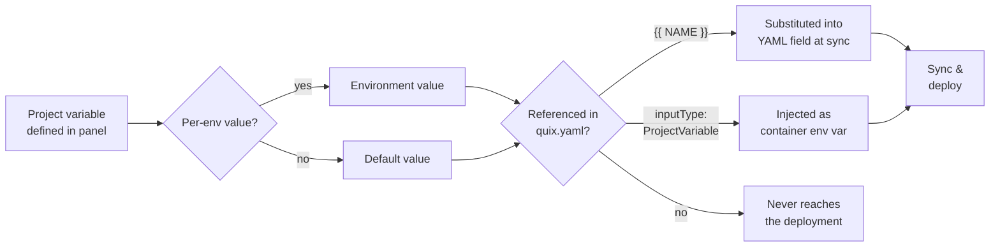
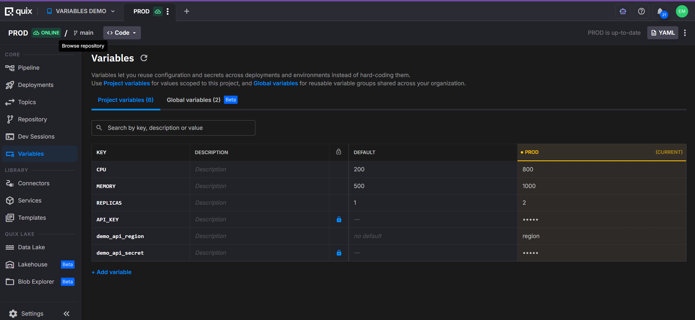
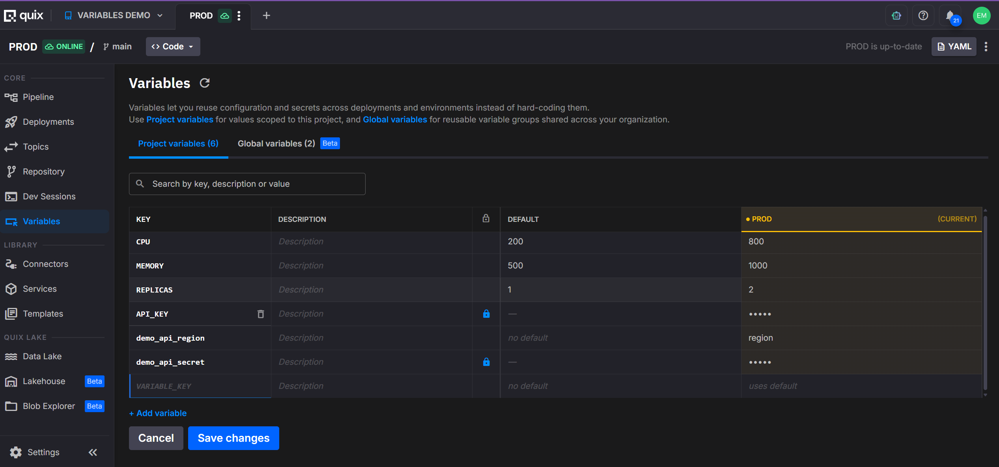
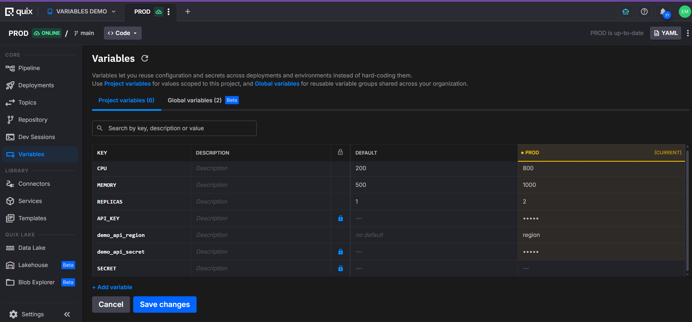
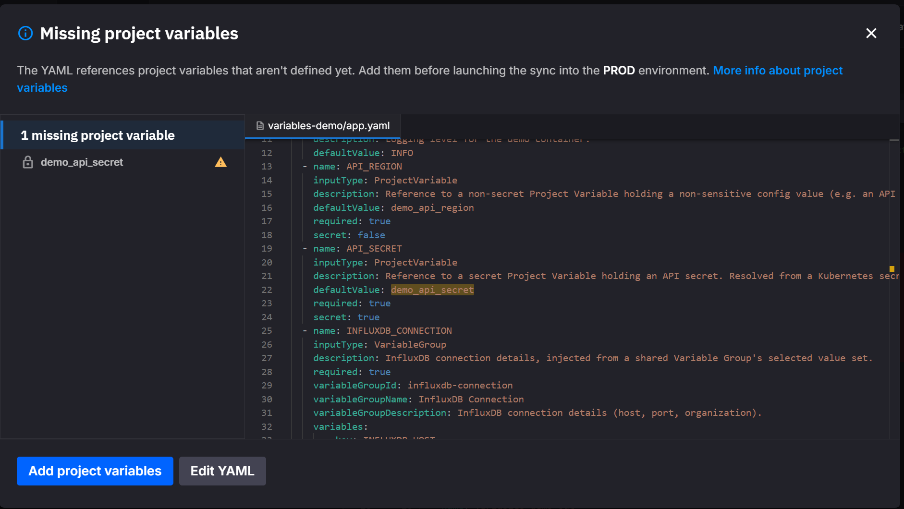

# Project variables

A **project variable** is a named value defined at project scope, with optional per-environment overrides and an optional `secret` flag that encrypts the value. Project variables are the single source of truth for any pipeline value that varies between environments (such as `develop` vs `production`) or has to be kept private (such as API keys and database passwords).

Define a value once on the project, give each environment its own value when needed, optionally mark it as a secret, and Quix resolves the right value at deployment time.

!!! warning "YAML Variables and Secrets Management are deprecated"

    Project variables replace two earlier features:

    * **YAML Variables** — per-environment `{{ }}` substitutions in `quix.yaml`.
    * **Secrets Management** — the separate encrypted store for credentials.

    Both are **deprecated**. Their URLs (`deploy/yaml-variables.html`, `deploy/secrets-management.html`, and the same paths under `quix-cloud/deployments/`) now redirect here, and the standalone UI panels they had have been replaced by the single `Project variables` panel.

    Existing projects keep working — the legacy YAML shapes are still accepted on read and continue to resolve. New work should use the project-variable patterns described on this page. See [Why we deprecated Secrets and YAML variables](#why-we-deprecated-secrets-and-yaml-variables) for the rationale, and [Backward compatibility](#backward-compatibility) for the YAML migration table.

## When to use a project variable

Use a project variable whenever a value needs at least one of:

* **A different value per environment.** Common for resource sizing, public URL prefixes, feature toggles, and any external endpoint that differs between `develop` / `staging` / `production`.
* **Encryption.** Common for API keys, database passwords, OAuth client secrets, third-party tokens.
* **Reuse across multiple deployments.** One variable, many references — change the value in one place and every deployment picks it up on next sync.

If none of those apply — for example, a hard-coded topic name that never varies — a literal `value:` in `quix.yaml` is fine.

## How Quix resolves a project variable



Key facts the diagram encodes:

* **Per-environment override > default value.** If the environment has its own value, that wins. Otherwise the default applies.
* **Defining a project variable does not expose it.** A variable reaches a deployment only when `quix.yaml` explicitly references it (either pattern).
* **Substitution happens at sync time.** Templated values are resolved when an environment is synced and the resolved literal lands in the rendered pipeline.
* **Binding happens at deployment runtime.** Application variables of `inputType: ProjectVariable` are resolved when the deployment starts, so the secret value never lands in YAML.

## Create a project variable

Project variables live on a dedicated `Project variables` panel attached to the project. The panel is the same across every environment in the project — environments share the variable definitions and only differ in the values they assign.

1. From your project, open the `Project variables` panel.

    
2. Click `+ New variable`.
3. Give the variable a `Name`. The name is the key you reference in `quix.yaml` and from your application code. Use uppercase letters, digits, and underscores starting with a letter or underscore so the name maps cleanly to a container environment variable.
4. Set the variable's `Default value`. The default applies to every environment that does not provide its own value, and is the fallback when a new environment is later created.
5. For any environment that needs a different value, set a per-environment override. The override replaces the default for that environment only; other environments continue to use the default.

    
6. To store the value securely, enable the `Secret` toggle. Encryption applies to both the default and every per-environment override, and the value is hidden in the UI, the YAML view, and Git.

    
7. Click `Save changes`.

!!! tip "Settings menu shortcut"

    `Settings → Project variables` opens the same panel from anywhere in the project. This entry replaces the legacy `Settings → Secrets management` entry.

## Pattern 1 — Substitute into a `quix.yaml` field

Wrap the variable name in double curly braces to substitute the resolved value of a project variable directly into a `quix.yaml` field. The substitution happens at sync time, so the value becomes part of the rendered pipeline configuration.

Use this pattern for fields that need to vary per environment but don't need to be secret — resource sizing, public URL prefixes, feature toggles.

**Before — hard-coded resources:**

```yaml
resources:
  limits:
    cpu: 200
    memory: 500
  replicas: 1
```

**After — per-environment values:**

```yaml
resources:
  limits:
    cpu: {{CPU}}
    memory: {{MEMORY}}
  replicas: {{REPLICAS}}
```

**Disabling a deployment per environment:**

```yaml
deployments:
  - name: CPU Threshold
    disabled: {{DISABLED}}
```

**Concatenating multiple variables in one string:**

```yaml
publicAccess:
  enabled: true
  urlPrefix: {{URL_PREFIX}}-{{ENV_NAME}}
```

!!! warning "Secrets cannot be referenced with `{{ }}`"

    `{{ }}` substitution embeds the resolved value into the rendered `quix.yaml`, which is stored in Git. If you reference a project variable that has `Secret` enabled, the sync fails with an error such as:

    `Secret project variables ('MY_SECRET') cannot be referenced via {{ }} template syntax. Use inputType: ProjectVariable with variableKey instead.`

    Use Pattern 2 (below) to pass a secret to a deployment. Pattern 2 resolves at runtime — the value never lands in YAML.

## Pattern 2 — Bind to a container environment variable

To pass a project variable to your application as an environment variable, declare the application variable with `inputType: ProjectVariable` and set `variableKey` to the name of the project variable. The value resolves at deployment runtime and is injected directly into the container, never into the rendered YAML.

Use this pattern for any value your application code reads from `os.environ` (or the equivalent). Required for secrets, recommended for any binding that doesn't need to vary the structure of `quix.yaml` itself.

```yaml { .annotate }
deployments:
  - name: my-service
    application: My Service
    variables:
      - name: API_KEY           # (1)!
        inputType: ProjectVariable  # (2)!
        description: Third-party API key
        required: true
        variableKey: THIRD_PARTY_API_KEY  # (3)!
        secret: true            # (4)!
```

1. The name of the environment variable as it appears inside the running container. Your code reads this.
2. Tells Quix to resolve the value from a project variable instead of using a literal `value:` field.
3. The key of the project variable to read. Resolution is per-environment at deployment time.
4. Optional hint that the referenced project variable is a secret. It must match the variable's `Secret` flag in the panel (a mismatch fails the sync — see [Validation errors](#validation-errors-and-the-missing-values-flow)); the portal writes it for you. Omit it for a non-secret variable, or set `secret: false`.

The application receives an environment variable named `API_KEY` whose value is the project variable `THIRD_PARTY_API_KEY` in the current environment. Mark `THIRD_PARTY_API_KEY` as `Secret` in the project variables panel to encrypt the value at rest and keep it out of YAML.

!!! note "`quix.yaml` or `app.yaml`? (the field name differs)"

    The binding above is on a deployment in `quix.yaml`, where the project-variable key goes in `variableKey`. You can also declare the same binding on the **application** in `app.yaml`, so it travels with the app to every deployment — but the application descriptor names the field **`defaultValue`** instead of `variableKey`:

    ```yaml
    # app.yaml — on the application; the project-variable key goes in `defaultValue`
    variables:
      - name: API_KEY
        inputType: ProjectVariable
        defaultValue: THIRD_PARTY_API_KEY
        required: true
        secret: true
    ```

    The portal writes `app.yaml` in this form when you add an application variable in the UI. A deployment of the app then inherits this binding — see [Inheriting variables from `app.yaml`](#inheriting-variables-from-appyaml) for how that works and when a deployment overrides it.

## Access the value from your application code

A project variable bound via Pattern 2 arrives in the container as a standard environment variable. Read it with the language's normal environment-variable API.

=== "Python"

    ```python
    import os

    api_key = os.environ["API_KEY"]
    ```

=== "Node.js"

    ```javascript
    const apiKey = process.env.API_KEY;
    ```

=== "C#"

    ```csharp
    var apiKey = Environment.GetEnvironmentVariable("API_KEY");
    ```

=== "Go"

    ```go
    apiKey := os.Getenv("API_KEY")
    ```

## Related concept — Variable groups

When a set of related values is shared across **multiple projects** — for example, the host, port, and token of a database every service connects to — define them once as organization-scoped **global variables** and bundle them into a *variable group*. A deployment then pulls in the whole group with a single reference:

```yaml
variables:
  - name: DB
    inputType: VariableGroup
    description: Database connection
    required: true
    variableGroupId: production-db
    variableGroupName: Production DB
    variableGroupDescription: Shared database connection
```

`inputType: VariableGroup` resolves at runtime like `inputType: ProjectVariable`, but the values come from an organization-scoped variable group rather than this project's variables. Use project variables for values local to one project; use a variable group when the same set is shared across projects. See [Global variables](global-variables.md) for the full feature.

## Validation errors and the missing-values flow

When you sync an environment, Quix validates every project-variable reference. These error kinds can be reported:

| Error | Cause | Fix |
|---|---|---|
| **Missing reference** | A deployment variable (`inputType: ProjectVariable`) or a `{{ }}` template references a key that does not exist as a project variable in this environment. | Create the variable, or remove/rename the reference. |
| **Type mismatch** | A `{{ }}` template resolves to a value that cannot be converted to the field's expected type. For example, `replicas` expects an integer; the resolved value is `"two"`. | Set a value of the correct type for that environment. |
| **Secret in template** | A `{{ }}` template references a project variable that has `Secret` enabled. | Switch to Pattern 2 (`inputType: ProjectVariable` + `variableKey`). |
| **Secret mismatch** | A deployment variable declares a `secret:` value in `quix.yaml` that contradicts the stored project variable's `Secret` flag. | Align the YAML `secret:` hint with the variable, or drop the hint and let the stored flag apply. |

If the target environment is missing required values, Quix blocks the sync and opens the `Missing project variables` dialog. The dialog explains: *"The YAML references project variables that aren't defined yet. Add them before launching the sync into the [environment] environment."* and lists the missing keys.



From this dialog you can:

* Click `Add project variables` to provide the missing values inline.
* Click `Edit YAML` to open `quix.yaml` and remove or rename the offending references instead.

The deployment does not start until every referenced project variable has a value for the target environment.

## Recipes

Common configuration tasks and the exact shape to use.

### Scale resources per environment

Goal — `develop` runs small, `production` runs big, same `quix.yaml`.

1. In `Project variables`, create `CPU`, `MEMORY`, `REPLICAS` with environment values `200 / 500 / 1` in `develop` and `800 / 1000 / 2` in `production`.
2. In `quix.yaml`:

```yaml
deployments:
  - name: my-service
    resources:
      limits:
        cpu: {{CPU}}
        memory: {{MEMORY}}
      replicas: {{REPLICAS}}
```

3. Sync each environment to apply.

### Inject a secret API key into a Python service

Goal — your code calls a third-party API; the key must never appear in Git.

1. In `Project variables`, create `THIRD_PARTY_API_KEY`, enable the `Secret` toggle, and set the per-environment values.
2. In `quix.yaml`, bind it to a container env var:

```yaml
variables:
  - name: API_KEY
    inputType: ProjectVariable
    required: true
    variableKey: THIRD_PARTY_API_KEY
    secret: true
```

3. In `main.py`:

```python
import os

api_key = os.environ["API_KEY"]
```

### Disable a deployment in selected environments

Goal — a debugging service runs in `develop` only.

1. In `Project variables`, create `DEBUG_DISABLED` with default `true` and override `false` in `develop`.
2. In `quix.yaml`:

```yaml
deployments:
  - name: Debug Inspector
    disabled: {{DEBUG_DISABLED}}
```

### Compose a per-environment public URL

Goal — `develop` exposes `myapp-develop.quix.io`, `production` exposes `myapp-production.quix.io`.

1. In `Project variables`, create `URL_PREFIX` with default `myapp`, and `ENV_NAME` with per-environment values `develop` / `production`.
2. In `quix.yaml`:

```yaml
publicAccess:
  enabled: true
  urlPrefix: {{URL_PREFIX}}-{{ENV_NAME}}
```

### Inject a database connection (multiple related values)

Goal — host, port, and token all need to be available, all per-environment, and the token must be encrypted.

1. In `Project variables`, create `DB_HOST`, `DB_PORT`, and `DB_TOKEN` (with `Secret` enabled), each with per-environment values.
2. In `quix.yaml`, bind each one:

```yaml
variables:
  - name: DB_HOST
    inputType: ProjectVariable
    variableKey: DB_HOST
  - name: DB_PORT
    inputType: ProjectVariable
    variableKey: DB_PORT
  - name: DB_TOKEN
    inputType: ProjectVariable
    required: true
    variableKey: DB_TOKEN
    secret: true
```

3. In your code:

```python
import os

host = os.environ["DB_HOST"]
port = os.environ["DB_PORT"]
token = os.environ["DB_TOKEN"]
```

!!! tip "Shared across projects?"

    If the same database is used by several projects, define these as an organization-scoped **global variable group** instead and inject all three with a single reference. See [Global variables](global-variables.md).

## Inheriting variables from `app.yaml`

From descriptor **version 2.0**, an application's variables are defined **once** in its **`app.yaml`**, and every deployment of that application **inherits** them — `quix.yaml` does not redeclare them.

- **`app.yaml` is the source of truth.** It declares each variable's `inputType`, `description`, `required`, and value or key (`defaultValue`). A deployment that references the application by `application` + `version` picks up the whole set. The portal writes `app.yaml` for you when you add an application variable in the UI.
- **`quix.yaml` records only overrides.** A deployment lists a variable *only* to change a property for that deployment — a different value or key. Anything left at the application default is omitted, so a deployment that uses every default has **no `variables:` block at all** (see the [full example](#full-example)). On write-back (after a sync or deployment update) the platform strips properties that match the app, keeping `quix.yaml` minimal.
- **To override one deployment**, declare just that variable in its `variables:` block with the changed property; the rest stays inherited.

The same variable uses a different field name on each side:

| Concept | `app.yaml` (define once) | `quix.yaml` deployment (override only) |
|---|---|---|
| Plain value | `defaultValue: cpu-load` | `value: cpu-load` |
| Project-variable key | `defaultValue: THIRD_PARTY_API_KEY` | `variableKey: THIRD_PARTY_API_KEY` |
| Variable-group reference | `variableGroupId: redis-config` | `variableGroupId: redis-config` |
| Secret flag | `secret: true` | `secret: true` *(inherited)* |

For example, an `app.yaml` default of `defaultValue: info` on a `LOG_LEVEL` variable is inherited by every deployment. To run one deployment at `debug`, that deployment alone adds the override:

```yaml
# quix.yaml — override LOG_LEVEL for this one deployment
variables:
  - name: LOG_LEVEL
    value: debug
```

Every other deployment keeps inheriting `info`, and `LOG_LEVEL` stays absent from their blocks.

Inheritance applies to deployments that reference an `application` + `version`; managed services don't inherit. See [Project structure](../projects/project-structure.md) for how the two files relate.

## Full example

The two files below show this together — `app.yaml` defines the variables, and the `quix.yaml` deployment inherits them while using `{{ }}` only for the per-environment pipeline fields it substitutes (resources, the public URL).

**`app.yaml`** — in the application folder, defines the application's variables:

```yaml
name: Starter transformation
language: python
variables:
  - name: input
    inputType: InputTopic
    description: Name of the input topic to listen to.
    required: false
    defaultValue: cpu-load
  - name: output
    inputType: OutputTopic
    description: Name of the output topic to write to.
    required: false
    defaultValue: transform
  - name: API_KEY
    inputType: ProjectVariable
    description: Third-party API key
    required: true
    defaultValue: THIRD_PARTY_API_KEY
    secret: true
dockerfile: build/dockerfile
runEntryPoint: main.py
```

**`quix.yaml`** — the pipeline; the deployment references the application, inherits the variables above, and substitutes per-environment values into its fields:

```yaml
# Quix Project Descriptor
metadata:
  version: 2.0

deployments:
  - name: CPU Threshold
    application: Starter transformation
    version: latest
    deploymentType: Service
    resources:
      limits:
        cpu: {{CPU}}
        memory: {{MEMORY}}
      replicas: {{REPLICAS}}
    disabled: {{DISABLED}}
    publicAccess:
      enabled: true
      urlPrefix: {{URL_PREFIX}}-{{ENV_NAME}}
    # input, output, and API_KEY are inherited from the application's app.yaml
```

In this example:

* `CPU`, `MEMORY`, `REPLICAS`, `DISABLED`, `URL_PREFIX`, and `ENV_NAME` are project variables substituted into the deployment's fields with `{{ }}` at sync time — so `develop` can run small and `production` large with no YAML change.
* `input`, `output`, and `API_KEY` are application variables defined in `app.yaml`; the deployment inherits them, so they don't have to be repeated in `quix.yaml`.
* `API_KEY` binds to the project variable `THIRD_PARTY_API_KEY`. With `secret: true` and the variable marked secret in the panel, the value resolves at runtime and never lands in YAML.

See the [Pipeline YAML reference](../../quix-cli/yaml-reference/pipeline-descriptor.md) for the complete schema.

## Sync workflow

After you change project variables or update `quix.yaml`, the affected environment may enter an out-of-sync state. To apply the changes:

1. Update project variables and `quix.yaml` in your development environment, and sync.
2. Merge the changes into the production environment.
3. Sync the production environment.

Once synced, confirm the resolved values match what you expect for each environment. The same `{{CPU}}` placeholder can produce `200` in `develop` and `800` in `production`, depending on the per-environment values you defined.

## Why we deprecated Secrets and YAML variables

### Problem 1 — Two stores, two mental models

YAML Variables and Secrets Management were two separate stores. Project variables unify the **store** while keeping how you *use* each — the behavior is the same, there's just one store now instead of two:

| Was | What it did | In project variables |
|---|---|---|
| **YAML Variables** | Per-environment values substituted into `quix.yaml` with `{{ }}` placeholders — CPU, memory, replicas, public URLs, feature toggles. | The same `{{ }}` substitution (Pattern 1), now reading from the unified store. |
| **Secrets Management** | An encrypted store for credentials, bound to an application's environment variable. | The same runtime binding (Pattern 2) plus a per-variable `Secret` flag, from the same store. |

Both usage patterns carry over unchanged — the substitution still substitutes, the binding still binds. What's gone is the *second store* and the need to choose between two systems when their uses overlapped. A single store now holds per-environment values, and a `Secret` flag turns on encryption per variable; existing `{{ }}` references and secret bindings keep resolving exactly as before.

### Problem 2 — Configuration scattered across many places

Pipeline configuration used to live in three places at once: hard-coded literals in `quix.yaml`, free-text values in each application's variables list, and entries in the secrets store. Changing one value often meant editing several places.

Project variables centralize the source of truth: one named value in one panel, referenced from `quix.yaml` wherever it's needed.

### Problem 3 — Credentials in version control

Hard-coding credentials in `quix.yaml` (or any committed file) put them in Git history. The legacy `inputType: Secret` pattern existed to avoid this, but it only worked for a subset of usage.

Project variables marked `Secret` are encrypted at rest, hidden in the UI, hidden in the YAML view, and never written into committed files — for both substitution-style and binding-style references.

## Backward compatibility

The deprecated YAML shapes from Secrets Management are still accepted on read — existing projects keep working without changes. Use the modern shapes for any new work:

| Deprecated YAML | Replace with |
|---|---|
| `inputType: Secret` | `inputType: ProjectVariable` |
| `secretKey: MY_KEY` | `variableKey: MY_KEY` |

Both forms resolve identically. Whenever the platform writes `app.yaml` or `quix.yaml` back to your repository (for example, after a sync or a deployment update), it emits the modern form. No manual migration of YAML files, project values, or secrets is required — values you previously stored as YAML Variables or Secrets are preserved as project variables, and any `{{ }}` substitution references in your `quix.yaml` continue to resolve as before.

## Reference summary

A condensed reference for tools and integrations that consume this page.

### `quix.yaml` variable fields

A binding-style reference (`inputType: ProjectVariable`) is an entry in a deployment's `variables:` block — distinct from the `{{ }}` substitution form ([Pattern 1](#pattern-1-substitute-into-a-quixyaml-field)), which has no such entry:

| Field | Required | Type | Meaning |
|---|---|---|---|
| `name` | yes | string | The environment-variable name injected into the container. Your code reads this. |
| `inputType` | yes | string | Must be `ProjectVariable` to bind to a project variable. |
| `variableKey` | yes | string | The **key** of the project variable to read. Resolved per-environment at deployment runtime. |
| `description` | no | string | Human-readable description, shown in the UI and error messages. |
| `required` | no | boolean | When `true`, the deployment fails to deploy if the variable cannot be resolved. |
| `secret` | no | boolean | Hint that the referenced variable is a secret. Must match the variable's stored `Secret` flag or the sync raises `Secret mismatch`. |

### `app.yaml` variable fields

On an **application** in `app.yaml`, the same binding uses the same fields — except the project-variable key goes in **`defaultValue`** instead of `variableKey`:

| Field | Required | Type | Meaning |
|---|---|---|---|
| `name` | yes | string | The environment-variable name injected into the container. |
| `inputType` | yes | string | Must be `ProjectVariable` to bind to a project variable. |
| `defaultValue` | yes | string | The **key** of the project variable to read — the `app.yaml` equivalent of `quix.yaml`'s `variableKey`. |
| `description` | no | string | Human-readable description. |
| `required` | no | boolean | When `true`, the deployment fails to deploy if the variable cannot be resolved. |
| `secret` | no | boolean | Hint that the referenced variable is a secret; must match the variable's stored `Secret` flag. |

* **Storage** — a project variable is a `(key, default value, per-environment values, secret flag)` record at project scope. One store backs both substitution-style and binding-style references.
* **Substitution pattern** — `{{ NAME }}` in any `quix.yaml` field. Resolved at sync time. Rejected for variables with `Secret` enabled.
* **Binding pattern** — `inputType: ProjectVariable` with the project-variable key in `variableKey` (`quix.yaml`) or `defaultValue` (`app.yaml`); see the field tables above. Resolved at deployment runtime. Required for secrets.
* **Secret hint** — an optional `secret: true|false` on the binding records whether the referenced variable is a secret. It must match the variable's stored `Secret` flag or the sync raises `Secret mismatch`.
* **Group pattern** — `inputType: VariableGroup` + `variableGroupId: <group>` references an organization-scoped [variable group](global-variables.md) (a named bundle of global variables), not a project variable.
* **Resolution order** — per-environment value > default value.
* **Validation errors** — `Missing reference`, `Type mismatch`, `Secret in template`, `Secret mismatch`. Surface in the `Missing project variables` dialog at sync time.
* **Encryption** — `Secret` flag encrypts both default and per-environment values at rest and hides them from UI, YAML view, and Git.
* **Migration** — legacy `inputType: Secret` / `secretKey:` shapes are accepted on read and rewritten to the modern shapes on write.

## Related documentation

* [How to add environment variables](environment-variables.md) — UI walkthrough for the per-deployment `+ Add` dialog.
* [Quix variables](quix-variables.md) — Reference for environment variables that Quix injects into every deployment.
* [Application YAML reference — variable input types](../projects/project-structure.md#variable-input-types) — Full list of `inputType` values.
* [Pipeline YAML reference (`quix.yaml`)](../../quix-cli/yaml-reference/pipeline-descriptor.md) — Full schema for the pipeline descriptor.
