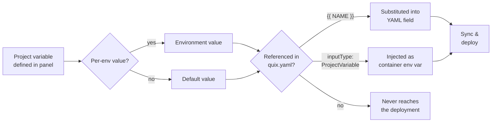
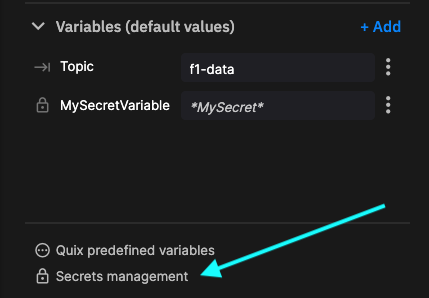

# Project variables

**Project variables are a single store for any value your pipeline needs that varies between environments or has to be kept private.** Define a value once at project scope, give it per-environment overrides, optionally mark it as a secret, and Quix resolves the right value at deployment time.

## One store, replacing two

Before project variables, Quix had two separate features doing closely related jobs:

| Old feature | What it did |
|---|---|
| **YAML variables** | Per-environment values substituted into `quix.yaml` with `{{ }}` placeholders — typically used for CPU, memory, replicas, public URLs, and feature toggles. |
| **Secrets management** | A separate encrypted store for credentials, accessed only by binding a secret to an application's environment variable. |

The boundary between "configurable" and "secret" was an implementation detail forced on you by the platform — two UIs, two mental models, two places to look when something was missing.

Project variables replace both. A single primitive carries the per-environment values, and a `Secret` flag on the variable turns on encryption at rest and hides the value from the UI, the YAML view, and Git. You get one panel to manage configuration, and one place to fix things when an environment is missing a value.

!!! note "Existing projects keep working"

    Values you previously stored as YAML variables or secrets are preserved as project variables. The `{{ }}` references in your `quix.yaml` and any application variables bound to secrets continue to resolve as before.

## When to use project variables

Use project variables to:

* **Scale resources per environment.** A production deployment can use higher `cpu`, `memory`, and `replicas` than a development deployment. The deployment uses placeholders in `quix.yaml`, and each environment provides its own values.
* **Store credentials.** API keys, database passwords, and other secrets are encrypted at rest and never exposed in the YAML file, the UI, or your Git repository.
* **Toggle behavior per environment.** Use a project variable to enable or disable a deployment, or to switch between mocked and live data in non-production environments.
* **Compose values.** Concatenate two project variables to build a URL prefix or any other compound string.

## Watch a video

<div style="position: relative; padding-bottom: 51.728110599078335%; height: 0;"><iframe src="https://www.loom.com/embed/c66029f67b8747bbb28c0605f5ea3fad?sid=ce696556-b98d-4231-8282-a4bbfdf9795c" frameborder="0" webkitallowfullscreen mozallowfullscreen allowfullscreen style="position: absolute; top: 0; left: 0; width: 100%; height: 100%;"></iframe></div>

??? "Transcript"

    00:01 Hello again, sorry about the glitch at the end of the last video, apologies for that. What I'll do is I'll just go through what I was going to show you at the end of the previous video and then we're going to get into the main content of this video which is talking about something called YAML variable

    00:21 . So you can see now that the application that we merged from developed to production is running. We can check it in normal way, everything looks good, we can check it in the data explorer.

    00:37 So everything seems to be working. Perfectly fine there. Now one thing that I noticed in the pipeline view here is that if we look at the resources we're using in production.

    00:52 I may it perhaps a little bit unhappy with that because while these values were fun. I'm fine for the development environment.

    01:03 I might want to increase the CPU cores and memory for the production environment. So the question is how can I have one set of deployment variables for develop and a different set of deployment variables for.

    01:21 A production. And that's what we're going to look at in this video. We're going to look at something called yaml variables.

    01:28 Now remember we can't make changes to the production environment directly. So we'll need to make our changes in develop and then merge them across.

    01:39 So let's do that. I'm going to go back to develop. Now a very key point in Quix in this iteration of Quix is the idea of a yaml file, a Quix yaml file.

    01:52 The Quix yaml file, which we're going to have a look at in a second, basically defines the entire pipeline. So with the, if you just have that single yaml file, Quix yaml file, you can reproduce the complete pipeline.

    02:10 So all the applications in the pipeline configurations and so on. So in this video, we're just going to look at some of the yaml variables.

    02:21 And we'll look at the yaml file, the Quix yaml file in much more detail in subsequent videos. But for now, let's focus on these variables that we can use to differently configure different environments.

    02:38 So I'm going to click on yaml. And I can see here the quicks.yaml file and you can see from the comment here that it says this file describes the data pipeline and configuration of resources of a Quix project.

    02:55 So it's essentially everything in this pipeline is. It's all defined here. Now the other thing that we can look at here is the yaml variables.

    03:13 We don't have any variables at the moment, but we can soon fix that. We can just create a new variable.

    03:22 And what I'm going to do is I'm going to have a variable called cpa count. Now you can see here I have my different environments.

    03:38 So I have production here. You can see and develop. Over here. This is highlighted because we're currently in the develop environment.

    03:51 So let's say I would like a cpa count. Oh, let's make it 800 in the production environment. And 200 in the develop environment.

    04:09 So let's just have a look at what that has done. So you can see that it's created this variable here.

    04:20 If I look in the. The code here, you can see that. My CPU count is specified here and my memory is also specified.

    04:36 This is actually half a gig. And this is point two of a call. So what. Well, what I'm also going to do is edit my variables and I want to add another one called memory.

    04:53 And in the develop environment that's currently 500. And for the production environment, I want it to be 1000. So I'm going to save that variable as well and get back here.

    05:13 So you can see for the develop environment, CPU count is 200 and memory is 500. Now, how do I get my YAML file to actually use those variables?

    05:29 Well, I'll need to edit the code to specify where to use those variables instead of hard coded values. And in this case, it's going to be in here.

    05:44 Now, you'll notice I'm using a syntax of double braces and then the variable name. So that's my CPU count and my memory.

    05:56 So now what will happen is the variable will be used depending on the environment. That I'm in. So for the development environment, the values of 200 and 500, but for production, they were, I think, 800 and 1000.

    06:15 So let's commit that change. Now, what we've got here is we've now got this coming up. We're saying develop is behind.

    06:32 It's out of sync. What's it out of sync with? Well, if you remember from our previous video, we said that any difference between the quick view of the pipeline and what's.

    06:43 It's actually in the repository. That's going to be notice. So previously, when we saw this happen, we had changed the repository by doing a pull request and merging that commit into the main branch.

    06:59 But this time, it's the other way around. We've changed the quick view. Things in, in the pipeline, we've changed the ammo code.

    07:06 And we need to sync that up with the repository. So because this isn't a protected repository, we don't need to do it through a pull request.

    07:16 So I can just click sync environment. And go to the pipeline. And now everything should be synced up. Now, if I go back to production.

    07:43 We can see that nothing in production has changed. We changed develop and we, we synced the quick view of the pipeline.

    07:58 The changes we made in the quick view with the repository. But nothing's changed in production. Of course, that's because we haven't merged the changes from the development environment to the production environment.

    08:12 Let's quickly go and have a look in, in here and look at the dev branch. Now the question is did our.

    08:23 Changes get synced up to here when we synchronize the develop environment. Let's have a look. So we're going to the quicks, yammer file and here you can see the changes that I made.

    08:34 I'll synced up. But as yet, if I look in the main branch. Those changes have not been reflected in in.

    08:43 Here in the main branch. So we need to do that. Now you already know how to do that because we saw it before.

    08:51 We're just going to create a merge request. And we're going from develop environment. To the production environment. So. Step branch to main branch.

    09:05 We create pull request. So we can see the pull request here. We can review that. We can make sure everything is good.

    09:26 Let's have a look at the commit. You can see the change here. So that looks good. So I'll go ahead.

    09:53 I'm happy with that. So I'll create the merge commit to merge that into main. And now that. That's merged. If we check.

    10:08 Main. Check the animal. We can see the change has been reflected. So now let's go back to the quick view of things and see what's going on there.

    10:23 So I'll go into. So the production environment. And now you can see that Quix has detected all I'm out of sync with what's in the get repository.

    10:33 So it knows that this environment needs to be synced with get repository because we just merged some changes from dev to main.

    10:41 So let's go ahead and sync the environment. You can see that it's using the variables that we created to now populate these values here.

    10:53 So you may remember for the production environment, we'll be using values of 800 and 1000. Whereas in the dev environment, these values were 200 and.

    11:05 500. So let's sync this up. And go to pipeline. Now you can see that we've now gone to the point eight calls, which corresponds to the 800 value.

    11:24 And. The memory has gone from 500 or half a gig to one gig, which corresponds to 1000. Okay, so now if we go back to develop the environment, we can check that this is still using the values that we set.

    11:45 Of.2 calls and.5, but in production we're using.8 and 1 gigabyte. Okay, so that's it for this video. Thanks for watching.

    11:57 See you in the next video.

## Create a project variable

Project variables live on a dedicated `Project variables` panel attached to the project. The panel is the same across every environment in the project — environments share the variable definitions and only differ in the values they assign.

To create a project variable:

1. From your project, open the `Project variables` panel.

    <!-- TODO: screenshot of the Project variables panel (overview list view). -->

2. Click `+ New variable`.

3. Give the variable a `Name`. The name is the key you reference in `quix.yaml` and from your application code.

4. Set the variable's `Default value`. The default applies to every environment that does not provide its own value, and serves as the fallback when an environment is created later.

5. For any environment that needs a different value, set a per-environment override. The override replaces the default for that environment only; other environments continue to use the default.

    <!-- TODO: screenshot of the create-variable dialog showing the Default value plus per-environment override fields. -->

6. To store the value securely, enable the `Secret` toggle. Encryption applies to both the default and every per-environment override, and the value is hidden in the UI, the YAML view, and Git.

    <!-- TODO: screenshot of the create-variable dialog with the Secret toggle highlighted. -->

7. Click `Save changes`.

!!! tip "Settings menu"

    `Settings → Project variables` opens the same panel from anywhere in the project, replacing the legacy `Settings → Secrets management` entry.

### Naming rules

A project variable name must:

* Be no longer than 254 characters.
* Match the regular expression `^[a-zA-Z_][a-zA-Z0-9_]*$` (letters, digits, and underscores only, and the first character must be a letter or an underscore).

## Use a project variable in `quix.yaml`

Defining a project variable does not, on its own, expose its value to any deployment. A project variable reaches a deployment only when the `quix.yaml` file explicitly references it, in one of two ways.



Pick the pattern that matches what you want to configure:

=== "Substitute into a YAML field"

    Wrap the variable name in double curly braces to substitute the value of a project variable directly into a deployment field. Use this for `resources`, `disabled`, `publicAccess.urlPrefix`, and any other field whose value should change per environment.

    For example, the following hard-coded resources:

    ```yaml
    resources:
      cpu: 200
      memory: 500
      replicas: 1
    ```

    Become per-environment values:

    ```yaml
    resources:
      cpu: {{CPU}}
      memory: {{MEMORY}}
      replicas: {{REPLICAS}}
    ```

    You can disable a deployment per environment:

    ```yaml
    deployments:
      - name: CPU Threshold
        disabled: {{DISABLED}}
    ```

    You can also concatenate variables in a single string, such as a public URL prefix:

    ```yaml
    publicAccess:
      enabled: true
      urlPrefix: {{URL_PREFIX}}-{{ENV_NAME}}
    ```

    !!! note

        Curly braces are required to denote the substitution.

    !!! warning "Secrets cannot be referenced with `{{ }}`"

        A `{{ }}` template substitution embeds the resolved value into the `quix.yaml` file, which is stored in Git. If you reference a project variable that has `Secret` enabled, the sync fails with an error such as:

        `Secret project variables ('MY_SECRET') cannot be referenced via {{ }} template syntax. Use inputType: ProjectVariable with variableKey instead.`

        To pass a secret value to a deployment, switch to the **Bind as a container env var** tab. The value resolves at runtime and is never written to YAML.

=== "Bind as a container env var"

    To pass a project variable to your application as an environment variable, declare the application variable with `inputType: ProjectVariable` and set `variableKey` to the name of the project variable:

    ```yaml { .annotate }
    deployments:
      - name: my-service
        application: My Service
        variables:
          - name: API_KEY           # (1)!
            inputType: ProjectVariable  # (2)!
            description: Third-party API key
            required: true
            variableKey: THIRD_PARTY_API_KEY  # (3)!
    ```

    1. The name of the environment variable as it appears inside the running container.
    2. Tells Quix to resolve the value from a project variable instead of using a literal `value:` field.
    3. The key of the project variable to read. Resolution happens per environment at deployment time.

    In this example, the application receives an environment variable named `API_KEY` whose value is taken from the project variable `THIRD_PARTY_API_KEY` in the current environment. Combine this pattern with the `Secret` toggle to feed encrypted credentials to your code without exposing them in `quix.yaml`.

    !!! tip "Multiple values that belong together"

        When several variables are always set together — for example, the host, port, and token of a database connection — group them into a *variable group* and reference the group from a single application variable with `inputType: Group`. A group bundles related project variables under one name so a deployment can pull them all in at once. <!-- TODO: link to the Variable Groups page once it ships. -->

    See the [Application YAML reference](../projects/project-structure.md#variable-input-types) for the full list of supported `inputType` values.

## Access a project variable from code

A project variable bound through a deployment variable is delivered to the container as a standard environment variable. Read it with the language's normal environment-variable API.

=== "Python"

    ```python
    import os

    api_key = os.environ["API_KEY"]
    ```

=== "Node.js"

    ```javascript
    const apiKey = process.env.API_KEY;
    ```

=== "C#"

    ```csharp
    var apiKey = Environment.GetEnvironmentVariable("API_KEY");
    ```

=== "Go"

    ```go
    apiKey := os.Getenv("API_KEY")
    ```

## Sync validation

When you sync an environment, Quix validates every project variable and `{{ }}` template reference in `quix.yaml`. Three error kinds can be reported:

| Error | Cause |
|---|---|
| **Missing reference** | A deployment variable (`inputType: ProjectVariable`) or a `{{ }}` template references a key that does not exist as a project variable in this environment. |
| **Type mismatch** | A `{{ }}` template resolves to a value that cannot be converted to the field's expected type. For example, a non-numeric value used in `replicas`, which expects an integer. |
| **Secret in template** | A `{{ }}` template references a project variable that has `Secret` enabled. See the warning in the previous section. |

If the missing variable is a required reference, Quix opens the `Missing values` dialog and lists the variables it needs:



<!-- TODO: replace the screenshot above with the new "Missing values" modal once it ships in the platform UI. The current image still shows the legacy "Missing secrets" copy. -->

From this dialog you can:

* Click `Add secrets` to provide values inline.
* Click `Edit YAML` to open the project variables panel and configure values across environments.

The deployment does not start until every required project variable has a value for the target environment.

## Full `quix.yaml` example

The following `quix.yaml` combines per-environment resource scaling, a disabled flag, a public URL prefix, and an application variable bound to a project variable. Hover the numbered markers for an explanation of each piece.

```yaml { .annotate }
# Quix Project Descriptor
# This file describes the data pipeline and configuration of resources of a Quix Project.

metadata:
  version: 1.0

deployments:
  - name: CPU Threshold
    application: Starter transformation
    deploymentType: Service
    version: transform-v2
    resources:
      cpu: {{CPU}}                            # (1)!
      memory: {{MEMORY}}
      replicas: {{REPLICAS}}
    desiredStatus: Stopped
    disabled: {{DISABLED}}                    # (2)!
    publicAccess:
      enabled: true
      urlPrefix: {{URL_PREFIX}}-{{ENV_NAME}}  # (3)!
    variables:
      - name: input
        inputType: InputTopic
        description: Name of the input topic to listen to.
        required: false
        value: cpu-load
      - name: output
        inputType: OutputTopic
        description: Name of the output topic to write to.
        required: false
        value: transform
      - name: API_KEY                         # (4)!
        inputType: ProjectVariable
        description: Third-party API key
        required: true
        variableKey: THIRD_PARTY_API_KEY      # (5)!
```

1. **Per-environment scaling.** Each environment sets its own `CPU`, `MEMORY`, and `REPLICAS` project variables, so `develop` can run small and `production` can run large without a YAML change.
2. **Disable per environment.** Set `DISABLED` to `true` in environments where this deployment should not provision.
3. **Composed URL prefix.** Two project variables concatenated into a single string at sync time.
4. **Container environment variable.** The application reads `API_KEY` from `os.environ` (or the equivalent in its language).
5. **Secret-safe reference.** The value of `THIRD_PARTY_API_KEY` resolves at runtime and never lands in the YAML file. Mark `THIRD_PARTY_API_KEY` as `Secret` in the project variables panel to encrypt it at rest.

See the [Pipeline YAML reference](../../quix-cli/yaml-reference/pipeline-descriptor.md) for the complete schema.

## Synchronize and verify

After you change project variables or update `quix.yaml`, the environment may enter an out-of-sync state. Sync the environment to apply the changes:

1. Update project variables and `quix.yaml` in your development environment, and sync to verify the configuration.
2. Merge the changes into the production environment.
3. Sync the production environment.

Once synced, confirm the resolved values match what you expect for each environment. The same `{{CPU}}` placeholder can produce `200` in `develop` and `800` in `production`, depending on the per-environment values you defined.

## Backward compatibility

Existing projects keep working without changes. Quix continues to accept the legacy YAML shapes that Secrets management used:

| Legacy YAML | Modern YAML |
|---|---|
| `inputType: Secret` | `inputType: ProjectVariable` |
| `secretKey: MY_KEY` | `variableKey: MY_KEY` |

Both forms are valid on read and are treated identically. Whenever the platform writes `app.yaml` or `quix.yaml` back to your repository (for example, after a sync or a deployment update), it emits the modern form. No manual migration of YAML files, project values, or secrets is required.

## Related documentation

* [How to add environment variables](environment-variables.md) — UI walkthrough for the per-deployment `+ Add` dialog.
* [Quix variables](quix-variables.md) — Reference for environment variables that Quix injects into every deployment.
