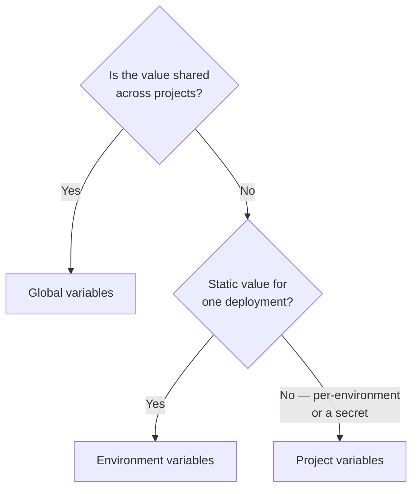

# Variables in quix.yaml

`quix.yaml` pulls a variable's value in two different ways — substituting it into a field with `{{ }}`, or binding it to a container environment variable with `inputType:`. Both patterns exist for project variables and for global variables, and the two resolve at different times. This page explains the choice between them; each variable kind's own page covers its syntax in full.

## Which kind of variable do you need?



| You want to… | Use |
|---|---|
| Share config across multiple projects | [Global variables](global-variables.md) |
| Store a per-environment value or secret within one project (`CPU`, `MEMORY`, `REPLICAS`, API keys) | [Project variables](project-variables.md) |
| Set a static value on one deployment | [Environment variables](environment-variables.md) |
| Read a platform-provided identifier | [Quix variables](quix-variables.md) |

## Two ways to reference a variable

**`{{ }}` substitution** embeds the resolved value directly into a `quix.yaml` field, as text. Use it for fields that need to vary per environment or across projects but don't need to be secret — resource sizing, public URL prefixes, feature toggles.

* `{{ VARIABLE_NAME }}` — a project variable. See [Project variables → Pattern 1](project-variables.md#pattern-1-substitute-into-a-quixyaml-field).
* `{{ groupId:variableKey }}` — a single member of a global-variable group. See [Global variables → Reference a group member](global-variables.md#reference-a-group-member-in-quixyaml).

**`inputType:` binding** binds a deployment variable to a container environment variable at deploy time — the value never lands in `quix.yaml`.

* `inputType: ProjectVariable` + `variableKey` — one project variable. See [Project variables → Pattern 2](project-variables.md#pattern-2-bind-to-a-container-environment-variable).
* `inputType: VariableGroup` + `variableGroupId` — an entire global-variable group, injected as one environment variable per member. See [Global variables → Reference a group](global-variables.md#reference-a-group-in-quixyaml).

Both patterns can appear on the same deployment:

```yaml
deployments:
  - name: my-service
    resources:
      replicas: {{REPLICAS}}       # {{ }} — substituted into the YAML at sync
    variables:
      - name: DB
        inputType: VariableGroup   # binding — resolved into the container at deploy
        variableGroupId: redis-config
```

## When each one resolves

|   | `{{ }}` substitution | `inputType:` binding |
|---|---|---|
| Resolved at | **Sync** — baked into the rendered descriptor | **Deploy** — injected into the container |
| Committed to Git | **No** — only the `{{ }}` token is committed, never the resolved value | No |
| Visible in the sync diff | **Yes** — the resolved value renders in the before/after comparison shown when you sync | No |
| Applies to | Any `quix.yaml` field (`cpu`, `replicas`, `urlPrefix`, `disabled`, and so on) | Container environment variables only |
| Reaches your code as an env var | No, not by itself | Yes |
| Picking up a changed value | **Sync the environment** | **Sync the environment to redeploy** |
| Secrets allowed | **No** | Yes |

Because `{{ }}` resolves at sync time, the resolved value renders in the **sync diff** — the before/after comparison shown when you sync — while the file Git actually stores keeps the `{{ }}` token itself, never the value. (The YAML *editor* in the sync dialog also shows tokens rather than values; only the diff renders them resolved.) The next rule follows from that diff, not from Git.

## Secrets are never available to `{{ }}`

A secret project variable, or a secret member of a global-variable group, is never resolved through `{{ }}` — doing so would render the secret's plaintext in the sync diff. Both sides reject the reference at sync time:

* **Project variable** — the sync fails with: `Secret project variables ('MY_SECRET') cannot be referenced via {{ }} template syntax. Use inputType: ProjectVariable with variableKey instead.`
* **Global-variable member** — the sync dialog's `Unresolved variable groups` step reports *"Secret variables cannot be used in YAML templates"*, with the remediation *"Remove the secret reference from the YAML. Secret values are never displayed."*

Use an `inputType:` binding instead. For a project variable, bind the secret key with `inputType: ProjectVariable` and `variableKey`. For a global-variable member, bind the entire group with `inputType: VariableGroup` and `variableGroupId`; global-variable groups do not support binding one member.

## Related pages

* [Project variables](project-variables.md) — `{{ }}` and `inputType: ProjectVariable` in full, including validation errors and recipes.
* [Global variables](global-variables.md) — variable groups, value sets, `inputType: VariableGroup`, and `{{ groupId:variableKey }}` in full.
* [Environment variables](environment-variables.md) — static, per-deployment values.
* [YAML 1.0 and 2.0](../projects/yaml-2-0.md) — how `app.yaml` and `quix.yaml` compute the descriptor these variables end up in.
