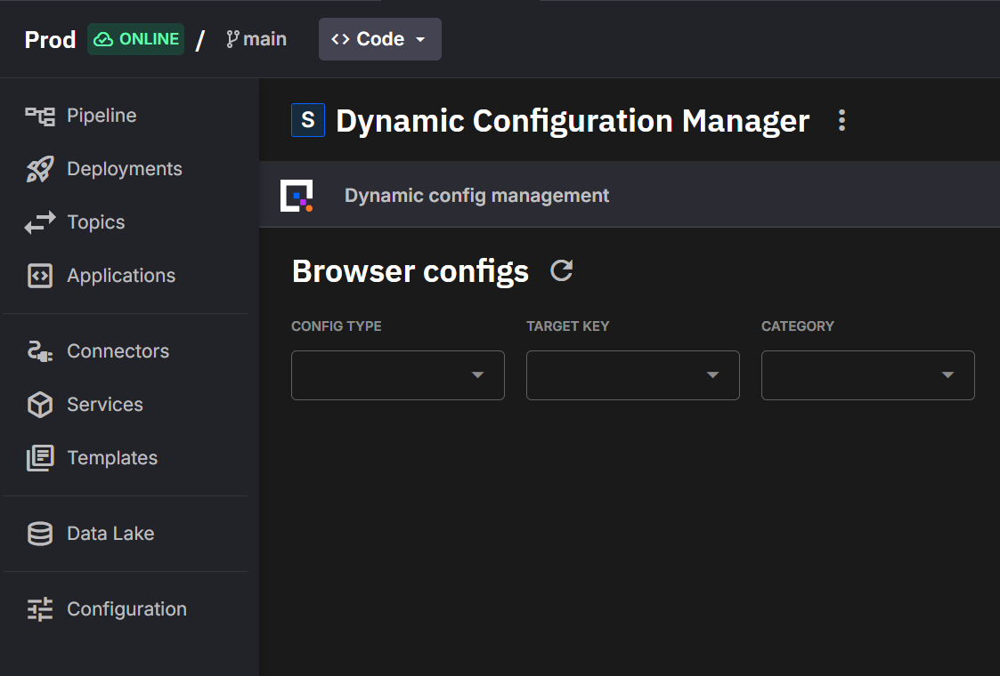
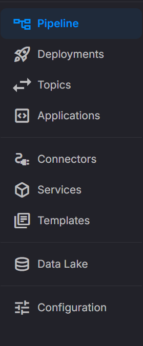

# Plugin System

The plugin system enables services to expose an embedded UI inside Deployment Details (rendered as an iframe), and optionally add a shortcut in the environment’s left sidebar.

Managed services could (or could not) populate these plugin properties automatically via the Managed Framework. You can always override them explicitly via YAML if needed.

Non‑managed services can also define these properties in YAML, making any deployment of your pipeline behave like a plugin without being a managed service.

## What it does

- Embed a UI in Deployment Details when enabled

  {width=80%}

- Optionally show a sidebar shortcut to the embedded view

  {height=50%}

- Provide basic authentication integration with Quix Cloud so publicly exposed services don’t require a separate login

## YAML

In your deployment YAML, you can enable the embedded UI and, optionally, a sidebar item:

```yaml
plugin:
  embeddedView: true            # Enables embedded UI (frontend renders iframe)
  sidebarItem:                  # Optional environment sidebar shortcut
    show: true                  # Whether to display a shortcut in the sidebar
    label: "Configuration"       # Text for the menu item
    icon: "tune"                 # Material icon name
    order: 1                    # Ordering (lower = higher)
```

Notes

- plugin.embeddedView: boolean. true → FE renders embedded UI.
- plugin.sidebarItem: optional object configuring the Environment’s left sidebar item.

## Embedded view URL

When the plugin feature is enabled, the deployment exposes a public URL dedicated to the embedded UI. The Portal uses this URL to load the embedded view inside the iframe when `embeddedView` is enabled.

Population rules:

- Managed service → Derived from Managed Services conventions.
- Non‑managed service → The `publicAccess` configuration needs to be enabled.

## Authentication and authorization

The embedded view inherits authentication and authorization from the Quix platform. No separate login is required, and the same user/environment permissions apply to the embedded view.
