---

title: "DataLake.Replay"
description: Managed service that replays persisted datasets from Quix Lake back into Kafka with full fidelity.
---

# Quix Lake - Replay

Quix Lake Replay is a managed service that streams persisted datasets from **Quix Lake** back into **Kafka**, preserving timestamps, partitions, offsets, headers, and gaps for high-fidelity re-runs and simulations.

Identifier: `DataLake.Replay`

## Where you can start a replay

You can launch a replay from multiple places in the Portal:

### From a pipeline

Use the pipeline canvas to add a Replay tile and start it in context of your flow. The screenshot shows the entry point on the canvas.
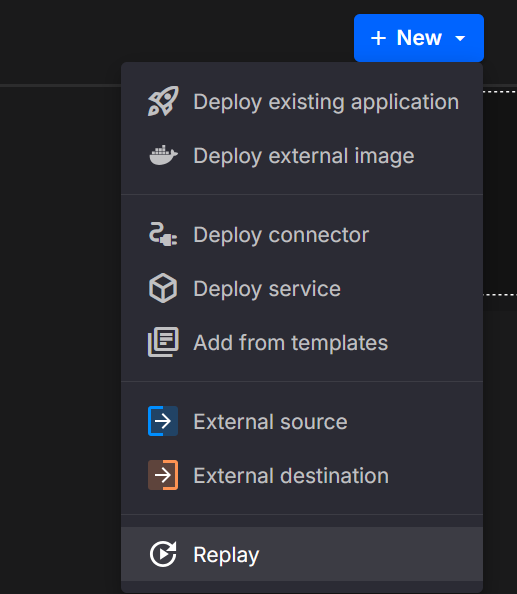

### From the Data Lake UI

Open **Data Lake**, select the dataset (topic + time window/keys/partitions), and start a replay directly from the catalog. The screenshot highlights the replay action on a selected dataset.
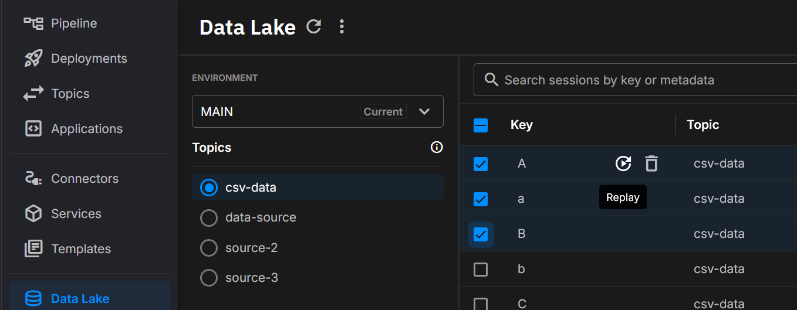

## Example YAML (basic)

```yaml
deployments:
  - name: Quix Lake - Replay
    application: DataLake.Replay
    version: latest
    deploymentType: Managed
    resources:
      cpu: 200
      memory: 500
      replicas: 1
    configuration:
      # Select data (source)
      sourceWorkspaceId: your-source-workspace-id
      sourceTopic: source-topic-name
      # Optional: limit to specific keys/partitions
      # sourceKeys:
      #   - device-001
      #   - device-002
      # sourcePartitions:
      #   - 0
      #   - 1
      fromTimestamp: 1719859200000   # inclusive, ms (optional)
      toTimestamp: 1719945600000     # inclusive, ms (optional)

      # Output (destination)
      destinationTopic: replayed-topic

      # Timing & speed
      timestampsType: Simulated       # Simulated | Original
      replaySpeed: "1"                # 0 = as fast as possible; 1 = real time; 2 = 2×; etc.

      # Gaps & throughput controls
      removeGaps: "false"             # true|false
      maxGapSizeInMilliseconds:       # e.g., 60000
      limitUploadSpeed: "false"       # true|false
      uploadSpeedLimitBytesPerSecond: # e.g., 1048576

      # Key mapping (optional)
      # If both arrays provided, mapping is by index: ReplayedKeys[i] for SourceKeys[i]
      # replayedKeys:
      #   - device-001-copy
      #   - device-002-copy
      suffixReplayedKeysWithTimestamp: "true"  # true|false
      replayedKeysSuffix:                      # e.g., "test"
      replayedKeysSuffixSeparator: "_"         # default "_"

      # Partitioning
      useOriginalMessagePartition: "false"     # true|false
      destinationPartition:                    # fixed partition (optional)
```

## What you’ll see in the UI

* **Controls:** Start, Pause, Resume, Restart, Stop.
* **Live status:** status badge with short reason (e.g., waiting for destination).
* **Progress:** advances as the selected window replays.
* **Speed:** live speed multiplier (1×, 2×, max).
* **Throughput:** upload/download rates (bytes/sec).
* **Window & filters:** active time window, keys, partitions.

### Tile states

**Stopped (100%)** - Finished window; safe to Restart or change config.  
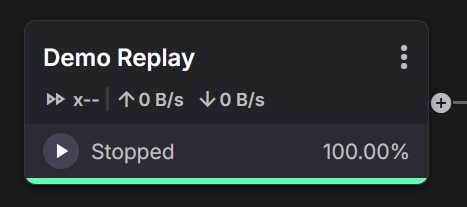

**Starting (0%)** - Initializing; producers warming up before messages flow.  
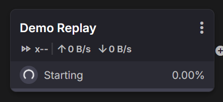

**Playing (live)** - Active replay with current speed and I/O throughput.  
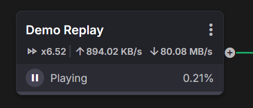

### Details & metrics

Operate the run and inspect configuration from the **Details** panel. The same view shows **Metrics** updating in real time: progress %, effective speed (e.g., `x9.15`), and upload/download rates.

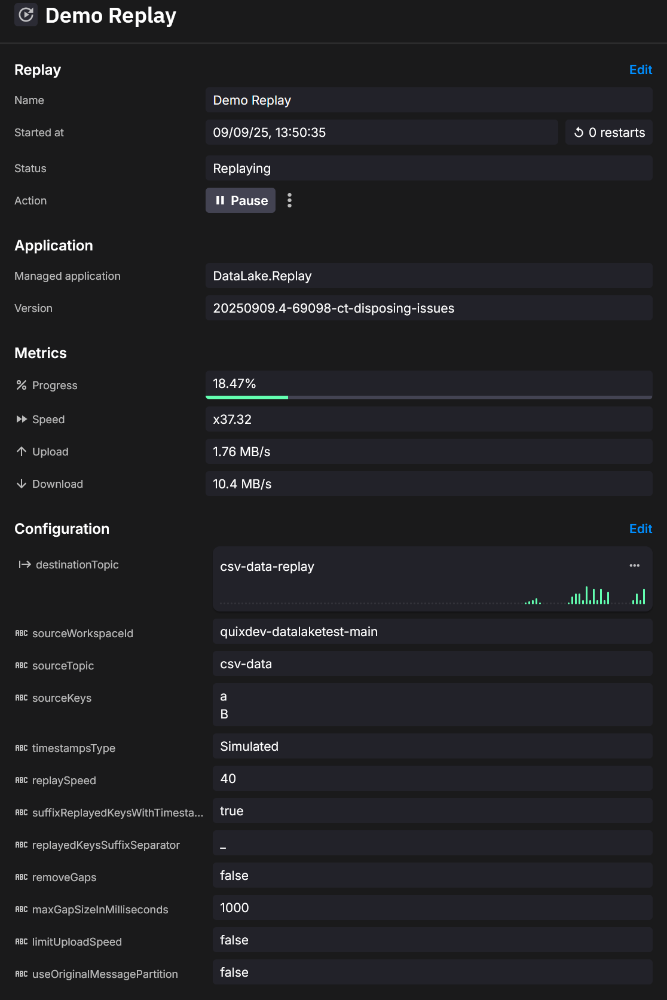

### Logs

Per-file reads, computed waits, gap trimming, queue length, and throttling-useful for timing decisions during playback.

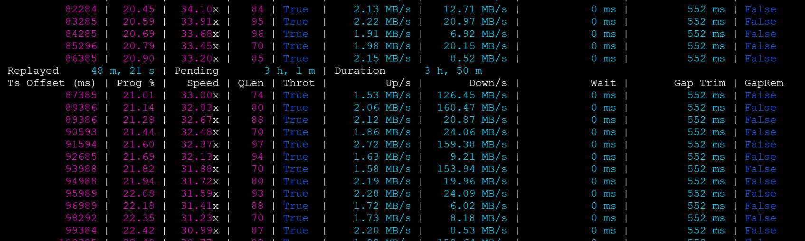

!!! tip "Advanced options"
    Time range, Remove gaps, Limit upload speed, Source/Destination partitions, and Deployment resources are advanced settings-hide them until needed.

## Key capabilities

* **Full fidelity**: preserves order, timestamps, partitions, offsets, headers, and gaps
* **Flexible windows**: replay entire datasets or specific time ranges
* **Speed control**: real time, faster-than-real-time, or max throughput
* **Selective targeting**: limit by keys and partitions; remap keys; suffix runs
* **Operational safety**: throttle producer throughput when needed


## How it works (high-level)

1. Queries the **Quix Lake API** to locate Avro segments for your topic, keys, partitions, and time window.
2. Streams records in order, applying **timestampsType** and **replaySpeed**.
3. Optional controls adjust gaps, throughput caps, key remapping, and partition routing.
4. Produces records to the **destinationTopic** in Kafka.


## Configuration

Managed services use simplified config. Quix maps these keys to underlying environment variables and wiring (including the **Quix Lake API URL**, which is injected automatically).

### Required

* **sourceWorkspaceId:**  workspace that owns the source topic
* **sourceTopic:**  persisted dataset’s topic name
* **destinationTopic:**  Kafka topic that receives replayed data

### Optional (selection)

* **sourceKeys:**  specific stream keys (multi)
* **sourcePartitions:**  specific source partitions (multi)
* **fromTimestamp / toTimestamp:**  inclusive ms boundaries; omit to use earliest/latest

### Optional (timing & speed)

* **timestampsType:**  `Simulated` (default) or `Original`
* **replaySpeed:**  `"0"` (max), `"1"` (real time), `"2"` (2×), etc.

### Optional (gaps & throughput)

* **removeGaps:**  collapse waits up to **maxGapSizeInMilliseconds**
* **limitUploadSpeed** and **uploadSpeedLimitBytesPerSecond:**  cap producer throughput

### Optional (key mapping & partitioning)

* **replayedKeys**, **suffixReplayedKeysWithTimestamp**, **replayedKeysSuffix**, **replayedKeysSuffixSeparator**
* **useOriginalMessagePartition** or **destinationPartition**

The **Basic configuration** panel lets you set the destination topic, timestamp mode, and speed:

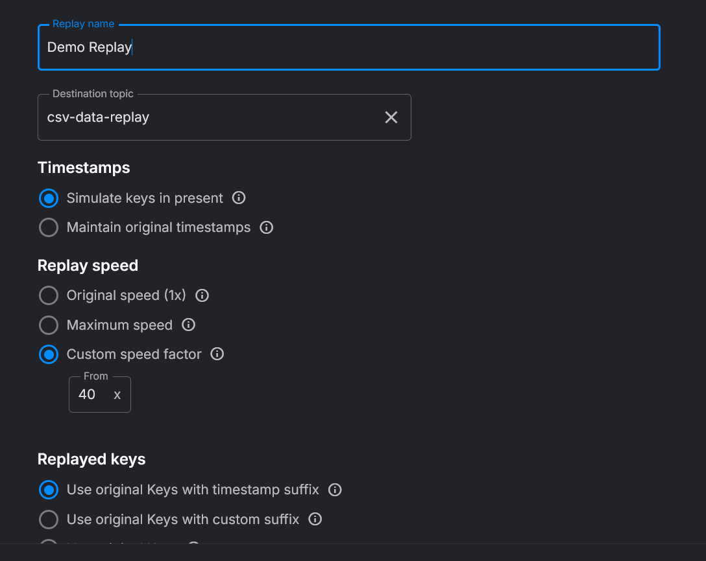

Toggle **Advanced settings** to reveal time range, gaps, throughput limits, partitions, and deployment resources:

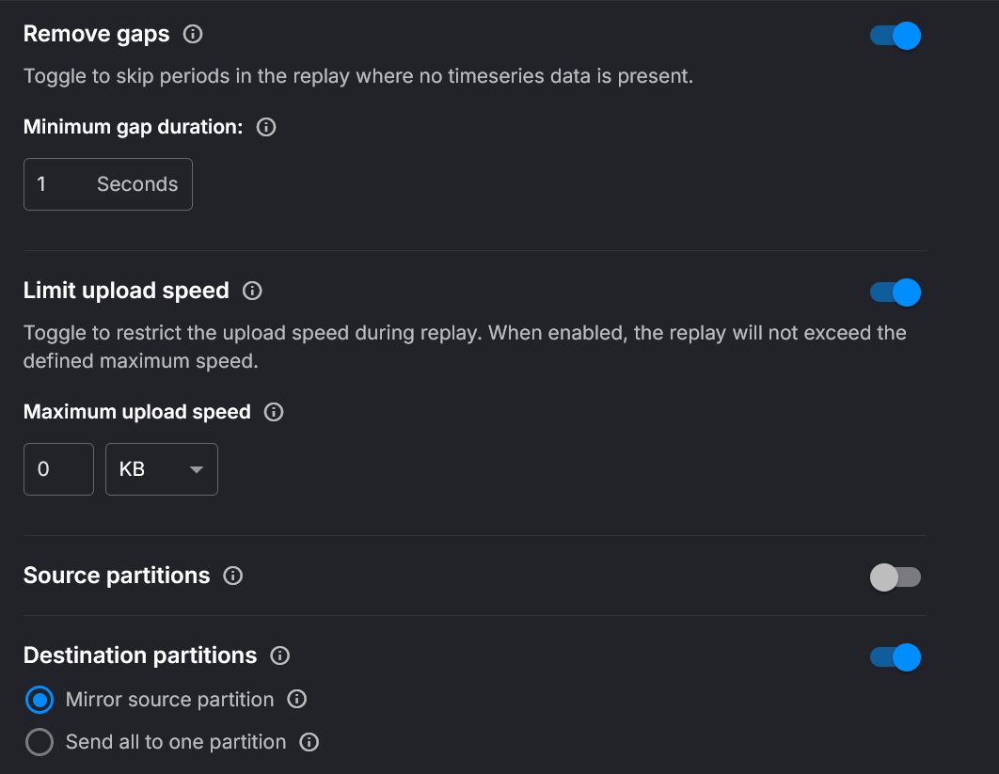

Pick a precise **Time range** with date-time inputs and the slider for quick refinement:

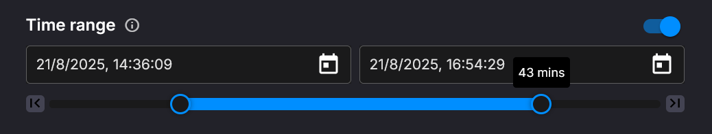

Choose **source partitions** to read from and how to route to **destination partitions**; adjust **CPU** and **Memory** to tune performance:

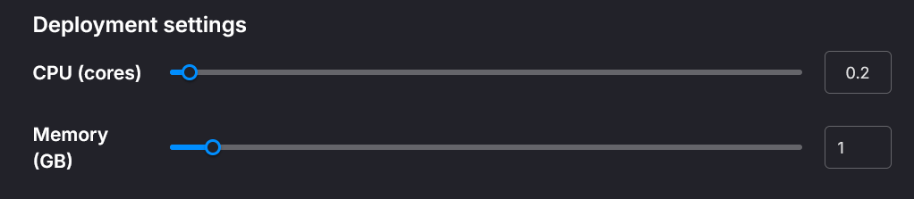
