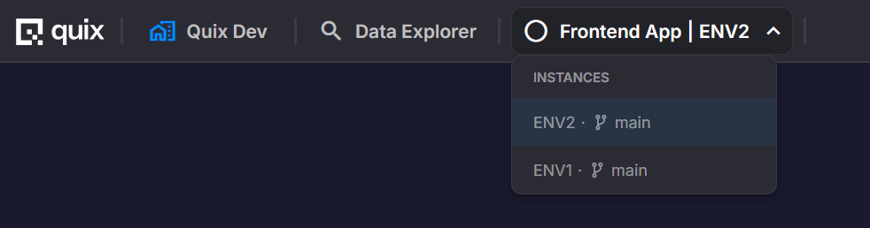

# Plugin System

The plugin system enables services to expose an embedded UI inside Deployment Details (rendered as an iframe), and optionally add shortcuts in the environment's left sidebar or globally in the top header.

Managed services may populate these plugin properties automatically via the Managed Framework, and you can always override them explicitly in YAML.

Non-managed services can also define these properties in YAML, making any deployment behave like a plugin without being a managed service.

## What it does

* Embed a UI in Deployment Details when enabled

  {width=80%}

* Optionally show a sidebar shortcut to the embedded view (environment-scoped)

  {height=50%}

* Optionally show a global shortcut in the top header (organization-wide access)

* Provide basic authentication integration with Quix Cloud so publicly exposed services don't require a separate login (recommended)

!!! tip "Icons"
    Sidebar icons use [Google Material Icons](https://fonts.google.com/icons). Use the icon code (e.g., `tune`, `settings`, `play_arrow`) in your YAML configuration.

## YAML configuration

In your deployment YAML, you can enable the embedded UI and, optionally, sidebar or global shortcuts:

```yaml
plugin:
  embeddedView:                # Can be a boolean or object
    enabled: true              # Enables embedded view
    hideHeader: false          # Optional. If true, hides the header (deployment name + menu)
    default: true              # Optional. If true, shows embedded view by default when opening deployment
  sidebarItem:                 # Optional environment sidebar shortcut
    show: true                 # Whether to display a shortcut in the sidebar
    label: "Configuration"     # Text for the menu item
    icon: "tune"               # Material icon name
    order: 1                   # Ordering (lower = higher)
    badge: "Alpha"             # Optional. Add a short label next to the sidebar item
  globalItem:                  # Optional global header shortcut (organization-wide)
    show: true                 # Whether to display in the global header
    label: "Test Manager"      # Text for the menu item
    order: 1                   # Ordering (lower = higher)
    badge: "Beta"              # Optional. Add a short label next to the item
```

Configuration details

* `plugin.embeddedView`: object configuring the embedded view behavior.
  * `enabled` (boolean, default = `false`): Enables the embedded view.
  * `hideHeader` (boolean, default = `false`): If `true`, hides the deployment name and menu in the embedded view.
  * `default` (boolean, default = `false`): If `true`, displays the embedded view by default when opening the deployment.

* `plugin.sidebarItem`: optional object configuring the environment's left sidebar shortcut.
  * `show`: boolean. Whether to display the shortcut.
  * `label`: string. Text for the menu item.
  * `icon`: string. Must be a [Google Material icon](https://fonts.google.com/icons) code (e.g., `tune`, `settings`, `play_arrow`).
  * `order`: number. Lower values appear higher in the sidebar.
  * `badge`: optional string (max 15 characters). Adds a short label next to the sidebar item (e.g., "Alpha", "Beta", "Experimental").

* `plugin.globalItem`: optional object configuring a global shortcut in the top header (organization-wide access).
  * `show`: boolean. Whether to display the global shortcut.
  * `label`: string. Text for the menu item.
  * `order`: number. Lower values appear first (left to right). Plugins with the same order are sorted by the default workspace order in the project.
  * `badge`: optional string (max 15 characters). Adds a short label next to the item (e.g., "Beta", "Preview").

## Global plugins

Global plugins appear in the top header of Quix Cloud and provide organization-wide access to a plugin's embedded UI, regardless of which environment or workspace is currently active.



### What are global plugins?

Unlike environment-scoped `sidebarItem` shortcuts (which only appear within a specific environment), global plugins:

* Are accessible from anywhere in Quix Cloud via the top header.
* Provide cross-workspace and cross-environment access to the plugin.
* Are visible to all users in the organization who have the `plugins:read` permission for that deployment.
* Appear in the order specified by the `order` field (lower values appear first, left to right).
* When multiple plugins share the same `order` value, they are sorted by the default workspace order in the project.

### When to use global plugins

Use `globalItem` for plugins that:

* Provide organization-wide services or dashboards (e.g., test managers, monitoring tools, admin panels).
* Need to be accessible regardless of the current environment context.
* Serve multiple workspaces or projects.

### Permissions and access control

Global plugins use a specialized permission model:

* Users need the `plugins:read` permission on the deployment to see and access the global plugin.
* The Operator role automatically grants full plugin access (`plugin:*`).
* Users can access a global plugin deployment even without `workspace:read` permissions on the workspace containing the deployment, as long as they have `plugins:read` on that specific deployment.
* This allows you to expose specific tools organization-wide without granting full workspace access.

For more information about roles and permissions, see the [Roles and Permissions](./roles.md) documentation.

### Configuration example

To create a global plugin for a test manager:

```yaml
deployments:
  - name: Test Manager
    application: TestManager
    version: latest
    deploymentType: Managed
    plugin:
      embeddedView:
        enabled: true
        default: true
      globalItem:
        show: true
        label: "Test Manager"
        order: 1
        badge: "Beta"
```

This configuration:

* Enables the embedded view and makes it the default view when opening the deployment.
* Creates a global shortcut labeled "Test Manager" in the top header.
* Sets the display order to `1` (appears first).
* Adds a "Beta" badge to indicate the feature status.

## Embedded view URL

When the plugin feature is enabled, the deployment exposes a public URL dedicated to the embedded UI. The Portal uses this URL to load the embedded view inside the iframe when `embeddedView` is enabled. This URL is not set in YAML; it's exposed by the API.

Population rules:

* Managed service → Derived from Managed Services conventions.
* Non-managed service → Requires `publicAccess` to be enabled; resolves from the deployment's public URL.

## Authentication and authorization (recommended)

!!! note
    Authentication is **not required**. If your frontend app doesn't need it, you can ignore this section.
    The details below are only useful if you want your embedded app to reuse Quix's authentication and authorization system, so it follows the same user and environment permissions.

When used, the embedded view inherits authentication and authorization from the Quix platform: no separate login is required, and the same user/environment permissions apply.

Quix supports two authentication methods for embedded plugins:

=== "Token-based (postMessage)"

    When an embedded view loads, the Plugin system injects the Quix user token into the iframe via `postMessage`. The UI can then use this token to call the backend securely.

    #### How the token is injected

    On initial load of the embedded view (and on reload), the Portal provides the user token to the iframe so the UI can authenticate calls to the backend.

    The token is passed via `window.postMessage` between the parent (Portal) and the embedded iframe. The following message types are exchanged:

    * `REQUEST_AUTH_TOKEN` — sent by the iframe to ask the parent for a token
    * `AUTH_TOKEN` — sent by the parent with `{ token: string }`

    **Example implementation in the embedded view (iframe):**

    ```ts
    // Ask the parent window (Portal) for a token
    window.parent.postMessage({ type: 'REQUEST_AUTH_TOKEN' }, '*');

    // Listen for the token response from the parent
    function messageHandler(event: MessageEvent) {
      const { data } = event;
      if (data?.type === 'AUTH_TOKEN' && data.token) {
        // Your app-specific setter
        setToken(data.token);
        // Optionally remove the listener if you only need the token once
        // window.removeEventListener('message', messageHandler);
      }
    }

    window.addEventListener('message', messageHandler);
    ```

    **Example implementation in the Portal (parent window):**

    ```ts
    // Listen for requests from the target iframe
    function messageHandler(event: MessageEvent) {
      const { origin, data } = event;

      // Ensure the origin matches the iframe URL you expect
      if (origin !== targetUrl) return;

      if (data?.type === 'REQUEST_AUTH_TOKEN') {
        // Reply with the token to the requesting iframe
        const iframeWindow = deploymentIframe?.contentWindow;
        iframeWindow?.postMessage({ type: 'AUTH_TOKEN', token }, targetUrl);
      }
    }

    window.addEventListener('message', messageHandler);
    ```

    **Important security considerations:**

    * Always validate `event.origin` in the parent before responding.
    * Prefer using a specific `targetUrl` over `'*'` when posting back to the iframe.
    * Remove listeners when no longer needed to avoid leaks.

=== "Cookie-based"

    For simpler integrations, embedded plugins can use the Portal's `quix_access_token` cookie for authentication. When the user is logged into Quix Cloud, this cookie contains a Bearer token that is automatically sent with requests to same-domain endpoints.

    **Cookie details:**

    * **Cookie name:** `quix_access_token`
    * **Contents:** Bearer token (same format as Authorization header)
    * **Scope:** Same-domain requests only

    **How it works:**

    1. The user logs into Quix Cloud, which sets the `quix_access_token` cookie.
    2. The embedded plugin iframe is loaded from a Quix-hosted URL.
    3. The browser automatically includes the cookie with requests to Quix APIs.
    4. Endpoints marked for cookie authentication extract and validate the token.

    **When to use cookie-based auth:**

    * Your plugin is hosted on the same domain as Quix Cloud
    * You want simpler frontend code without postMessage handling
    * You're accessing file content or static resources in iframes

    **Supported endpoints:**

    Cookie-based authentication is enabled for specific endpoints:

    * Workspace file content (markdown, images, CSS, PDFs)
    * Template files for embedded views

    **Limitations:**

    * Only works for same-origin deployments (cookie not sent cross-origin)
    * Only specific endpoints marked for cookie auth accept it (listed above)
    * Less flexible than token-based auth for cross-origin scenarios

### How to handle the token in the backend

If you want to validate and authorize requests against Quix, you can install the Quix Portal helper package from the public feed:

```bash
pip install -i https://pkgs.dev.azure.com/quix-analytics/53f7fe95-59fe-4307-b479-2473b96de6d1/_packaging/public/pypi/simple/ quixportal
```

Then, in the backend service, validate the token and enforce authorization for each request. For example:

```python
import os
from quixportal.auth import Auth

# Instantiate authentication client. By default it will read
# the portal API url from the environment variable Quix__Portal__Api
auth = Auth()

# Obtain the authorization token, traditionally passed as a header
# Authorization: Bearer <token>
token = ...

# Example to obtain "Read" access to the "Workspace" resource
resource_type = "Workspace"
workspace_id = os.environ["Quix__Workspace__Id"]
permissions = "Read"

# Authorize the token bearer to access the resource
if auth.validate_permissions(
    token=token,
    resourceType=resource_type,
    resourceID=workspace_id,
    permissions=permissions,
):
    print("Bearer is authorized to access the resource")
else:
    print("Bearer is not authorized to access the resource")
```

## Checking permissions programmatically

For developers building integrations, you can check [permissions](./roles.md) using the Portal API.

### API endpoint

**Endpoint**: `GET /auth/permissions/query`

| Parameter | Type | Description |
|-----------|------|-------------|
| `resourceType` | enum | The type of resource to check |
| `resourceId` | string | The ID of the specific resource |
| `permission` | enum | The permission type to check |

**Returns**: `true` if permission is granted, `false` otherwise.

### Resource types

| Resource Type | resourceId | Description |
|---------------|------------|-------------|
| `Organisation` | organisation ID | Organisation-level settings |
| `Repository` | repository ID | Git repository access |
| `Workspace` | workspace ID | Environment access |
| `Topic` | workspace ID | Topic management within an environment |
| `Deployment` | workspace ID | Deployment access within an environment |
| `User` | user ID | User management |
| `Billing` | organisation ID | Billing information |
| `Session` | session ID | IDE session access |
| `Plugin` | workspace ID | Plugin access within an environment |

### Permission types

| Permission | Description |
|------------|-------------|
| `Create` | Create new resources |
| `Read` | View resources |
| `Update` | Modify resources |
| `Delete` | Remove resources |
| `Write` | Write data (streaming operations only) |

## See also

- [Roles and Permissions](./roles.md) - Understanding user roles and permissions
- [Personal Access Tokens](../develop/authentication/personal-access-token.md) - Token-based authentication
- [Portal API](../apis/portal-api/overview.md) - Full API documentation
