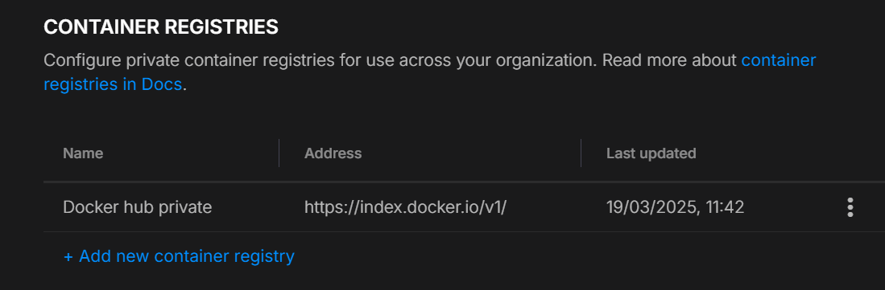
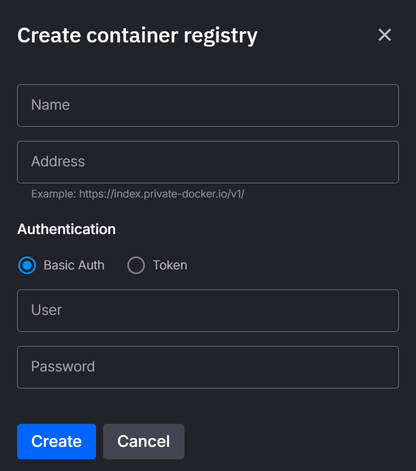

# Private Container Registries

When using an image hosted in a private container registry, you must configure registry credentials in the platform to ensure secure access during deployments.

To configure these credentials, navigate to your organization's Settings page and locate the Container Registries section. Here, you can create, edit, and delete container registry configurations as needed.

## Required Information:

Provide the following details when configuring credentials:

| Field           | Description                                                                                           | Example                      |
|-----------------|-------------------------------------------------------------------------------------------------------|------------------------------|
| **Display Name**| A friendly name to easily identify your registry.                                                     | `My Org Private Registry`    |
| **Address**     | The address of your registry.                                                                         | `my-registry.com`            |
| **Auth Type**   | Authentication type. Supported values: `BasicAuth` or `Token`.                                        | `BasicAuth` or `Token`       |
| **Credentials** | Depending on the authentication method selected:                                                      |                              |
|                 | - **BasicAuth**: Provide a Username & Password                                                        | Username/password            |
|                 | - **Token**: Provide a long-lived token                                                               | Token string                 |

!!! warning

    Ensure the credentials provided are long-lived, as the platform does not support automatic credential refresh.

!!! note

    If the image was deployed prior to configuring the credentials, you may need to restart the deployment for changes to take effect.

More details about private registry authentication can be found [here](https://kubernetes.io/docs/tasks/configure-pod-container/pull-image-private-registry/).