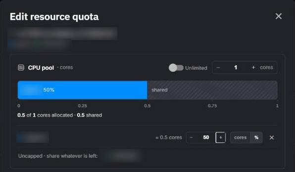
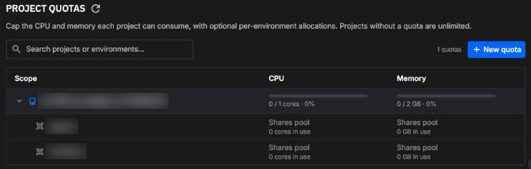

# Project quotas

A project quota caps the CPU and memory that one project's deployments can use in total. The quota is a pool for the whole project, and you can optionally cap individual environments within it so that, for example, deployments in a development environment can't be created, resized, or started beyond a fixed share of the pool.

In the Portal, quotas are managed in one place: **Organization Settings > Project Quotas**. A project without a quota is unlimited.

!!! note "Project quotas are not organization resource limits"

    Your organization's subscription also carries resource limits: the largest CPU and memory limit a single deployment may set, and an organization-wide total. Those limits apply to every deployment regardless of project and are not configured on this page. A project quota is an additional, tighter bound that you set yourself, per project. A deployment has to fit both.

## How a quota works

### The pool

A quota has two independent axes, **CPU** (in cores) and **memory** (in GB). Each axis is either a pool size or **Unlimited**. You can cap CPU and leave memory unlimited, or the other way round.

What counts against the pool is every deployment in the project's environments that is running or on its way to running, summed as `resource limit × replicas`. That includes deployments that are queued, building, deploying, starting, stopping, or in a runtime error, and deployments whose build has succeeded. Stopped, completed, failed, and deleting deployments count for nothing. Dev sessions are not counted: they are bounded by the organization's resource limits only.

### There is no on/off switch

Enforcement follows the quota itself:

- Create a quota for a project, and that project is enforced from that moment.
- Remove the quota, and the project is unlimited again immediately.

There is no feature toggle to look for, and projects that have never had a quota are unlimited.

Saving a quota never stops a deployment that is already running, whether you create the quota, shrink a pool, or lower an environment's cap. Quotas are checked only when a deployment is created, edited, or started, so running deployments can stay above the new limits. Until usage falls back under them, every start in the over-limit project or environment is refused, and so is every increase on the axis that is over its limit.

### Environment caps

Within the pool you can cap individual environments. Each environment carries its own cap **per axis**, and each cap is expressed in one of two ways:

| Cap type | Meaning | Example |
|---|---|---|
| Absolute | A fixed amount in cores or GB | `1.5 cores`, `4 GB` |
| Percentage | A share of that axis' pool, 1 to 100 | `50%` of the CPU pool |

The two axes never influence each other, so an environment can take `50%` of the CPU pool while holding an absolute `4 GB` memory cap.

A percentage needs a pool to be a percentage of: if an axis is **Unlimited**, that axis' caps must be absolute. Percentages resolve by rounding down.

An environment with no cap on an axis is bounded by the project pool alone. The overview page labels it **Shares pool**: it can use whatever the capped environments are not using.

### The two bounds

When you save a quota, both of these must hold on each axis:

1. **Each cap fits inside the pool.** No single environment can be promised more than the whole project has.
2. **The caps together fit inside the pool.** Percentages are resolved to absolute amounts first, and the sum of every cap may not exceed the pool.

Because the caps cannot add up to more than the pool, one capped environment never takes another's share: a capped environment is admitted only up to its own cap. Deployments that were already running before a cap was set or lowered are the exception.

Caps are ceilings, not reservations. An environment that has no cap may still use the whole pool. If every environment must be protected from every other, cap every environment; the dialog then reports the leftover pool as **unallocated**.

### Worked example

A project with a `4 cores` / `8 GB` quota and three environments:

| Environment | CPU cap | Memory cap | Effective CPU | Effective memory |
|---|---|---|---|---|
| production | `50%` | `4 GB` | 2 cores | 4 GB |
| staging | `1 core` | none | 1 core | up to 8 GB |
| dev | none | none | up to 4 cores | up to 8 GB |

The quota never lets production grow past 2 cores or 4 GB, or staging past 1 core, whatever else is happening in the project. Together the CPU caps promise 3 of the 4 cores, which is allowed. Dev shares the pool: it can start a deployment as long as the project total, dev included, stays within 4 cores and 8 GB.

## Set a project quota

You need to be an organization admin to open **Organization Settings** and to create, edit, or remove quotas.

1. Open **Settings** in the left navigation, then **Project Quotas**.
2. Click **New quota** (or **Add new quota** when the organization has none yet), then pick the project in the **New resource quota** dialog. Projects that already have a quota are edited from their own row instead.
3. For each of **CPU pool** and **Memory pool**, either switch on **Unlimited** or enter the pool size in cores or GB.
4. To cap an environment on an axis, click its name in the environment list under that axis. The list reads **No caps yet — all environments share the pool** until you add the first cap, and **Uncapped · share whatever is left:** after that. Enter the cap value and choose the unit, `cores` / `GB` for an absolute cap or `%` for a share of the pool. You can also drag the environment's handle on the allocation bar.
5. Click **Create quota**.

The dialog keeps a running total under each bar. If the caps on an axis add up to more than its pool, it reports **Over-allocated** and the save button stays disabled until you reduce the caps or grow the pool.



To change a quota later, open the project row's menu and choose **Edit quota**, or click one of the project's environment rows. Both open the **Edit resource quota** dialog. To lift the quota entirely, choose **Remove quota**; the project's deployments become unlimited immediately.

### Values that are rejected

A quota can't be saved, and the dialog shows why, when:

| Rule | Reason |
|---|---|
| A pool or a cap resolves to less than the smallest deployment (50 millicores CPU, 100 MB memory), for example `1%` of a 4-core pool | Nothing could ever start in it |
| A percentage cap is set on an axis whose pool is Unlimited | There is no pool to take a share of |
| A percentage is outside 1 to 100 | Outside the range a share can take |
| A cap is larger than its pool | Bound 1 above |
| The caps on an axis add up to more than the pool | Bound 2 above |
| A cap refers to an environment that no longer belongs to the project | The environment was deleted while you were editing the quota |

## Read the overview

The **Project Quotas** page lists only the projects that have a quota. Each project row shows, per axis, a meter of what is in use against the pool, for example `1.5 / 4 cores · 38%`, or the **∞ Unlimited** symbol with the current usage when that axis has no pool. The meter changes color at 80% and again at 90% of the pool.

Expand a project to see its environments. A capped environment shows its cap and a meter against it, with a **near cap** marker at 90%. An uncapped environment shows **Shares pool** and its current usage.



Usage is read when the page opens. Click the refresh button to read it again.

## When a quota is exceeded

Quotas are checked whenever a deployment would take more from the pool:

- creating a deployment
- editing a deployment's CPU, memory, or replicas
- starting a deployment that is not running (stopped, completed, or failed)
- syncing an environment, since a sync creates and updates deployments

The check is on the increase. Lowering a running deployment's CPU, memory, or replicas is never refused by a project or environment quota, even if the project is already over it, so you can always work your way back under it. Your subscription's organization limits are checked separately.

A request that a project or environment quota refuses reports which bound was hit and how much of it is left, in millicores (1 core = 1000 millicores) and MB (1 GB = 1024 MB):

```text
Exceeded project CPU quota. 100 millicores remaining of the 100 millicores project quota.
```

```text
Exceeded environment memory quota. 512 MB remaining of the 2048 MB environment quota.
```

In the Portal, only organization admins can see quotas and usage. Anyone else learns about a quota from this message, which says how much of it is left. It appears word for word in these places:

- **Deployment dialog**: when you create or edit a deployment, the message appears inside the dialog, which stays open so you can change the values and try again. It also appears as an error notification, prefixed with the environment name.
- **Start**: starting a stopped deployment from the pipeline, the deployments list, or the deployment's page shows the message as an error notification.
- **Sync in the Portal**: the sync dialog marks the change it stopped at with an error icon, marks later changes with a pending icon whose tooltip reads **Pending**, and shows the message below the list. **Rollback** is offered only when another change in the same sync was already applied.
- **CLI**: when `quix pipeline sync` stops at a deployment the quota refuses, it prints that deployment and the message:

    ```text
    ✗ Sync failed for deployment '<deployment>': Exceeded project CPU quota. 100 millicores remaining of the 100 millicores project quota.
    ```

The word after `Exceeded` names the scope: `project`, `environment`, or `organisation`. An `organisation` message comes from your subscription's resource limits, not from a project quota.

To get a refused deployment running, do one of the following:

- stop or shrink other deployments in the project (or in the same environment, when the environment's cap was hit)
- reduce the deployment's own CPU, memory, or replicas
- raise the pool or the environment's cap in **Organization Settings > Project Quotas**
- remove the project quota

## Next steps

- [Syncing an environment](syncing-environment.md): a sync stops at the first deployment that would exceed a quota, with the messages above.
- [Roles and permissions](../roles.md): who can manage organization settings.
- [Deployments overview](../deployments/overview.md): where a deployment's CPU, memory, and replicas are set.
