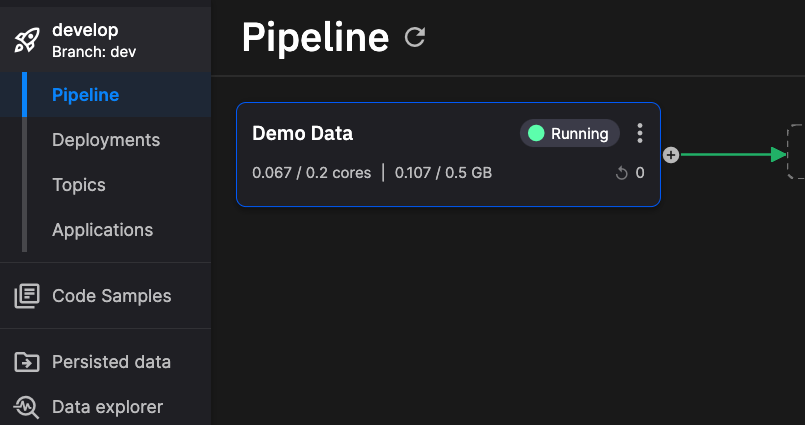
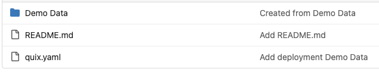
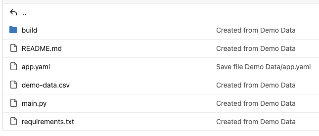

# Explore project structure

This page looks at the file structure of a typical project in Quix, as hosted in its Git repository. 

A project in Quix maps to a Git repository. Within a project you can create multiple environments, and these correspond to branches in the Git repository. Within a branch (environment) there are some root files. The most important is `quix.yaml`, the **pipeline descriptor** that defines the pipeline. Each application in the pipeline also has its own folder, containing its code and its **application descriptor**, `app.yaml`, alongside files such as `main.py`. Both descriptors matter. The `app.yaml` configures the whole application — its language, Dockerfile, entry point, and the **default values for its variables**. From descriptor [version 2.0](./yaml-2-0.md), each `quix.yaml` deployment **inherits those variable defaults** and declares a variable only to **override** it for that deployment, rather than repeating them all.

## Pipeline

This section shows an example pipeline consisting of one application, `Demo Data`, as illustrated by the following screenshot:



Looking at the project stored in Git, it would have the following structure:



Note the `quix.yaml` file that defines the pipeline, and the `Demo Data` folder for the application, which holds its own `app.yaml`. Under descriptor version 2.0 the two work together: each `app.yaml` defines its application's defaults — its variables' default values, plus build and runtime settings — and `quix.yaml` assembles the deployments, inheriting those defaults and overriding a variable only where a deployment needs a different value.

The complete `quix.yaml` file is shown here, using descriptor **version 2.0**:

``` yaml
# Quix Project Descriptor
# This file describes the data pipeline and configuration of resources of a Quix Project.

metadata:
  version: 2.0

# This section describes the Deployments of the data pipeline
deployments:
  - name: Demo Data
    application: Demo Data
    deploymentType: Job
    version: ada522b5199fc9667505b4dd19980995804ca764
    resources:
      limits:
        cpu: 200
        memory: 200
      replicas: 1
    libraryItemId: 7abe02e1-1e75-4783-864c-46b930b42afe

# This section describes the Topics of the data pipeline
topics:
  - name: f1-data
    persisted: false
    configuration:
      partitions: 2
      replicationFactor: 2
      retentionInMinutes: -1
      retentionInBytes: 262144000
```

This defines one or more deployments and their allocated resources, along with other information such as the code commit version to use, here `ada522b`. The topics in the pipeline are also defined here. Note there is **no `variables:` block** on the deployment: under version 2.0 the deployment inherits its variables — such as the `Topic` output — from the application's `app.yaml`, so they are not repeated in `quix.yaml`. See [YAML 1.0 and 2.0](./yaml-2-0.md) for how inheritance works and how the versions differ.

## Application

Opening the `Demo Data` folder in the Git repository, you see the structure of the application (one service in the pipeline) itself:



The notable file here is the `app.yaml` file that defines important aspects of the application. The full `app.yaml` for this application is shown here:

``` yaml
name: Demo Data
language: python
variables:
  - name: Topic
    inputType: OutputTopic
    description: Name of the output topic to write into
    defaultValue: f1-data
    required: true
dockerfile: build/dockerfile
runEntryPoint: main.py
defaultFile: main.py
```

### Variable input types

Variables can use different input types to control how they appear in the UI. The `Options` input type lets you define a set of predefined values that users can select from:

``` yaml
variables:
  - name: CONTENT_STORE
    inputType: Options
    description: Where to store the content
    defaultValue: mongo
    options:
      - label: MongoDB
        value: mongo
      - label: File System
        value: file
```

Each option has a `label` (shown in the UI dropdown) and a `value` (the actual value set in the environment variable).

The available input types are:

| Input type | Use |
|---|---|
| `FreeText` | A plain text value. |
| `HiddenText` | A plain text value masked in the UI (not a managed secret). |
| `InputTopic` / `OutputTopic` | A topic the application reads from / writes to. |
| `Options` | A selection from a predefined `label`/`value` list (the list lives in `app.yaml`). |
| `ProjectVariable` | A value looked up from the project's variables store; set `secret: true` for sensitive values such as API keys. |
| `VariableGroup` | A reference to an organization-level [variable group](../deployments/global-variables.md). |

To store a secret such as an API key, use a `ProjectVariable` with `secret: true` — the modern replacement for the older `Secret` input type:

``` yaml
variables:
  - name: API_KEY
    inputType: ProjectVariable
    description: Third-party API key
    secret: true
    defaultValue: THIRD_PARTY_API_KEY
    required: true
```

See [Project variables](../deployments/project-variables.md) for how project variables resolve per environment.

This provides a reference to the Dockerfile that is to be used to build the application before it is deployed. This is located in the `build` directory, and the full Dockerfile for this application is shown here:

``` yaml
FROM python:3.11.1-slim-buster

ENV DEBIAN_FRONTEND="noninteractive"
ENV PYTHONUNBUFFERED=1
ENV PYTHONIOENCODING=UTF-8

WORKDIR /app
COPY --from=git /project .
RUN find | grep requirements.txt | xargs -I '{}' python3 -m pip install -i http://pip-cache.pip-cache.svc.cluster.local/simple --trusted-host pip-cache.pip-cache.svc.cluster.local -r '{}' --extra-index-url https://pypi.org/simple --extra-index-url https://pkgs.dev.azure.com/quix-analytics/53f7fe95-59fe-4307-b479-2473b96de6d1/_packaging/public/pypi/simple/
ENTRYPOINT ["python3", "main.py"]
```

This defines the build environment used to create the container image that will run in Kubernetes.

As well as the `app.yaml` the application folder also contains the actual code for the service, in this case in `main.py` - the complete Python code for the application.

There is also a `requirements.txt` file - this is the standard Python file that lists modules to be installed. In this case there is only one requirement that is "pip installed" as part of the build process, the [Quix Streams client library](https://quix.io/docs/quix-streams/introduction.html).

Any data files required by the application can also be located in the application's folder. In this example there is a `demo-data.csv` file that is loaded by the application code.

While this documentation has explored a simple project consisting of a pipeline with one application (service), pipelines with multiple applications have a similar structure, with a `quix.yaml` defining the pipeline, and with each application having its own folder, containing its application-specific files and an `app.yaml` file.

!!! tip

    Your project repository can also include Git submodules to reference external repositories. See [Git submodules](./submodules.md) for details and limitations. 
