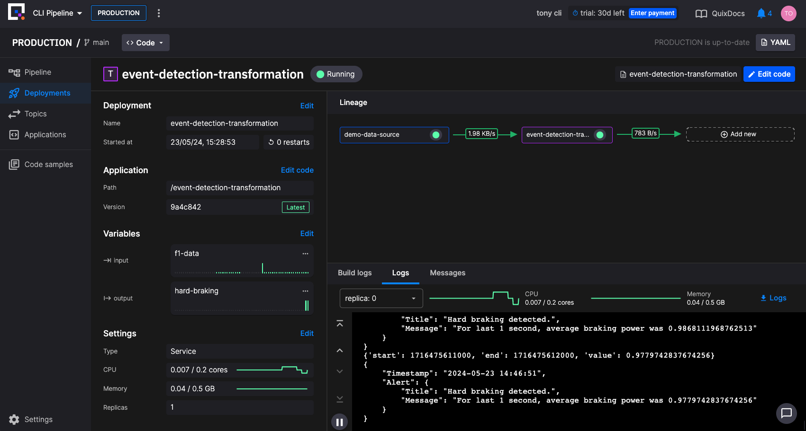
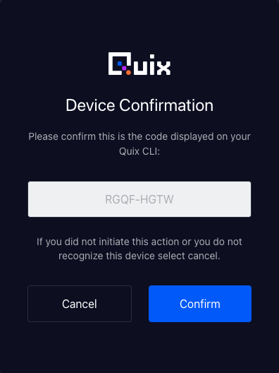

# Quickstart - Deploy your local pipeline to Quix Cloud

You can now level up by deploying your local pipeline to Quix Cloud.

??? "Why use Quix Cloud?"

    This provides a bullet point list of why you should use Quix Cloud:

    - Quix Cloud - Deploy, Collaborate and Observe your pipelines in the Cloud
    - Pipelines - Observe and manage the status of your pipeline
        - Pipeline view
        - Data metrics in real-time between your deployments
        - Add/Edit/Delete deployments to your pipeline
        - Start/stop deployments
    - CI/CD - Manage multiple environments in the same project using Git branches
        - Git integrations to any Git provider
        - Multiple environments tied to Git branches
        - Pipelines as code using YAML files
        - YAML variables per environment
        - Secrets management
        - CLI commands to synchronize your changes using GitHub actions
    - Users - Collaborate on multiple Projects in your organization
        - Invite users into your organization
        - Assign visibility and permissions to your Projects and Environments
    - Develop - Code editors with a hands off Build and Deploy system
        - Online code editors to modify your applications and Yaml files
        - Scale your pipeline just editing replicas, cpu and memory
        - Synchronize the changes to your pipeline with a single operation
        - Code samples templates
        - Connectors to main relevant sources and sinks
        - Dev Containers support (coming soon)
    - Data Explorer - Query and explore the data and consumers of your topics
        - Waveform and Table data explorer
        - Messages visualizer
        - Consumers lag and metrics
    - Monitoring - Logs and Metrics in real-time to check the status of your pipeline running in the cloud
        - Realtime logs
        - Build logs
        - Topic data metrics
        - Deployment metrics CPU/Memory
    - Dedicated /BYOC - Dedicated and private infrastructure with some add-ons like Historical logs and metrics, SLA, and more
        - SLA
        - Dedicated infrastructure to collaborate and run your pipelines
        - Historical logs (Loki)
        - Historical metrics (Prometheus)
        - Grafana dashboards
        - Private code samples library - ready-to-use application deployable samples specific to your organization

## Prerequisites

!!! danger "Important"

    This Quickstart assumes you have already completed the [CLI Quickstart](../cli/cli-quickstart.md).

## Step 1: Sign up to Quix Cloud

It's free to [sign up to Quix Cloud](https://portal.platform.quix.io/self-sign-up){target=_blank}.

After signing up using the method of your choice, you'll be taken to the `Welcome to Quix` dialog, where you can create a new project, as shown in the next step.

## Step 2: Create your first project

You're now ready to create your first project. 

1. Give your project a suitable name, such as "CLI Pipeline".
2. Select the `Quix advanced configuration` option.
3. Click `Let's get started`.
4. Select your Git provider from the `Connect to your own Git repo` panel.
5. Link the project to your Git repository using the setup guide provided for your chosen Git provider.
6. Click `Validate` to make sure everything is good and then click `Done`.
7. Click `Create project`.
8. Now create an environment. Enter an environment name of "PRODUCTION".
9. Make sure the `main` branch is selected.
10. Click `Continue`.
11. Select the Quix managed broker (which is the default option).
12. Click `Create environment`. After the environment is fully created you are taken to your pipeline view.

## Step 3: Synchronize your Quix environment 

To synchronize your pipeline view with your Git repository, click the `Sync environment` button, which is located in the top right of your pipeline view.

You'll be shown the `Sync to this commit` dialog. View the changes that are to be made and then click `Sync to this commit`.

Now click `Go to pipeline`.

## Step 4: See your pipeline running in Quix Cloud

In the pipeline view you can see your pipeline running:


## Step 5: View a deployment running in Quix Cloud

In your pipeline view, click on the `event-detection-transformation` service panel.

You'll now see how much additional observability Quix Cloud gives you:



Here you can explore the complete information of the service, including CPU amd memory utilization, topics being used, live data, logging, and much more. 

## Step 6: Explore the `Messages` tab

You can even explore individual Kafka messages being published to topics.

Click the `Messages` tab. This service has two topics associated with it, the input and output topics. Let's view the messages on the output topic.

In the `TOPIC` drop down, select the output topic `hard-braking`.

Click on a message to see its details:


You can see the JSON for the message.

You also have access to powerful tools, such as the `OFFSET` drop down, where you can select to view historical messages for example. If you view historical messages, and want to go back to seeing messages in real time, simply select `Live messages` from the drop down.

Feel free to explore further.

## Step 7: Continue development on the command line

You can now continue development on the command line. You can make changes to your pipeline locally, and test by running in Docker as you saw previously. When you are ready to deploy your changes to the Quix Cloud, you can simply run the following command:

```
quix local pipeline update
```

This updates your local `quix.yaml` file.

Then, to push your changes to your Git repository, and synchronize those changes with Quix Cloud, use:

```
quix local pipeline sync
```

You will see the following error:

```
You're not connected to Quix Cloud
```

To solve this, log into Quix Cloud using:

```
quix login
```

A `Device Confirmation` dialog is displayed in your web browser. Click `Confirm` to log in:



Now check your status with `quix status`:

```
✓ Logged in
  User:                 somebody+testing@quix.io (Test User)
  Organization:         tony cli (tonycli)
  Current context:      default (https://portal-api.platform.quix.io)
  Default environment:  ! Not set
  Local Broker:         ! Not set
  Local Broker enabled? ✗ No
  Git Root:             /Users/tbedford/new-cli/cli-pipeline
✓ VS Code installed
! PyCharm not installed
✓ Docker installed
✓ Git installed
```

Check that you are shown as logged into Quix Cloud.

!!! tip

    If you delay in clicking `Confirm` in the `Device Confirmation` dialog, you might need to log in again, as the code may have timed out.

Now, run `quix local pipeline sync` again and you'll see something similar to the following:

```
Sending all changes to git ...
On branch main
Your branch is up to date with 'origin/main'.

nothing to commit, working tree clean

! No changes were pushed
! Detected only one environment, selecting it automatically ...
✓ Project: CLI Pipeline
✓ Environment: CLI Pipeline - PRODUCTION
✓ Sync completed
```

You're changes are now synchronized from your Git repo to Quix Cloud. 

Now check your context by typing `quix context list` and you'll see something similar to the following:

```
   Name    │ Portal Url                          │   Default environment            │   Local Broker  
───────────┼─────────────────────────────────────┼──────────────────────────────────┼──────────────── 
 → default │ https://portal-api.platform.quix.io │ ✓ tonycli-clipipeline-production │                 
```

You can see the correct environment has been selected for you.

## Next step

* [Read the CLI Reference](../cli/cli-reference.md)
