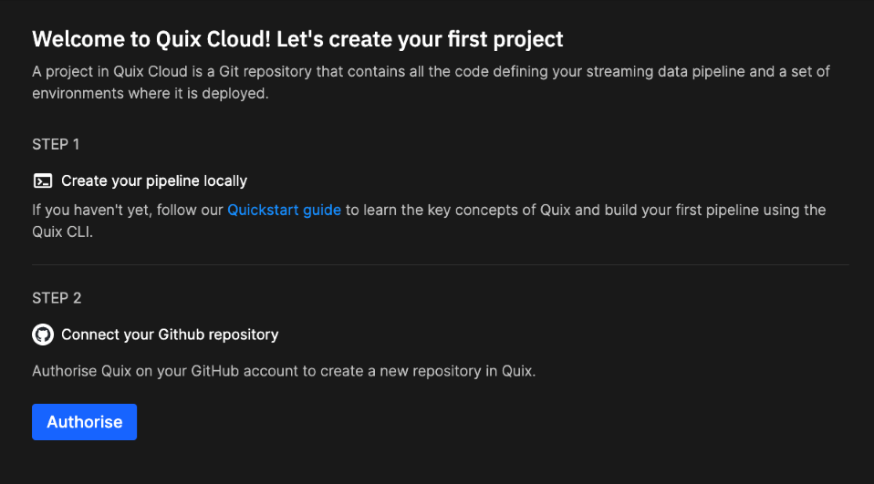
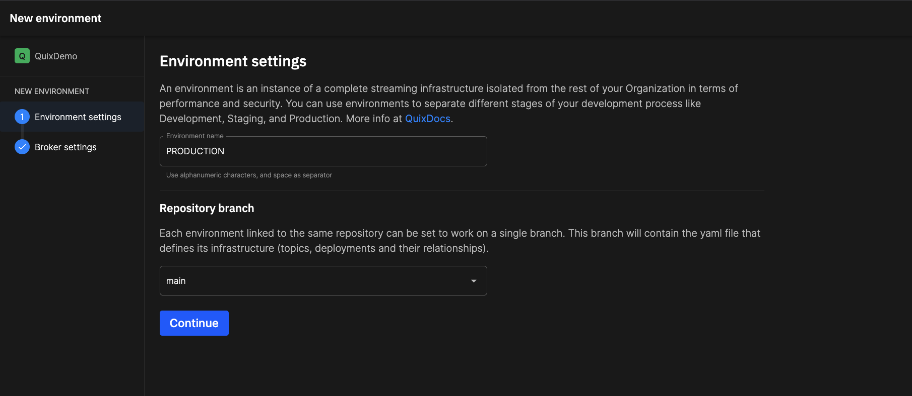
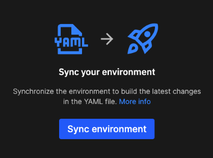
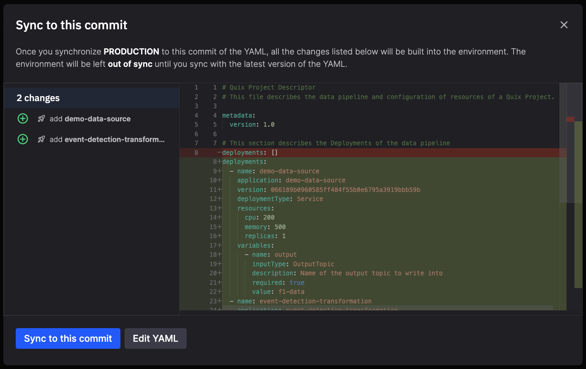
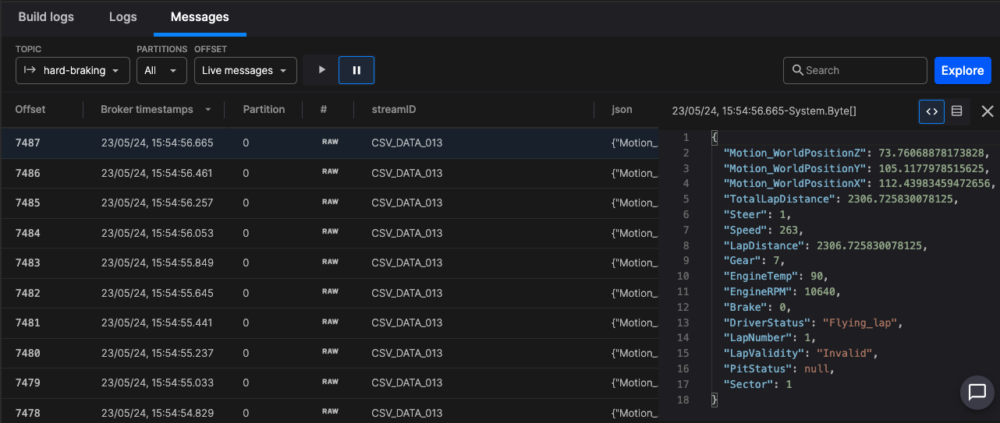

# Quickstart - Deploy your local pipeline to Quix Cloud

Welcome to the Quickstart guide for deploying your local pipeline to Quix Cloud. 

In this tutorial, we'll walk you through the seamless process of transitioning your local pipeline to Quix Cloud unlocking the full potential of your data processing workflows.

With Quix Cloud, you can focus on developing and refining your pipeline without worrying about infrastructure management. Whether you're a small team or a large enterprise, Quix Cloud provides the flexibility and scalability you need to accelerate your pipeline development and deployment processes.

If you're new to Quix Cloud or need a refresher on its features, [learn more here](../quix-cloud/why-quix-cloud.md).

## Prerequisites

!!! warning "Important"

    Before proceeding, ensure you've completed the [Quix CLI Quickstart](../quix-cli/cli-quickstart.md).

## Step 1: Sign in to Quix Cloud

??? info "Start for free"
    [Book a session](https://meetings.hubspot.com/mike-rosam/product-demo) with us to start for free.
        
    We will create a time limited free account for you, and our experts will help you get started with your specific use case. 

After you sign in, you'll be taken to the `Welcome to Quix` dialog, where you can create a new project, as shown in the next step.

## Step 2: Create your first project

You're now ready to create your first project. 

1. Click `Authorise` to connect your Github account to Quix.
2. Select the account that you used during the [Quix CLI Quickstart](../quix-cli/cli-quickstart.md) to install the QuixIntegration application.
3. Select which repositories you wish to authorise access to (select at least the one containing the Quix pipeline code)
4. Click `Install & Authorize`.
5. Select the Git repository used during the [Quix CLI Quickstart](../quix-cli/cli-quickstart.md) from the list provided.
6. Click `Create project`.

## Step 3: Create an environment for your project 

Now, create an environment where the pipeline will be deployed.

1. Enter "PRODUCTION" as the environment name.
2. Make sure the `main` branch is selected.
3. Click `Continue`.

    

4. Select the "Quix managed broker".
5. Click `Create environment`. After the environment is fully created you are taken to your pipeline view.

## Step 4: Synchronize your Quix environment 

Let's apply some magic now. We'll synchronize the code and YAML files from your Git repository with your environment, setting up all the necessary resources to start running your pipeline.

To synchronize your environment with your Git repository, click the `Sync environment` button, which is located in the center of the screen.

You'll be shown the `Sync to this commit` dialog. View the changes that are to be made and then click `Sync to this commit`.

In the pipeline view you can see your pipeline running:

🎉🎉 Congratulations! Your pipeline is now deployed and running in the cloud! 🎉🎉

## Step 5: View a deployment running in Quix Cloud

In your pipeline view, click on the `event-detection-transformation` service panel.

You'll now see how much additional observability Quix Cloud gives you:

Here you can explore the complete information of the service, including CPU and memory utilization, topics being used, live data, logging, and much more. 

## Step 6: Explore the `Messages` tab

You can even explore individual Kafka messages being published to topics.

Click the `Messages` tab. This service has two topics associated with it, the input and output topics. Let's view the messages on the output topic.

In the `TOPIC` drop down, select the output topic `hard-braking`.

Click on a message to see its details:

You can see the JSON for the message.

You also have access to powerful tools, such as the `OFFSET` drop down, where you can select to view historical messages for example. If you view historical messages, and want to go back to seeing messages in real time, simply select `Live messages` from the drop down.

Feel free to explore further.

## Next steps

- __1. Quix Cloud tour__

    ---

    Continue exploring Quix Cloud features.

    [Quix Cloud Tour :octicons-arrow-right-24:](../create/overview.md)

