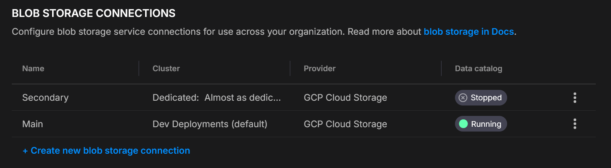
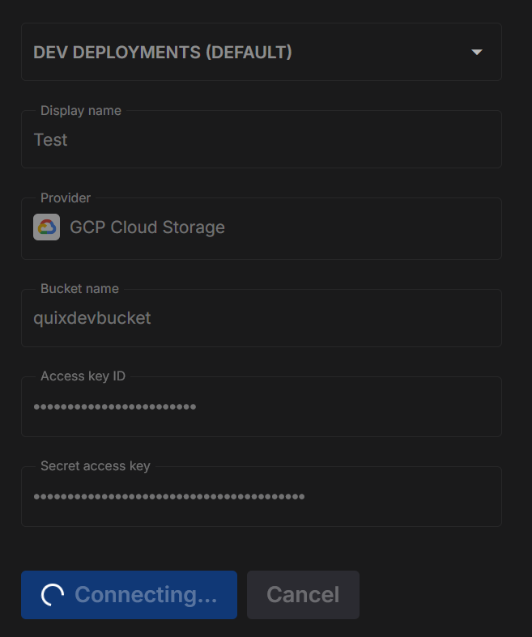
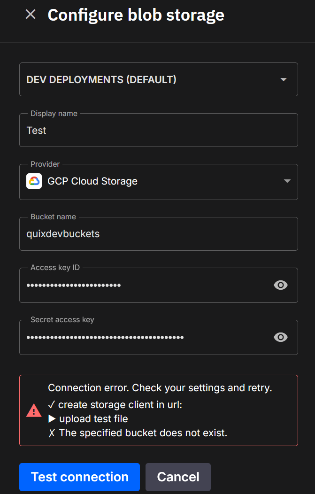

# Blob storage connections

Connect your cluster to a bucket/container so Quix can enable **[Quix Lake](./overview.md)** (Data Lake, Lakehouse, or both) or any other managed service that requires a blob storage connection.

!!! important "One connection per cluster"
    Each **cluster** supports **one** blob storage connection.
    You can configure different connections for different clusters.
    Both the [Data Lake Sink](./data-lake/sink.md) and the [Lakehouse Sink](./lakehouse/sink.md) use this same connection.

    One shared connection doesn't mean one shared view of the data: each team only sees its own data, and the bucket's keys stay locked away. See the [Storage Access Gateway](./secure-storage-access.md).

???+ info "Quix Lake at a glance"
    Quix Lake is the persistence layer of Quix Cloud. It ships in two flavors that share this blob storage connection:

    - **[Data Lake](./data-lake/overview.md)** — raw Kafka messages in Avro plus a Parquet index. Replay-first, byte-perfect.
    - **[Lakehouse](./lakehouse/overview.md)** — columnar Parquet tables registered in a catalog. Query-first, SQL-ready.

    Run one, the other, or both — see the [Quix Lake overview](./overview.md) for how to choose.

## Create a connection

1. **Settings → Blob storage connections → Create**
2. Pick **Cluster**, set **Display name**, choose **Provider**, fill the fields
3. **Test connection** (below)
4. **Save**

## Test before saving

When you click **Test connection**, Quix runs a short round-trip check to make sure your details are correct and that the platform can both see and use your storage.

**Here’s what happens:**

1. **Connect** - Quix creates a storage client using the details you entered.  
2. **Upload** - it writes a small temporary file into a `tmp/` folder in your bucket or container.  
3. **Check visibility** - it confirms the file shows up in the storage listing.  
4. **Query** - it runs a simple check to ensure the file is discoverable for later Quix Lake operations.  
5. **Clean up** - the temporary file is deleted so your storage stays tidy.

**Success**  
Each step is shown in the dialog. Successful steps are marked with a ✓, and you’ll see confirmation when everything checks out.

**Failure**  
If a step fails, you’ll see ✗ next to it along with the reason (for example, “Access denied” or “Wrong region”). This makes it easy to fix permissions or update your settings.

## Providers

=== "Amazon S3"

    1. Log in to the **AWS Management Console**.  
    2. Go to **IAM**.  
    3. Open **Users**.  
    4. Select an existing user or click **Add user** to create a new one.  
    5. **Permissions**  
       - In the **Permissions** tab, attach a policy that allows bucket access.  
    6. **Security credentials**  
       - Open the **Security credentials** tab.  
       - Click **Create access key**.  
    7. **Save credentials**  
       - Copy the **Access Key ID** and **Secret Access Key** (the secret appears only once).  
    8. Copy the information into the Quix S3 form.  
    9. Click **Test Connection**.  

=== "Google Cloud Storage (GCS)"

    1. **Ensure access**  
       - Have Google Cloud project owner or similar permissions where your bucket resides or will be created.  
       - Create a service account and assign it to the bucket with R/W (e.g., `roles/storage.objectAdmin`) or equivalent minimal object roles.  
    2. **Open Cloud Storage settings**  
       - In the Google Cloud Console, go to **Storage → Settings**.  
    3. **Interoperability tab**  
       - Select **Interoperability**.  
       - If disabled, click **Enable S3 interoperability**.  
    4. **Create (or view) keys**  
       - Under **Access keys for service accounts**, click **Create key** and follow the process to assign one to the service account.  
    5. **Save credentials**  
       - Copy the **Access key** and **Secret** (the secret is shown only once).  
       - Paste this information into the Quix S3 connector form.  
    6. Click **Test Connection**.  

=== "Azure Blob Storage"

    1. **Ensure access**  
       - Your Azure user must have at least the **Storage Blob Data Contributor** role (or higher).  
       - Open the **Azure Portal** and go to your **Storage account**.  
    2. **Navigate to credentials**  
       - In the left menu, expand **Security + networking**.  
       - Click **Access keys**.  
    3. **Copy credentials**  
       - Note the **Storage account name**.  
       - Copy **Key1** (or **Key2**) value.  
       - Paste the information into the Quix Azure Blob connector form.  
    4. Click **Test Connection**.  

=== "MinIO (S3-compatible)"

    1. **Ensure access**  
       - Your MinIO user or role must include permissions to create and list access keys (e.g., `consoleAdmin` or a custom PBAC policy).  
    2. **Log in** to the MinIO Console.  
    3. **Go to Access keys**  
       - Select **Access keys** in the left menu.  
    4. **Create a new key**  
       - Click **Create access key** to generate an **Access Key** and **Secret Key**.  
    5. **Save credentials**  
       - Copy the **Access Key** and **Secret Key** - the secret is shown only once.  
    6. Copy the information into the Quix MinIO connector form.  
    7. Click **Test Connection**.  

## Variables injected into bound deployments

When a deployment — or a [dev session](../applications/dev-sessions/overview.md) — is bound to this blob storage connection, Quix injects the connection itself as a secret:

| Variable | Description |
|----------|-------------|
| `Quix__BlobStorage__Connection__Json` | The full connection as a JSON document — provider plus credentials and the bucket/container. Injected as a secret so values stay hidden in logs and the UI. |

The JSON carries the selected **Provider** (S3, GCS, Azure Blob, or MinIO) and the matching credential and location fields you entered above. Your code reads this one variable and deserializes it to connect to the storage.

When [Quix Lake](./overview.md) is enabled, the Lakehouse endpoints are injected too, so your code can reach the Catalog and Query services without hard-coding URLs:

| Variable | Description |
|----------|-------------|
| `Quix__Lakehouse__Catalog__Url` | The Catalog URL (preferred name). Also injected as `CATALOG_URL` (legacy / PyIceberg alias) and `QUIX_LAKE_URL` (QuixLake / QuixLab alias). |
| `Quix__Lakehouse__Catalog__AuthToken` | Authenticates your code's requests to the Catalog — pair it with `Quix__Lakehouse__Catalog__Url`. Only injected under the `Quix__` name (no alias). Injected as a secret. |
| `Quix__Lakehouse__Query__Url` | The Query URL. |
| `Quix__Lakehouse__Query__AuthToken` | Authenticates your code's requests to the Query service — pair it with `Quix__Lakehouse__Query__Url`. Injected as a secret. |

See [Quix Variables](../deployments/quix-variables.md) for the full list of variables the platform injects into deployments.

## Security & operations

- Dedicated principals per connection (IAM user / Service Account / MinIO user)  
- Scope credentials to **one** bucket/container  
- Rotate keys regularly; store secrets securely  
- Consider server-side encryption and access logging

## See more

* [Quix Lake overview](./overview.md) — what it is and how to choose between Data Lake and Lakehouse
* [Data Lake overview](./data-lake/overview.md) — replay-first storage
* [Lakehouse overview](./lakehouse/overview.md) — query-first storage
* [Data Lake Sink](./data-lake/sink.md) — persist topics as Avro + Parquet index
* [Lakehouse Sink](./lakehouse/sink.md) — persist topics as queryable Parquet tables
