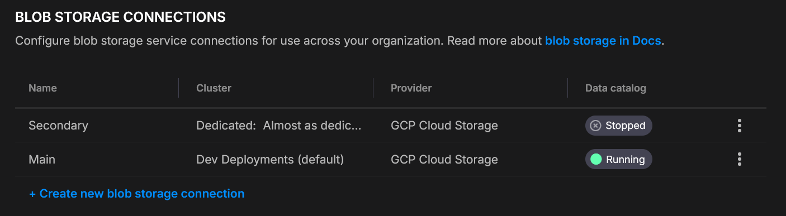
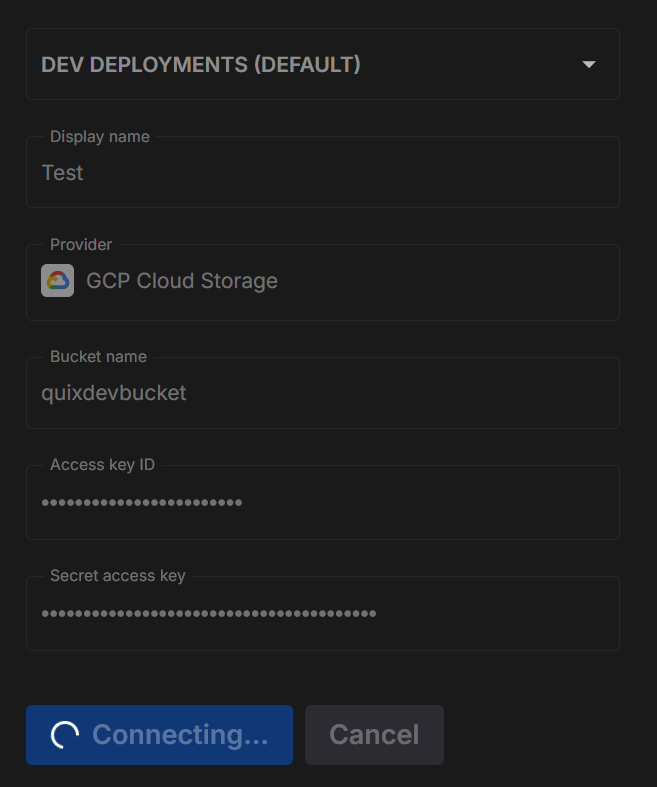
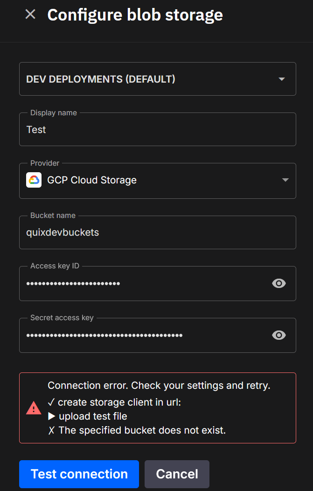

# Quix Lake connections and storages

Connect your cluster to a bucket or container so Quix can enable **[Quix Lake](./overview.md)**, the Data Lake, the Lakehouse, or any other managed service that needs storage. One connection can then hold several storages. Each storage is its own bucket.



!!! important "One connection per cluster and node group"
    Each **cluster and node group** pair supports **one** Quix Lake connection. The Portal names a connection by that pair.
    You can configure different connections for different pairs.
    One connection still holds as many storages as you need, so a second bucket needs no second connection.
    Both the [Data Lake Sink](./data-lake/sink.md) and the [Lakehouse Sink](./lakehouse/sink.md) use this same connection.

    One shared connection doesn't mean one shared view of the data: each team only sees its own data, and the bucket's keys stay locked away. See the [Storage Access Gateway](./secure-storage-access.md).

???+ info "Quix Lake at a glance"
    Quix Lake is the persistence layer of Quix Cloud. It ships in two flavors that share this connection:

    - **[Data Lake](./data-lake/overview.md)** — raw Kafka messages in Avro plus a Parquet index. Replay-first, byte-perfect.
    - **[Lakehouse](./lakehouse/overview.md)** — columnar Parquet tables registered in a catalog. Query-first, SQL-ready.

    Run one, the other, or both — see the [Quix Lake overview](./overview.md) for how to choose.

## Create a connection

1. Open **Settings → Quix Lake** and click **Create**.
2. Pick **Cluster**, set **Display name**, choose **Provider**, and fill the fields.
3. Click **Test connection**, described below.
4. Click **Save**.

The page lists every cluster in your organization. A cluster without a connection shows a **Not connected** badge, so you can see at a glance where Quix Lake is still to set up.

The bucket you name here becomes the **main storage** of the connection. Your code addresses it by that bucket name. A storage you add later never moves it.

You can change both facts later. An administrator can [rename the storage](#rename-a-storage), and an administrator can [make another storage the main storage](#make-a-storage-the-main-storage). The two are separate: a rename changes a bucket name, and a main storage move changes no bucket name at all.

## Test before saving



When you click **Test connection**, Quix runs a short round-trip check to confirm your details are correct and that the platform can both see and use your storage.

Here is what happens:

1. **Connect** — Quix creates a storage client from the details you entered.
2. **Upload** — Quix writes a small temporary file into a `tmp/` folder in your bucket or container.
3. **Check visibility** — Quix confirms the file shows up in the storage listing.
4. **Query** — Quix runs a simple check to confirm the file is discoverable for later Quix Lake operations.
5. **Clean up** — Quix deletes the temporary file, so your storage stays tidy.

The dialog shows each step. A successful step carries a ✓, and you get a confirmation when every step passes.

If a step fails, you see ✗ next to it with the reason, such as "Access denied" or "Wrong region". Use the reason to fix the permissions or correct your settings.



## Edit a connection

Open a connection from **Settings → Quix Lake** to change it.

The **Access key** and the **Secret** are optional when you edit. Leave both empty and Quix keeps the keys it already holds. Fill them in only when you rotate the credentials.

Quix asks you to test again only when you change a field that reaches the storage, such as the endpoint, the bucket, or the credentials. A change to a display name saves at once.

## Providers

=== "Amazon S3"

    1. Log in to the **AWS Management Console**.  
    2. Go to **IAM**.  
    3. Open **Users**.  
    4. Select an existing user or click **Add user** to create a new one.  
    5. **Permissions**  
       - In the **Permissions** tab, attach a policy that allows bucket access.  
    6. **Security credentials**  
       - Open the **Security credentials** tab.  
       - Click **Create access key**.  
    7. **Save credentials**  
       - Copy the **Access Key ID** and **Secret Access Key**. The secret appears only once.  
    8. Copy the information into the Quix S3 form.  
    9. Click **Test Connection**.  

=== "Google Cloud Storage (GCS)"

    1. **Ensure access**  
       - Have Google Cloud project owner or similar permissions where your bucket resides or will be created.  
       - Create a service account and assign it to the bucket with read and write rights, such as `roles/storage.objectAdmin`, or equivalent minimal object roles.  
    2. **Open Cloud Storage settings**  
       - In the Google Cloud Console, go to **Storage → Settings**.  
    3. **Interoperability tab**  
       - Select **Interoperability**.  
       - If disabled, click **Enable S3 interoperability**.  
    4. **Create (or view) keys**  
       - Under **Access keys for service accounts**, click **Create key** and follow the process to assign one to the service account.  
    5. **Save credentials**  
       - Copy the **Access key** and **Secret**. The secret is shown only once.  
       - Paste this information into the Quix S3 connector form.  
    6. Click **Test Connection**.  


=== "Azure Blob Storage"

    1. **Ensure access**  
       - Your Azure user must have at least the **Storage Blob Data Contributor** role, or higher.  
       - Open the **Azure Portal** and go to your **Storage account**.  
    2. **Navigate to credentials**  
       - In the left menu, expand **Security + networking**.  
       - Click **Access keys**.  
    3. **Copy credentials**  
       - Note the **Storage account name**.  
       - Copy **Key1** or **Key2**.  
       - Paste the information into the Quix Azure Blob connector form.  
    4. Click **Test Connection**.  

=== "MinIO (S3-compatible)"

    1. **Ensure access**  
       - Your MinIO user or role must include permissions to create and list access keys, such as `consoleAdmin` or a custom PBAC policy.  
    2. **Log in** to the MinIO Console.  
    3. **Go to Access keys**  
       - Select **Access keys** in the left menu.  
    4. **Create a new key**  
       - Click **Create access key** to generate an **Access Key** and **Secret Key**.  
    5. **Save credentials**  
       - Copy the **Access Key** and **Secret Key**. The secret is shown only once.  
    6. Copy the information into the Quix MinIO connector form.  
    7. Click **Test Connection**.  

## Add a storage

A cluster still holds one connection, but that connection can serve more than one storage. Each storage is **its own bucket**. The name you give a storage is the bucket name your clients use. So a client reaches a second storage with a second bucket name, on the same endpoint and with the same credential.

Add a storage when you want data in a different bucket, region, or provider. You give your services no second connection to manage.

To add one:

1. Open **Settings → Quix Lake** and select the connection.
2. Open the **Storages** tab.
3. Click **Add storage**.
4. Set a **Display name**, a **Storage name**, and the **Provider** with its credentials.
5. Click **Test connection**, then **Save**.

The **Storages** tab lists every storage on the connection. Each row shows the bucket name your clients use and the provider behind it. The main storage carries a **Main** badge. The `⋮` menu holds **Edit storage** and **Delete storage**.

!!! note "A new storage never moves an old one"
    A storage you add changes nothing about the storages that are already there. The main storage keeps its bucket name, and every path to it keeps working. A customer with one storage sees no change at all.

### Storage name rules

The storage name is the bucket name your clients use, so Quix applies the bucket rules to it:

* It is 3 to 63 characters long.
* It starts with a lowercase letter or a digit.
* It then holds only lowercase letters, digits, and `-`.
* It is unique on the connection. Two storages cannot share one bucket name.

A storage with **no** name of its own keeps the bucket name of the bucket behind it. A connection starts with its main storage that way, so an existing connection needs no change.

Every storage may take a name of its own, the main storage included. The Portal calls the field the **SAG bucket name**, and the **Storages** tab shows it in a column of that name. A storage with no name is not automatically the main storage: the **Main** badge marks the main storage, and nothing else does.

### Rename a storage

You can rename a storage after you create it. Open **Edit storage** from the `⋮` menu on the **Storages** tab. Change the **Storage name** field. The display name is a label for the Portal only, so a change to it moves nothing.

!!! warning "A rename changes the bucket name every client uses"
    The name is the bucket, so a rename changes the address of the whole storage. The old bucket name stops working at once.

    Every deployment bound to that storage must redeploy before it works again. Quix writes the bucket name into the deployment at deploy time.

    A rename also stops every multipart upload that is still running. Quix shows a warning before it saves the rename. Update your code, your saved paths, and your sink configuration first.

### Make a storage the main storage

Any storage on the connection can become the main storage. Open the `⋮` menu on the **Storages** tab and click **Make this the main storage**. Quix asks you to type a word to confirm.

The move changes one thing only:

* **Both storages keep their bucket name.** The promoted storage answers on the same bucket name as before, and the old main storage answers on the same bucket name as before. **No client of either storage breaks.**
* **The environment path moves.** `s3://<workspaceId>/` reaches the promoted storage from that moment. See [The environment shortcut](#the-environment-shortcut) below.
* **Your services stay where their data is.** The Data Lake and the Lakehouse keep the storage that holds their tables. Quix never moves a running service to a bucket that holds none of its history.

Quix copies **no** data. A read of `s3://<workspaceId>/` answers empty until you copy the environment folders into the new main storage yourself.

!!! warning "Copy the data before you rely on the new main storage"
    A main storage move is a two-part job, and Quix only does the first part. Before you move the main storage:

    1. Announce the change and stop writes.
    2. Copy every environment folder from the old main storage to the new one. Check the file counts and the byte totals.
    3. Move the main storage in the Portal.
    4. Read, write, and list through `s3://<workspaceId>/` to confirm the new main storage answers.
    5. Keep the old storage on the connection until every check passes.

    To go back, make the old storage the main storage again. Quix has no undo button.

### The environment shortcut

An environment's data lives in a folder named after the environment ID, inside the **main storage**:

```text
s3://quixdevbucket/<workspaceId>/    the real location, inside the main storage
s3://<workspaceId>/                  the same data, addressed by the shortcut
```

Both addresses reach the same objects, and every operation answers the same through either one. Use whichever suits your code. The shortcut is the one place the gateway changes a path: a key you read through `s3://<workspaceId>/` drops its `<workspaceId>/` lead.

The shortcut always follows the main storage. It works only for an environment ID. Any other name that is not a storage answers `404 NoSuchBucket`.

The shortcut also needs a credential issued against the main storage. A service bound to another storage reaches only its own bucket, so it must use the full address.

### What your code sees

Take a connection whose main storage is the bucket `quixdevbucket`. An administrator adds a MinIO storage, names it `minio`, and points it at the real bucket `archive-bucket`:

```text
s3://quixdevbucket/<workspaceId>/    an environment's data in the main storage
s3://<workspaceId>/                  the same data, through the environment shortcut
s3://minio/reports/2026-08.csv       a file in the storage named minio
```

The main storage answers to `quixdevbucket` before the add and after it. The added storage answers to the name `minio`. Its real bucket name stays hidden from your clients.

The gateway rewrites the bucket name only. Your object keys travel unchanged, so an object you write through the gateway lands at the same key it would land at if you wrote it to the bucket directly. The [environment shortcut](#the-environment-shortcut) is the single exception.

There is no listing across every storage, because an S3 LIST covers one bucket. Call **ListBuckets** to see every storage you may reach. Read [S3-compatible endpoint](./s3-endpoint.md) for the client-side detail. Read [Storage Access Gateway](./secure-storage-access.md) for who may see what.

### Delete a storage

Open **Delete storage** from the `⋮` menu on the **Storages** tab. Quix refuses the delete while a service or a credential still uses that storage. Quix also refuses to delete the main storage while other storages remain. Deleting a storage removes it from the connection. Your data stays in your own bucket.

## Variables injected into bound deployments

When a deployment — or a [dev session](../applications/dev-sessions/overview.md) — binds to this connection, Quix injects the storage as a secret:

| Variable | Description |
|----------|-------------|
| `Quix__BlobStorage__Connection__Json` | The bound storage as a JSON document — the endpoint plus the credentials and the bucket. Injected as a secret, so values stay hidden in logs and the UI. |

Your code reads this one variable and deserializes it to connect to the storage. See [Quix Lake storage](../deployments/blob-storage-and-library.md) for how to read it in Python.

When [Quix Lake](./overview.md) is enabled, Quix injects the Lakehouse endpoints too, so your code reaches the Catalog and Query services without hard-coded URLs:

| Variable | Description |
|----------|-------------|
| `Quix__Lakehouse__Catalog__Url` | The Catalog URL, the preferred name. Quix also injects it as `CATALOG_URL`, the legacy PyIceberg alias, and as `QUIX_LAKE_URL`, the QuixLake and QuixLab alias. |
| `Quix__Lakehouse__Catalog__AuthToken` | Authenticates your code's requests to the Catalog. Pair it with `Quix__Lakehouse__Catalog__Url`. Quix injects it only under the `Quix__` name, as a secret. |
| `Quix__Lakehouse__Query__Url` | The Query URL. |
| `Quix__Lakehouse__Query__AuthToken` | Authenticates your code's requests to the Query service. Pair it with `Quix__Lakehouse__Query__Url`. Injected as a secret. |

See [Quix variables](../deployments/quix-variables.md) for the full list of variables the platform injects into deployments.

## Security and operations

* Use a dedicated principal per storage — an IAM user, a service account, or a MinIO user.
* Scope each credential to **one** bucket or container.
* Rotate keys regularly and store secrets securely.
* Consider server-side encryption and access logging.

## Next steps

* [Storage explorer](./storage-explorer.md) — browse and manage files in the Portal
* [Storage Access Gateway](./secure-storage-access.md) — who can read and change what
* [S3-compatible endpoint](./s3-endpoint.md) — reach the same data from your code
* [Quix Lake overview](./overview.md) — how to choose between Data Lake and Lakehouse
* [Data Lake Sink](./data-lake/sink.md) — persist topics as Avro plus a Parquet index
* [Lakehouse Sink](./lakehouse/sink.md) — persist topics as queryable Parquet tables
