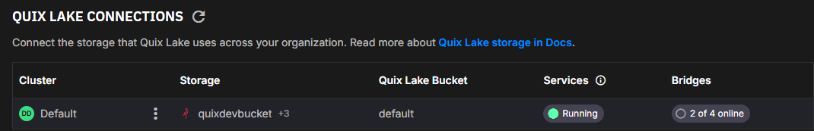
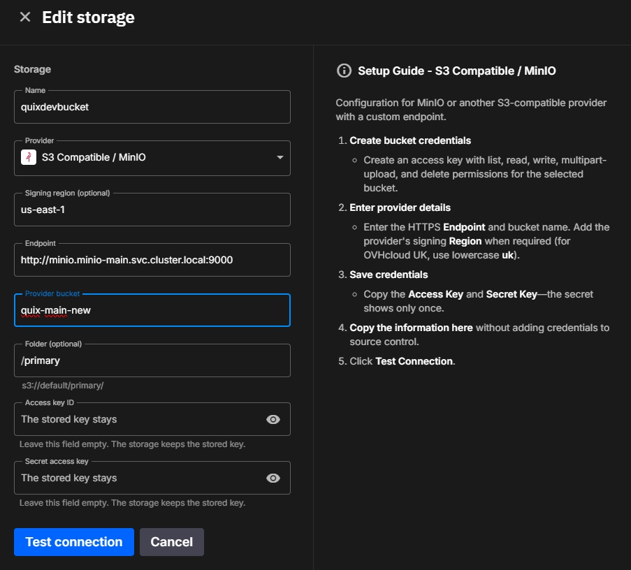
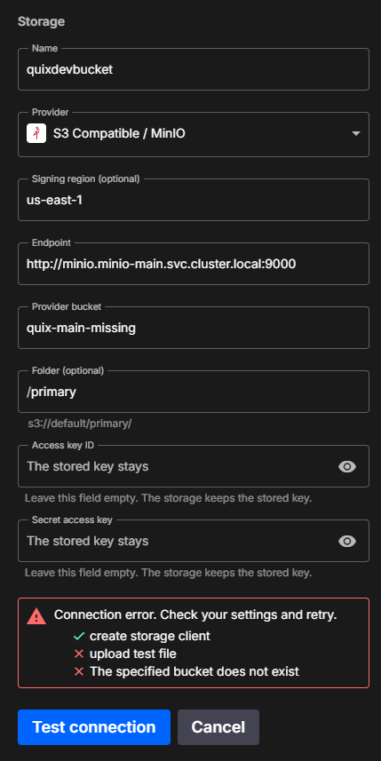

# Quix Lake connections and storages

Connect your cluster to a bucket or container so Quix can enable **[Quix Lake](./overview.md)**, the Data Lake, the Lakehouse, or any other managed service that needs storage. One connection can then hold several storages. Your clients address **one bucket**, and each storage is a **folder** inside it.



!!! important "One bucket, one root"
    One connection holds **one Quix Lake bucket**. Every storage on the connection is a **folder** in that bucket.

    Only the **main storage** may sit at the **root** of the bucket. A storage that is not the main storage always has a folder.

    The main storage may take a folder of its own too. Then no storage sits at the root.

!!! important "One connection per cluster and node group"
    Each **cluster and node group** pair supports **one** Quix Lake connection. The Portal names a connection by that pair.
    You can configure different connections for different pairs.
    One connection still holds as many storages as you need, so a second storage needs no second connection.
    Both the [Data Lake Sink](./data-lake/sink.md) and the [Lakehouse Sink](./lakehouse/sink.md) use this same connection.

    One shared connection doesn't mean one shared view of the data: each team only sees its own data, and the bucket's keys stay locked away. See the [Storage Access Gateway](./secure-storage-access.md).

???+ info "Quix Lake at a glance"
    Quix Lake is the persistence layer of Quix Cloud. It ships in two flavors that share this connection:

    - **[Data Lake](./data-lake/overview.md)** — raw Kafka messages in Avro plus a Parquet index. Replay-first, byte-perfect.
    - **[Lakehouse](./lakehouse/overview.md)** — columnar Parquet tables registered in a catalog. Query-first, SQL-ready.

    Run one, the other, or both — see the [Quix Lake overview](./overview.md) for how to choose.

## Create a connection

1. Open **Settings → Quix Lake**. The page shows one row for each cluster.
2. Click the row of a cluster that shows **Not connected**. The **Connect storage** panel opens, with the **Cluster** filled in.
3. Type the **Quix Lake bucket**.
4. Choose the **Provider**. Fill in the **Provider bucket** and the credentials.
5. Click **Test connection**, described below.
6. Click **Create**.

The page lists every cluster in your organization. A cluster without a connection shows a **Not connected** badge, so you can see at a glance where Quix Lake is still to set up.

You type the **Quix Lake bucket** name yourself. It is the one bucket name your code uses, and it is separate from the **Provider bucket**. The first storage becomes the **main storage** of the connection. It sits at the **root** of the Quix Lake bucket, unless you fill in **Folder (optional)**. A storage you add later never moves it, because a new storage becomes a folder inside that same bucket.

You can change these facts later. An administrator can rename the Quix Lake bucket: open the connection and click the edit button on the **Quix Lake bucket** line. An administrator can also [rename a storage](#rename-a-storage), and [make another storage the main storage](#make-a-storage-the-main-storage). A storage rename always moves the folder of one storage. A main storage move moves a folder only in one case. The storage that steps down sits at the root, so it must take a folder.

## Test before saving



When you click **Test connection**, Quix runs a short round-trip check to confirm your details are correct and that the platform can both see and use your storage. Quix writes a small test file into your bucket, checks that it can list and read the file, and then deletes it.

When the test passes, the panel shows **Tested connection** with a tick.

When the test fails, the panel shows "Connection error. Check your settings and retry." and lists the steps with the reason. Use the reason to fix the permissions or correct your settings.



## Edit a connection

Open the connection from **Settings → Quix Lake**. On the **Storages** tab, click the main storage row, or select **Edit storage** in its `⋮` menu.

The **Access key ID** and the **Secret access key** are optional when you edit. Leave both empty and Quix keeps the keys it already holds. Fill them in only when you rotate the credentials.

Quix asks you to test again only when you change a field that reaches the storage, such as the endpoint, the bucket, or the credentials. A change to the **Name** saves at once.

## Providers

=== "Amazon S3"

    1. Log in to the **AWS Management Console**.  
    2. Go to **IAM**.  
    3. Open **Users**.  
    4. Select an existing user or click **Add user** to create a new one.  
    5. **Permissions**  
       - In the **Permissions** tab, attach a policy that allows bucket access.  
    6. **Security credentials**  
       - Open the **Security credentials** tab.  
       - Click **Create access key**.  
    7. **Save credentials**  
       - Copy the **Access Key ID** and **Secret Access Key**. The secret appears only once.  
    8. Copy the information into the Quix S3 form.  
    9. Click **Test connection**.  

=== "Google Cloud Storage (GCS)"

    1. **Ensure access**  
       - Have Google Cloud project owner or similar permissions where your bucket resides or will be created.  
       - Create a service account and assign it to the bucket with read and write rights, such as `roles/storage.objectAdmin`, or equivalent minimal object roles.  
    2. **Open Cloud Storage settings**  
       - In the Google Cloud Console, go to **Storage → Settings**.  
    3. **Interoperability tab**  
       - Select **Interoperability**.  
       - If disabled, click **Enable S3 interoperability**.  
    4. **Create (or view) keys**  
       - Under **Access keys for service accounts**, click **Create key** and follow the process to assign one to the service account.  
    5. **Save credentials**  
       - Copy the **Access key** and **Secret**. The secret is shown only once.  
       - Paste this information into the Quix S3 connector form.  
    6. Click **Test connection**.  


=== "Azure Blob Storage"

    1. **Ensure access**  
       - Your Azure user must have at least the **Storage Blob Data Contributor** role, or higher.  
       - Open the **Azure Portal** and go to your **Storage account**.  
    2. **Navigate to credentials**  
       - In the left menu, expand **Security + networking**.  
       - Click **Access keys**.  
    3. **Copy credentials**  
       - Note the **Storage account name**.  
       - Copy **Key1** or **Key2**.  
       - Paste the information into the Quix Azure Blob connector form.  
    4. Click **Test connection**.  

=== "MinIO (S3-compatible)"

    1. **Ensure access**  
       - Your MinIO user or role must include permissions to create and list access keys, such as `consoleAdmin` or a custom PBAC policy.  
    2. **Log in** to the MinIO Console.  
    3. **Go to Access keys**  
       - Select **Access keys** in the left menu.  
    4. **Create a new key**  
       - Click **Create access key** to generate an **Access Key** and **Secret Key**.  
    5. **Save credentials**  
       - Copy the **Access Key** and **Secret Key**. The secret is shown only once.  
    6. Copy the information into the Quix MinIO connector form.  
    7. Click **Test connection**.  

## Add a storage

A cluster still holds one connection, but that connection can serve more than one storage. Your clients keep addressing **one bucket**, the Quix Lake bucket, and each storage is a **folder** inside it. The **Folder** you set on a storage is that folder name. So a client reaches a second storage by putting the folder first in the key, on the same endpoint and with the same credential:

```text
s3://<connectionBucket>/<storage>/<key>
```

Each storage keeps its own bucket or container and its own credentials. One bucket name in your code can therefore hide several providers. Add a storage when you want data in a different bucket, region, or provider, and give your services no second connection to manage.

A storage can also serve folders on a machine you own, such as a local disk or a network share. See the [Quix Lake Bridge](./bridge/overview.md) (beta).

To add one:

1. Open **Settings → Quix Lake** and select the connection.
2. Open the **Storages** tab.
3. Click **Add storage**.
4. Choose the **Provider**. Fill in the **Provider bucket** and the credentials.
5. Set the **Folder**.
6. Click **Test connection**, then **Create**. A [Quix Lake Bridge](./bridge/overview.md) storage has no connection to test, so this step goes straight to **Create**.

A cloud storage takes the name of its provider bucket. You can change the **Name** later in **Edit storage**. A Quix Lake Bridge storage also asks for a **Name**.

The **Storages** tab lists every storage on the connection. Each row shows the **Folder** your clients use and the **Provider bucket** behind it. The main storage carries a **Main** badge. The `⋮` menu holds **Edit storage**. On a storage that is not the main storage, it also holds **Make this the main storage** and **Delete storage**.

!!! note "A new storage never moves an old one"
    A storage you add changes nothing about the storages that are already there. The Quix Lake bucket keeps its name, and every path to it keeps working. A customer with one storage sees no change at all.

### Folder name rules

The folder name sits at the root of the Quix Lake bucket, and Quix applies the bucket rules to it:

* It is 3 to 63 characters long.
* It starts and ends with a lowercase letter or a digit.
* It holds only lowercase letters, digits, and `-`.
* It is unique on the connection. Two storages cannot share one folder.
* It cannot start with your organization ID and a hyphen. Every environment ID starts that way, and the [environment shortcut](#the-environment-shortcut) needs that shape.
* It cannot be your organization ID, and it cannot be the name of the Quix Lake bucket.
* It cannot be `admin`, `explorer`, `internal`, `health` or `metrics`.

Quix also refuses a name when a folder of that name **already exists** in the main storage. The new storage would hide that folder. Pick another name, or move the folder first.

The **Folder** column on the **Storages** tab shows where the storage sits in the Quix Lake bucket, as a path. It shows `/` for a storage at the bucket root, and `/archive/` for a storage in the folder `archive`. Only the main storage can show `/`.

### Rename a storage

Open **Edit storage** from the `⋮` menu on the **Storages** tab and change the **Folder** field. The **Name** is a label for the Portal only, so a change to it moves nothing.

You cannot empty the **Folder** field of a storage that is not the main storage. Only the main storage may sit at the bucket root.

!!! warning "A rename moves the folder every client uses"
    The folder is the address of the storage. So a rename moves the whole storage to another folder of the Quix Lake bucket. The old folder stops working at once. There is no alias and no grace period.

    ```text
    s3://quixdevbucket/minio/reports/day.csv      before the rename
    s3://quixdevbucket/archive/reports/day.csv    after a rename to archive
    ```

    Quix moves the permissions of the storage with it, so nobody loses access. Quix also restarts the deployments bound to the storage. Your code still needs a change, because the folder in its keys changes. Update your code, your saved paths, and your sink configuration before you rename. A multipart upload that uses the old folder fails after the rename. The Portal shows a warning before it saves the rename.

!!! warning "A path change can break Lakehouse tables"
    A Lakehouse table stores the full path of its files. A rename or a main storage move can change the path of a storage that holds Lakehouse tables. Those tables then stop working until the Lakehouse catalog updates its stored paths.

### Make a storage the main storage

Any storage on the connection can become the main storage. Open the `⋮` menu on the **Storages** tab and click **Make this the main storage**.

Only the main storage may sit at the root of the Quix Lake bucket, so the storage that steps down must leave the root. The dialog has **two steps** when the current main storage sits at the root:

1. **Name a folder for the current main storage.** The [folder name rules](#folder-name-rules) apply.
2. **Confirm.** The Portal shows what changes and asks you to type a word to confirm.

Quix changes nothing until you finish both steps. When the current main storage **already has a folder**, the dialog asks for no folder name, and no address changes.

The move changes these things:

* **The promoted storage keeps its folder** and takes the **Main** badge. No running client of that storage breaks.
* **The storage that steps down moves, if it sat at the root.** It answers under the folder you named from that moment:

    ```text
    s3://quixdevbucket/reports/day.csv            before the move, at the bucket root
    s3://quixdevbucket/principal/reports/day.csv  after the move, in the folder principal
    ```

    Quix restarts the deployments bound to that storage and moves its permissions into the new folder. Update your own code, your saved paths, and your sink configuration.

* **The environment shortcut moves.** `s3://<workspaceId>/` reaches the promoted storage from that moment. See [The environment shortcut](#the-environment-shortcut).
* **The Quix Lake bucket keeps its name.** The bucket belongs to the connection, not to the main storage.
* **Your services stay where their data is.** The Data Lake and the Lakehouse keep the storage that holds their tables.
* **A promote never clears a folder.** An administrator can still put the main storage back at the bucket root. To do so, empty its **Folder** field in **Edit storage**.

Quix copies **no** data. A read of `s3://<workspaceId>/` answers empty until you copy the environment folders into the new main storage yourself.

!!! note "A Quix Lake Bridge storage needs a bucket root first"
    The Portal refuses **Make this the main storage** on a bridge storage until the bridge has a bucket root. Set the bucket root in the bridge console first. See [The bucket root](./bridge/shared-folders.md#the-bucket-root).

??? info "Checklist: copy the data before you rely on the new main storage"
    A main storage move is a two-part job. Quix only does the first part. Before you move the main storage:

    1. Announce the change and stop writes.
    2. Copy every environment folder from the old main storage to the new one. Check the file counts and the byte totals.
    3. Pick the folder name for the current main storage, if it sits at the root. Tell every team that reads that storage.
    4. Move the main storage in the Portal.
    5. Read, write, and list through `s3://<workspaceId>/` to confirm the new main storage answers.
    6. Read the storage that stepped down through its new folder to confirm it answers.
    7. Keep the old storage on the connection until every check passes.

    To go back, make the old storage the main storage again. A move back does not undo the folder. That storage stays in the folder you named. Only the **Main** badge and the environment shortcut move back.

### The environment shortcut

An environment's data lives in a folder named after the environment ID, inside the **main storage**:

```text
s3://quixdevbucket/<workspaceId>/    the real location, inside the main storage
s3://<workspaceId>/                  the same data, addressed by the shortcut
```

Both addresses reach the same objects, and every operation answers the same through either one. A key you read through `s3://<workspaceId>/` drops its `<workspaceId>/` lead.

If an administrator gives the main storage a folder of its own, the folder address works too, and all three reach the same objects:

```text
s3://quixdevbucket/principal/<workspaceId>/   the main storage in the folder principal
s3://quixdevbucket/<workspaceId>/             the same data, without the folder
s3://<workspaceId>/                           the same data, through the environment shortcut
```

The shortcut always follows the main storage. It works only for an environment ID. Any other bucket name that names no storage answers `404 NoSuchBucket`.

A deployment binds the **main storage** of the connection, so its credential always reaches the shortcut, and it reaches the other storages by key. See [S3-compatible endpoint](./s3-endpoint.md#write-to-another-storage-by-key) for the client-side detail, and [Storage Access Gateway](./secure-storage-access.md) for who may see what.

??? info "The storage name as a bucket name"
    A client can also address a storage by its name as a bucket name. This old address still works, so old code keeps running.

    ```text
    s3://minio/reports/2026-08.csv                  the old address, still served
    s3://quixdevbucket/minio/reports/2026-08.csv    the address to use
    ```

    Move your code to the folder address. Do not build new code on the old address. A [rename](#rename-a-storage) breaks it at once.

### Delete a storage

Open **Delete storage** from the `⋮` menu on the **Storages** tab.

* Quix refuses the delete while a deployment uses the storage, and while the storage is the main storage and other storages remain.
* A Data Lake does not block the delete: Quix deletes the Data Lake with the storage.
* When a credential still uses the storage, the Portal asks **Delete it anyway?**. That delete revokes the credential, and every service that holds it gets an access error until you redeploy it.

Deleting a storage removes it from the connection. Your data stays in your own bucket.

## Variables injected into bound deployments

When a deployment — or a [dev session](../applications/dev-sessions/overview.md) — binds to this connection, Quix injects the connection as a secret:

| Variable | Description |
|----------|-------------|
| `Quix__BlobStorage__Connection__Json` | The bound connection as a JSON document — the endpoint plus the credentials and the bucket. The bucket is the Quix Lake bucket. Injected as a secret, so values stay hidden in logs and the UI. |

The document keeps the shape it always had. A new storage does not change it, and a [main storage move](#make-a-storage-the-main-storage) does not change the bucket name in it. The bucket name changes only when an administrator renames the Quix Lake bucket. Quix then restarts the bound deployments, so they take the new name.

Your code reads this one variable and deserializes it to connect to the storage. See [Quix Lake storage](../deployments/blob-storage-and-library.md) for how to read it in Python.

When a Lakehouse Catalog or Query service runs on the storage that the deployment binds, Quix injects the Lakehouse endpoints too. Your code then reaches the Catalog and Query services without hard-coded URLs:

| Variable | Description |
|----------|-------------|
| `Quix__Lakehouse__Catalog__Url` | The Catalog URL, the preferred name. Quix also injects it as `CATALOG_URL`, the legacy PyIceberg alias, and as `QUIX_LAKE_URL`, the QuixLake and QuixLab alias. |
| `Quix__Lakehouse__Catalog__AuthToken` | Authenticates your code's requests to the Catalog. Pair it with `Quix__Lakehouse__Catalog__Url`. Quix injects it only under the `Quix__` name, as a secret. |
| `Quix__Lakehouse__Query__Url` | The Query URL. |
| `Quix__Lakehouse__Query__AuthToken` | Authenticates your code's requests to the Query service. Pair it with `Quix__Lakehouse__Query__Url`. Injected as a secret. |

See [Quix variables](../deployments/quix-variables.md) for the full list of variables the platform injects into deployments.

## Security and operations

* Use a dedicated principal per storage — an IAM user, a service account, or a MinIO user.
* Scope each credential to **one** bucket or container.
* Rotate keys regularly and store secrets securely.
* Consider server-side encryption and access logging.

## Next steps

* [File Explorer](./file-explorer.md) — browse and manage files in the Portal
* [Storage Access Gateway](./secure-storage-access.md) — who can read and change what
* [S3-compatible endpoint](./s3-endpoint.md) — reach the same data from your code
* [Quix Lake Bridge](./bridge/overview.md) — serve folders on your own machine as a storage
* [Data Lake Sink](./data-lake/sink.md) — persist topics as Avro plus a Parquet index
* [Lakehouse Sink](./lakehouse/sink.md) — persist topics as queryable Parquet tables
